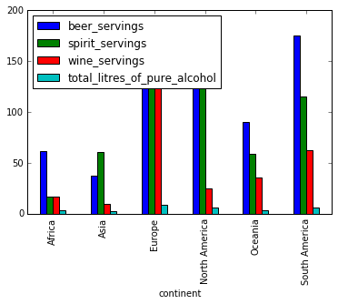
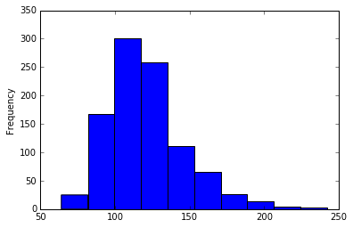
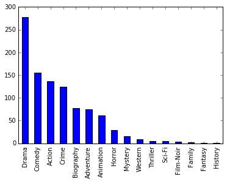
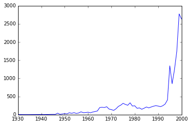

# Python pandas Q&A video series by [Data School](http://www.dataschool.io/)


<!-- toc orderedList:0 depthFrom:1 depthTo:6 -->

- [Python pandas Q&A video series by Data School](#python-pandas-qa-video-series-by-data-schoolhttpwwwdataschoolio)
	- [1. What is pandas?](#1-what-is-pandas)
	- [2. How do I read a tabular data file into pandas?](#2-how-do-i-read-a-tabular-data-file-into-pandas)
	- [3. How do I select a pandas Series from a DataFrame?](#3-how-do-i-select-a-pandas-series-from-a-dataframe)
	- [4. Why do some pandas commands end with parentheses (and others don't)?](#4-why-do-some-pandas-commands-end-with-parentheses-and-others-dont)
	- [5. How do I rename columns in a pandas DataFrame?](#5-how-do-i-rename-columns-in-a-pandas-dataframe)
	- [6. How do I remove columns from a pandas DataFrame?](#6-how-do-i-remove-columns-from-a-pandas-dataframe)
	- [7. How do I sort a pandas DataFrame or a Series?](#7-how-do-i-sort-a-pandas-dataframe-or-a-series)
	- [8. How do I filter rows of a pandas DataFrame by column value?](#8-how-do-i-filter-rows-of-a-pandas-dataframe-by-column-value)
	- [9. How do I apply multiple filter criteria to a pandas DataFrame?](#9-how-do-i-apply-multiple-filter-criteria-to-a-pandas-dataframe)
	- [10. Your pandas questions answered!](#10-your-pandas-questions-answered)
	- [11. How do I use the "axis" parameter in pandas?](#11-how-do-i-use-the-axis-parameter-in-pandas)
	- [12. How do I use string methods in pandas?](#12-how-do-i-use-string-methods-in-pandas)
	- [13. How do I change the data type of a pandas Series?](#13-how-do-i-change-the-data-type-of-a-pandas-series)
	- [14. When should I use a "groupby" in pandas?](#14-when-should-i-use-a-groupby-in-pandas)
	- [15. How do I explore a pandas Series?](#15-how-do-i-explore-a-pandas-series)
	- [16. How do I handle missing values in pandas?](#16-how-do-i-handle-missing-values-in-pandas)
	- [17. What do I need to know about the pandas index? (Part 1)](#17-what-do-i-need-to-know-about-the-pandas-index-part-1)
	- [18. What do I need to know about the pandas index? (Part 2)](#18-what-do-i-need-to-know-about-the-pandas-index-part-2)
	- [19. How do I select multiple rows and columns from a pandas DataFrame?](#19-how-do-i-select-multiple-rows-and-columns-from-a-pandas-dataframe)
	- [20. When should I use the "inplace" parameter in pandas?](#20-when-should-i-use-the-inplace-parameter-in-pandas)
	- [21. How do I make my pandas DataFrame smaller and faster?](#21-how-do-i-make-my-pandas-dataframe-smaller-and-faster)
	- [22. How do I use pandas with scikit-learn to create Kaggle submissions?](#22-how-do-i-use-pandas-with-scikit-learn-to-create-kaggle-submissions)
	- [23. More of your pandas questions answered!](#23-more-of-your-pandas-questions-answered)
	- [24. How do I create dummy variables in pandas?](#24-how-do-i-create-dummy-variables-in-pandas)
	- [25. How do I work with dates and times in pandas?](#25-how-do-i-work-with-dates-and-times-in-pandas)
	- [26. How do I find and remove duplicate rows in pandas?](#26-how-do-i-find-and-remove-duplicate-rows-in-pandas)
	- [27. How do I avoid a SettingWithCopyWarning in pandas?](#27-how-do-i-avoid-a-settingwithcopywarning-in-pandas)
	- [28. How do I change display options in pandas?](#28-how-do-i-change-display-options-in-pandas)
	- [29. How do I create a pandas DataFrame from another object?](#29-how-do-i-create-a-pandas-dataframe-from-another-object)
	- [30. How do I apply a function to a pandas Series or DataFrame?](#30-how-do-i-apply-a-function-to-a-pandas-series-or-dataframe)

<!-- tocstop -->

```python
# conventional way to import pandas
import pandas as pd
```

## 1. What is pandas?

- [pandas main page](http://pandas.pydata.org/)
- [pandas installation instructions](http://pandas.pydata.org/pandas-docs/stable/install.html)
- [Anaconda distribution of Python](https://www.continuum.io/downloads) (includes pandas)
- [How to use the IPython/Jupyter notebook](https://youtu.be/IsXXlYVBt1M?t=5m17s) (video)

## 2. How do I read a tabular data file into pandas?


```python
# read a dataset of Chipotle orders directly from a URL and store the results in a DataFrame
orders = pd.read_table('http://bit.ly/chiporders')
```


```python
# examine the first 5 rows
orders.head()
```


<div>
<table border="1" class="dataframe">
  <thead>
    <tr style="text-align: right;">
      <th></th>
      <th>order_id</th>
      <th>quantity</th>
      <th>item_name</th>
      <th>choice_description</th>
      <th>item_price</th>
    </tr>
  </thead>
  <tbody>
    <tr>
      <th>0</th>
      <td>1</td>
      <td>1</td>
      <td>Chips and Fresh Tomato Salsa</td>
      <td>NaN</td>
      <td>$2.39</td>
    </tr>
    <tr>
      <th>1</th>
      <td>1</td>
      <td>1</td>
      <td>Izze</td>
      <td>[Clementine]</td>
      <td>$3.39</td>
    </tr>
    <tr>
      <th>2</th>
      <td>1</td>
      <td>1</td>
      <td>Nantucket Nectar</td>
      <td>[Apple]</td>
      <td>$3.39</td>
    </tr>
    <tr>
      <th>3</th>
      <td>1</td>
      <td>1</td>
      <td>Chips and Tomatillo-Green Chili Salsa</td>
      <td>NaN</td>
      <td>$2.39</td>
    </tr>
    <tr>
      <th>4</th>
      <td>2</td>
      <td>2</td>
      <td>Chicken Bowl</td>
      <td>[Tomatillo-Red Chili Salsa (Hot), [Black Beans...</td>
      <td>$16.98</td>
    </tr>
  </tbody>
</table>
</div>


Documentation for [**`read_table`**](http://pandas.pydata.org/pandas-docs/stable/generated/pandas.read_table.html)


```python
# read a dataset of movie reviewers (modifying the default parameter values for read_table)
user_cols = ['user_id', 'age', 'gender', 'occupation', 'zip_code']
users = pd.read_table('http://bit.ly/movieusers', sep='|', header=None, names=user_cols)
```


```python
# examine the first 5 rows
users.head()
```


<div>
<table border="1" class="dataframe">
  <thead>
    <tr style="text-align: right;">
      <th></th>
      <th>user_id</th>
      <th>age</th>
      <th>gender</th>
      <th>occupation</th>
      <th>zip_code</th>
    </tr>
  </thead>
  <tbody>
    <tr>
      <th>0</th>
      <td>1</td>
      <td>24</td>
      <td>M</td>
      <td>technician</td>
      <td>85711</td>
    </tr>
    <tr>
      <th>1</th>
      <td>2</td>
      <td>53</td>
      <td>F</td>
      <td>other</td>
      <td>94043</td>
    </tr>
    <tr>
      <th>2</th>
      <td>3</td>
      <td>23</td>
      <td>M</td>
      <td>writer</td>
      <td>32067</td>
    </tr>
    <tr>
      <th>3</th>
      <td>4</td>
      <td>24</td>
      <td>M</td>
      <td>technician</td>
      <td>43537</td>
    </tr>
    <tr>
      <th>4</th>
      <td>5</td>
      <td>33</td>
      <td>F</td>
      <td>other</td>
      <td>15213</td>
    </tr>
  </tbody>
</table>
</div>


[<a href="#Python-pandas-Q&A-video-series-by-Data-School">Back to top</a>]

## 3. How do I select a pandas Series from a DataFrame?


```python
# read a dataset of UFO reports into a DataFrame
ufo = pd.read_table('http://bit.ly/uforeports', sep=',')
```


```python
# read_csv is equivalent to read_table, except it assumes a comma separator
ufo = pd.read_csv('http://bit.ly/uforeports')
```


```python
# examine the first 5 rows
ufo.head()
```


<div>
<table border="1" class="dataframe">
  <thead>
    <tr style="text-align: right;">
      <th></th>
      <th>City</th>
      <th>Colors Reported</th>
      <th>Shape Reported</th>
      <th>State</th>
      <th>Time</th>
    </tr>
  </thead>
  <tbody>
    <tr>
      <th>0</th>
      <td>Ithaca</td>
      <td>NaN</td>
      <td>TRIANGLE</td>
      <td>NY</td>
      <td>6/1/1930 22:00</td>
    </tr>
    <tr>
      <th>1</th>
      <td>Willingboro</td>
      <td>NaN</td>
      <td>OTHER</td>
      <td>NJ</td>
      <td>6/30/1930 20:00</td>
    </tr>
    <tr>
      <th>2</th>
      <td>Holyoke</td>
      <td>NaN</td>
      <td>OVAL</td>
      <td>CO</td>
      <td>2/15/1931 14:00</td>
    </tr>
    <tr>
      <th>3</th>
      <td>Abilene</td>
      <td>NaN</td>
      <td>DISK</td>
      <td>KS</td>
      <td>6/1/1931 13:00</td>
    </tr>
    <tr>
      <th>4</th>
      <td>New York Worlds Fair</td>
      <td>NaN</td>
      <td>LIGHT</td>
      <td>NY</td>
      <td>4/18/1933 19:00</td>
    </tr>
  </tbody>
</table>
</div>


```python
# select the 'City' Series using bracket notation
ufo['City']

# or equivalently, use dot notation
ufo.City
```


    0                      Ithaca
    1                 Willingboro
    2                     Holyoke
    3                     Abilene
    4        New York Worlds Fair
    5                 Valley City
    6                 Crater Lake
    7                        Alma
    8                     Eklutna
    9                     Hubbard
    10                    Fontana
    11                   Waterloo
    12                     Belton
    13                     Keokuk
    14                  Ludington
    15                Forest Home
    16                Los Angeles
    17                  Hapeville
    18                     Oneida
    19                 Bering Sea
    20                   Nebraska
    21                        NaN
    22                        NaN
    23                  Owensboro
    24                 Wilderness
    25                  San Diego
    26                 Wilderness
    27                     Clovis
    28                 Los Alamos
    29               Ft. Duschene
                     ...         
    18211                 Holyoke
    18212                  Carson
    18213                Pasadena
    18214                  Austin
    18215                El Campo
    18216            Garden Grove
    18217           Berthoud Pass
    18218              Sisterdale
    18219            Garden Grove
    18220             Shasta Lake
    18221                Franklin
    18222          Albrightsville
    18223              Greenville
    18224                 Eufaula
    18225             Simi Valley
    18226           San Francisco
    18227           San Francisco
    18228              Kingsville
    18229                 Chicago
    18230             Pismo Beach
    18231             Pismo Beach
    18232                    Lodi
    18233               Anchorage
    18234                Capitola
    18235          Fountain Hills
    18236              Grant Park
    18237             Spirit Lake
    18238             Eagle River
    18239             Eagle River
    18240                    Ybor
    Name: City, dtype: object


**Bracket notation** will always work, whereas **dot notation** has limitations:

- Dot notation doesn't work if there are **spaces** in the Series name
- Dot notation doesn't work if the Series has the same name as a **DataFrame method or attribute** (like 'head' or 'shape')
- Dot notation can't be used to define the name of a **new Series** (see below)


```python
# create a new 'Location' Series (must use bracket notation to define the Series name)
ufo['Location'] = ufo.City + ', ' + ufo.State
ufo.head()
```


<div>
<table border="1" class="dataframe">
  <thead>
    <tr style="text-align: right;">
      <th></th>
      <th>City</th>
      <th>Colors Reported</th>
      <th>Shape Reported</th>
      <th>State</th>
      <th>Time</th>
      <th>Location</th>
    </tr>
  </thead>
  <tbody>
    <tr>
      <th>0</th>
      <td>Ithaca</td>
      <td>NaN</td>
      <td>TRIANGLE</td>
      <td>NY</td>
      <td>6/1/1930 22:00</td>
      <td>Ithaca, NY</td>
    </tr>
    <tr>
      <th>1</th>
      <td>Willingboro</td>
      <td>NaN</td>
      <td>OTHER</td>
      <td>NJ</td>
      <td>6/30/1930 20:00</td>
      <td>Willingboro, NJ</td>
    </tr>
    <tr>
      <th>2</th>
      <td>Holyoke</td>
      <td>NaN</td>
      <td>OVAL</td>
      <td>CO</td>
      <td>2/15/1931 14:00</td>
      <td>Holyoke, CO</td>
    </tr>
    <tr>
      <th>3</th>
      <td>Abilene</td>
      <td>NaN</td>
      <td>DISK</td>
      <td>KS</td>
      <td>6/1/1931 13:00</td>
      <td>Abilene, KS</td>
    </tr>
    <tr>
      <th>4</th>
      <td>New York Worlds Fair</td>
      <td>NaN</td>
      <td>LIGHT</td>
      <td>NY</td>
      <td>4/18/1933 19:00</td>
      <td>New York Worlds Fair, NY</td>
    </tr>
  </tbody>
</table>
</div>


[<a href="#Python-pandas-Q&A-video-series-by-Data-School">Back to top</a>]

## 4. Why do some pandas commands end with parentheses (and others don't)?


```python
# read a dataset of top-rated IMDb movies into a DataFrame
movies = pd.read_csv('http://bit.ly/imdbratings')
```

**Methods** end with parentheses, while **attributes** don't:


```python
# example method: show the first 5 rows
movies.head()
```


<div>
<table border="1" class="dataframe">
  <thead>
    <tr style="text-align: right;">
      <th></th>
      <th>star_rating</th>
      <th>title</th>
      <th>content_rating</th>
      <th>genre</th>
      <th>duration</th>
      <th>actors_list</th>
    </tr>
  </thead>
  <tbody>
    <tr>
      <th>0</th>
      <td>9.3</td>
      <td>The Shawshank Redemption</td>
      <td>R</td>
      <td>Crime</td>
      <td>142</td>
      <td>[u'Tim Robbins', u'Morgan Freeman', u'Bob Gunt...</td>
    </tr>
    <tr>
      <th>1</th>
      <td>9.2</td>
      <td>The Godfather</td>
      <td>R</td>
      <td>Crime</td>
      <td>175</td>
      <td>[u'Marlon Brando', u'Al Pacino', u'James Caan']</td>
    </tr>
    <tr>
      <th>2</th>
      <td>9.1</td>
      <td>The Godfather: Part II</td>
      <td>R</td>
      <td>Crime</td>
      <td>200</td>
      <td>[u'Al Pacino', u'Robert De Niro', u'Robert Duv...</td>
    </tr>
    <tr>
      <th>3</th>
      <td>9.0</td>
      <td>The Dark Knight</td>
      <td>PG-13</td>
      <td>Action</td>
      <td>152</td>
      <td>[u'Christian Bale', u'Heath Ledger', u'Aaron E...</td>
    </tr>
    <tr>
      <th>4</th>
      <td>8.9</td>
      <td>Pulp Fiction</td>
      <td>R</td>
      <td>Crime</td>
      <td>154</td>
      <td>[u'John Travolta', u'Uma Thurman', u'Samuel L....</td>
    </tr>
  </tbody>
</table>
</div>


```python
# example method: calculate summary statistics
movies.describe()
```


<div>
<table border="1" class="dataframe">
  <thead>
    <tr style="text-align: right;">
      <th></th>
      <th>star_rating</th>
      <th>duration</th>
    </tr>
  </thead>
  <tbody>
    <tr>
      <th>count</th>
      <td>979.000000</td>
      <td>979.000000</td>
    </tr>
    <tr>
      <th>mean</th>
      <td>7.889785</td>
      <td>120.979571</td>
    </tr>
    <tr>
      <th>std</th>
      <td>0.336069</td>
      <td>26.218010</td>
    </tr>
    <tr>
      <th>min</th>
      <td>7.400000</td>
      <td>64.000000</td>
    </tr>
    <tr>
      <th>25%</th>
      <td>7.600000</td>
      <td>102.000000</td>
    </tr>
    <tr>
      <th>50%</th>
      <td>7.800000</td>
      <td>117.000000</td>
    </tr>
    <tr>
      <th>75%</th>
      <td>8.100000</td>
      <td>134.000000</td>
    </tr>
    <tr>
      <th>max</th>
      <td>9.300000</td>
      <td>242.000000</td>
    </tr>
  </tbody>
</table>
</div>


```python
# example attribute: number of rows and columns
movies.shape
```


    (979, 6)


```python
# example attribute: data type of each column
movies.dtypes
```


    star_rating       float64
    title              object
    content_rating     object
    genre              object
    duration            int64
    actors_list        object
    dtype: object


```python
# use an optional parameter to the describe method to summarize only 'object' columns
movies.describe(include=['object'])
```


<div>
<table border="1" class="dataframe">
  <thead>
    <tr style="text-align: right;">
      <th></th>
      <th>title</th>
      <th>content_rating</th>
      <th>genre</th>
      <th>actors_list</th>
    </tr>
  </thead>
  <tbody>
    <tr>
      <th>count</th>
      <td>979</td>
      <td>976</td>
      <td>979</td>
      <td>979</td>
    </tr>
    <tr>
      <th>unique</th>
      <td>975</td>
      <td>12</td>
      <td>16</td>
      <td>969</td>
    </tr>
    <tr>
      <th>top</th>
      <td>The Girl with the Dragon Tattoo</td>
      <td>R</td>
      <td>Drama</td>
      <td>[u'Daniel Radcliffe', u'Emma Watson', u'Rupert...</td>
    </tr>
    <tr>
      <th>freq</th>
      <td>2</td>
      <td>460</td>
      <td>278</td>
      <td>6</td>
    </tr>
  </tbody>
</table>
</div>


Documentation for [**`describe`**](http://pandas.pydata.org/pandas-docs/stable/generated/pandas.DataFrame.describe.html)

[<a href="#Python-pandas-Q&A-video-series-by-Data-School">Back to top</a>]

## 5. How do I rename columns in a pandas DataFrame?


```python
# read a dataset of UFO reports into a DataFrame
ufo = pd.read_csv('http://bit.ly/uforeports')
```


```python
# examine the column names
ufo.columns
```


    Index([u'City', u'Colors Reported', u'Shape Reported', u'State', u'Time'], dtype='object')


```python
# rename two of the columns by using the 'rename' method
ufo.rename(columns={'Colors Reported':'Colors_Reported', 'Shape Reported':'Shape_Reported'}, inplace=True)
ufo.columns
```


    Index([u'City', u'Colors_Reported', u'Shape_Reported', u'State', u'Time'], dtype='object')


Documentation for [**`rename`**](http://pandas.pydata.org/pandas-docs/stable/generated/pandas.DataFrame.rename.html)


```python
# replace all of the column names by overwriting the 'columns' attribute
ufo_cols = ['city', 'colors reported', 'shape reported', 'state', 'time']
ufo.columns = ufo_cols
ufo.columns
```


    Index([u'city', u'colors reported', u'shape reported', u'state', u'time'], dtype='object')


```python
# replace the column names during the file reading process by using the 'names' parameter
ufo = pd.read_csv('http://bit.ly/uforeports', header=0, names=ufo_cols)
ufo.columns
```


    Index([u'city', u'colors reported', u'shape reported', u'state', u'time'], dtype='object')


Documentation for [**`read_csv`**](http://pandas.pydata.org/pandas-docs/stable/generated/pandas.read_csv.html)


```python
# replace all spaces with underscores in the column names by using the 'str.replace' method
ufo.columns = ufo.columns.str.replace(' ', '_')
ufo.columns
```


    Index([u'city', u'colors_reported', u'shape_reported', u'state', u'time'], dtype='object')


Documentation for [**`str.replace`**](http://pandas.pydata.org/pandas-docs/stable/generated/pandas.Series.str.replace.html)

[<a href="#Python-pandas-Q&A-video-series-by-Data-School">Back to top</a>]

## 6. How do I remove columns from a pandas DataFrame?


```python
# read a dataset of UFO reports into a DataFrame
ufo = pd.read_csv('http://bit.ly/uforeports')
ufo.head()
```


<div>
<table border="1" class="dataframe">
  <thead>
    <tr style="text-align: right;">
      <th></th>
      <th>City</th>
      <th>Colors Reported</th>
      <th>Shape Reported</th>
      <th>State</th>
      <th>Time</th>
    </tr>
  </thead>
  <tbody>
    <tr>
      <th>0</th>
      <td>Ithaca</td>
      <td>NaN</td>
      <td>TRIANGLE</td>
      <td>NY</td>
      <td>6/1/1930 22:00</td>
    </tr>
    <tr>
      <th>1</th>
      <td>Willingboro</td>
      <td>NaN</td>
      <td>OTHER</td>
      <td>NJ</td>
      <td>6/30/1930 20:00</td>
    </tr>
    <tr>
      <th>2</th>
      <td>Holyoke</td>
      <td>NaN</td>
      <td>OVAL</td>
      <td>CO</td>
      <td>2/15/1931 14:00</td>
    </tr>
    <tr>
      <th>3</th>
      <td>Abilene</td>
      <td>NaN</td>
      <td>DISK</td>
      <td>KS</td>
      <td>6/1/1931 13:00</td>
    </tr>
    <tr>
      <th>4</th>
      <td>New York Worlds Fair</td>
      <td>NaN</td>
      <td>LIGHT</td>
      <td>NY</td>
      <td>4/18/1933 19:00</td>
    </tr>
  </tbody>
</table>
</div>


```python
# remove a single column (axis=1 refers to columns)
ufo.drop('Colors Reported', axis=1, inplace=True)
ufo.head()
```


<div>
<table border="1" class="dataframe">
  <thead>
    <tr style="text-align: right;">
      <th></th>
      <th>City</th>
      <th>Shape Reported</th>
      <th>State</th>
      <th>Time</th>
    </tr>
  </thead>
  <tbody>
    <tr>
      <th>0</th>
      <td>Ithaca</td>
      <td>TRIANGLE</td>
      <td>NY</td>
      <td>6/1/1930 22:00</td>
    </tr>
    <tr>
      <th>1</th>
      <td>Willingboro</td>
      <td>OTHER</td>
      <td>NJ</td>
      <td>6/30/1930 20:00</td>
    </tr>
    <tr>
      <th>2</th>
      <td>Holyoke</td>
      <td>OVAL</td>
      <td>CO</td>
      <td>2/15/1931 14:00</td>
    </tr>
    <tr>
      <th>3</th>
      <td>Abilene</td>
      <td>DISK</td>
      <td>KS</td>
      <td>6/1/1931 13:00</td>
    </tr>
    <tr>
      <th>4</th>
      <td>New York Worlds Fair</td>
      <td>LIGHT</td>
      <td>NY</td>
      <td>4/18/1933 19:00</td>
    </tr>
  </tbody>
</table>
</div>


Documentation for [**`drop`**](http://pandas.pydata.org/pandas-docs/stable/generated/pandas.DataFrame.drop.html)


```python
# remove multiple columns at once
ufo.drop(['City', 'State'], axis=1, inplace=True)
ufo.head()
```


<div>
<table border="1" class="dataframe">
  <thead>
    <tr style="text-align: right;">
      <th></th>
      <th>Shape Reported</th>
      <th>Time</th>
    </tr>
  </thead>
  <tbody>
    <tr>
      <th>0</th>
      <td>TRIANGLE</td>
      <td>6/1/1930 22:00</td>
    </tr>
    <tr>
      <th>1</th>
      <td>OTHER</td>
      <td>6/30/1930 20:00</td>
    </tr>
    <tr>
      <th>2</th>
      <td>OVAL</td>
      <td>2/15/1931 14:00</td>
    </tr>
    <tr>
      <th>3</th>
      <td>DISK</td>
      <td>6/1/1931 13:00</td>
    </tr>
    <tr>
      <th>4</th>
      <td>LIGHT</td>
      <td>4/18/1933 19:00</td>
    </tr>
  </tbody>
</table>
</div>


```python
# remove multiple rows at once (axis=0 refers to rows)
ufo.drop([0, 1], axis=0, inplace=True)
ufo.head()
```


<div>
<table border="1" class="dataframe">
  <thead>
    <tr style="text-align: right;">
      <th></th>
      <th>Shape Reported</th>
      <th>Time</th>
    </tr>
  </thead>
  <tbody>
    <tr>
      <th>2</th>
      <td>OVAL</td>
      <td>2/15/1931 14:00</td>
    </tr>
    <tr>
      <th>3</th>
      <td>DISK</td>
      <td>6/1/1931 13:00</td>
    </tr>
    <tr>
      <th>4</th>
      <td>LIGHT</td>
      <td>4/18/1933 19:00</td>
    </tr>
    <tr>
      <th>5</th>
      <td>DISK</td>
      <td>9/15/1934 15:30</td>
    </tr>
    <tr>
      <th>6</th>
      <td>CIRCLE</td>
      <td>6/15/1935 0:00</td>
    </tr>
  </tbody>
</table>
</div>


[<a href="#Python-pandas-Q&A-video-series-by-Data-School">Back to top</a>]

## 7. How do I sort a pandas DataFrame or a Series?


```python
# read a dataset of top-rated IMDb movies into a DataFrame
movies = pd.read_csv('http://bit.ly/imdbratings')
movies.head()
```


<div>
<table border="1" class="dataframe">
  <thead>
    <tr style="text-align: right;">
      <th></th>
      <th>star_rating</th>
      <th>title</th>
      <th>content_rating</th>
      <th>genre</th>
      <th>duration</th>
      <th>actors_list</th>
    </tr>
  </thead>
  <tbody>
    <tr>
      <th>0</th>
      <td>9.3</td>
      <td>The Shawshank Redemption</td>
      <td>R</td>
      <td>Crime</td>
      <td>142</td>
      <td>[u'Tim Robbins', u'Morgan Freeman', u'Bob Gunt...</td>
    </tr>
    <tr>
      <th>1</th>
      <td>9.2</td>
      <td>The Godfather</td>
      <td>R</td>
      <td>Crime</td>
      <td>175</td>
      <td>[u'Marlon Brando', u'Al Pacino', u'James Caan']</td>
    </tr>
    <tr>
      <th>2</th>
      <td>9.1</td>
      <td>The Godfather: Part II</td>
      <td>R</td>
      <td>Crime</td>
      <td>200</td>
      <td>[u'Al Pacino', u'Robert De Niro', u'Robert Duv...</td>
    </tr>
    <tr>
      <th>3</th>
      <td>9.0</td>
      <td>The Dark Knight</td>
      <td>PG-13</td>
      <td>Action</td>
      <td>152</td>
      <td>[u'Christian Bale', u'Heath Ledger', u'Aaron E...</td>
    </tr>
    <tr>
      <th>4</th>
      <td>8.9</td>
      <td>Pulp Fiction</td>
      <td>R</td>
      <td>Crime</td>
      <td>154</td>
      <td>[u'John Travolta', u'Uma Thurman', u'Samuel L....</td>
    </tr>
  </tbody>
</table>
</div>


**Note:** None of the sorting methods below affect the underlying data. (In other words, the sorting is temporary).


```python
# sort the 'title' Series in ascending order (returns a Series)
movies.title.sort_values().head()
```


    542     (500) Days of Summer
    5               12 Angry Men
    201         12 Years a Slave
    698                127 Hours
    110    2001: A Space Odyssey
    Name: title, dtype: object


```python
# sort in descending order instead
movies.title.sort_values(ascending=False).head()
```


    864               [Rec]
    526                Zulu
    615          Zombieland
    677              Zodiac
    955    Zero Dark Thirty
    Name: title, dtype: object


Documentation for [**`sort_values`**](http://pandas.pydata.org/pandas-docs/stable/generated/pandas.Series.sort_values.html) for a **Series**. (Prior to version 0.17, use [**`order`**](http://pandas.pydata.org/pandas-docs/version/0.17.0/generated/pandas.Series.order.html) instead.)


```python
# sort the entire DataFrame by the 'title' Series (returns a DataFrame)
movies.sort_values('title').head()
```


<div>
<table border="1" class="dataframe">
  <thead>
    <tr style="text-align: right;">
      <th></th>
      <th>star_rating</th>
      <th>title</th>
      <th>content_rating</th>
      <th>genre</th>
      <th>duration</th>
      <th>actors_list</th>
    </tr>
  </thead>
  <tbody>
    <tr>
      <th>542</th>
      <td>7.8</td>
      <td>(500) Days of Summer</td>
      <td>PG-13</td>
      <td>Comedy</td>
      <td>95</td>
      <td>[u'Zooey Deschanel', u'Joseph Gordon-Levitt', ...</td>
    </tr>
    <tr>
      <th>5</th>
      <td>8.9</td>
      <td>12 Angry Men</td>
      <td>NOT RATED</td>
      <td>Drama</td>
      <td>96</td>
      <td>[u'Henry Fonda', u'Lee J. Cobb', u'Martin Bals...</td>
    </tr>
    <tr>
      <th>201</th>
      <td>8.1</td>
      <td>12 Years a Slave</td>
      <td>R</td>
      <td>Biography</td>
      <td>134</td>
      <td>[u'Chiwetel Ejiofor', u'Michael Kenneth Willia...</td>
    </tr>
    <tr>
      <th>698</th>
      <td>7.6</td>
      <td>127 Hours</td>
      <td>R</td>
      <td>Adventure</td>
      <td>94</td>
      <td>[u'James Franco', u'Amber Tamblyn', u'Kate Mara']</td>
    </tr>
    <tr>
      <th>110</th>
      <td>8.3</td>
      <td>2001: A Space Odyssey</td>
      <td>G</td>
      <td>Mystery</td>
      <td>160</td>
      <td>[u'Keir Dullea', u'Gary Lockwood', u'William S...</td>
    </tr>
  </tbody>
</table>
</div>


```python
# sort in descending order instead
movies.sort_values('title', ascending=False).head()
```


<div>
<table border="1" class="dataframe">
  <thead>
    <tr style="text-align: right;">
      <th></th>
      <th>star_rating</th>
      <th>title</th>
      <th>content_rating</th>
      <th>genre</th>
      <th>duration</th>
      <th>actors_list</th>
    </tr>
  </thead>
  <tbody>
    <tr>
      <th>864</th>
      <td>7.5</td>
      <td>[Rec]</td>
      <td>R</td>
      <td>Horror</td>
      <td>78</td>
      <td>[u'Manuela Velasco', u'Ferran Terraza', u'Jorg...</td>
    </tr>
    <tr>
      <th>526</th>
      <td>7.8</td>
      <td>Zulu</td>
      <td>UNRATED</td>
      <td>Drama</td>
      <td>138</td>
      <td>[u'Stanley Baker', u'Jack Hawkins', u'Ulla Jac...</td>
    </tr>
    <tr>
      <th>615</th>
      <td>7.7</td>
      <td>Zombieland</td>
      <td>R</td>
      <td>Comedy</td>
      <td>88</td>
      <td>[u'Jesse Eisenberg', u'Emma Stone', u'Woody Ha...</td>
    </tr>
    <tr>
      <th>677</th>
      <td>7.7</td>
      <td>Zodiac</td>
      <td>R</td>
      <td>Crime</td>
      <td>157</td>
      <td>[u'Jake Gyllenhaal', u'Robert Downey Jr.', u'M...</td>
    </tr>
    <tr>
      <th>955</th>
      <td>7.4</td>
      <td>Zero Dark Thirty</td>
      <td>R</td>
      <td>Drama</td>
      <td>157</td>
      <td>[u'Jessica Chastain', u'Joel Edgerton', u'Chri...</td>
    </tr>
  </tbody>
</table>
</div>


Documentation for [**`sort_values`**](http://pandas.pydata.org/pandas-docs/stable/generated/pandas.DataFrame.sort_values.html) for a **DataFrame**. (Prior to version 0.17, use [**`sort`**](http://pandas.pydata.org/pandas-docs/version/0.17.0/generated/pandas.DataFrame.sort.html) instead.)


```python
# sort the DataFrame first by 'content_rating', then by 'duration'
movies.sort_values(['content_rating', 'duration']).head()
```


<div>
<table border="1" class="dataframe">
  <thead>
    <tr style="text-align: right;">
      <th></th>
      <th>star_rating</th>
      <th>title</th>
      <th>content_rating</th>
      <th>genre</th>
      <th>duration</th>
      <th>actors_list</th>
    </tr>
  </thead>
  <tbody>
    <tr>
      <th>713</th>
      <td>7.6</td>
      <td>The Jungle Book</td>
      <td>APPROVED</td>
      <td>Animation</td>
      <td>78</td>
      <td>[u'Phil Harris', u'Sebastian Cabot', u'Louis P...</td>
    </tr>
    <tr>
      <th>513</th>
      <td>7.8</td>
      <td>Invasion of the Body Snatchers</td>
      <td>APPROVED</td>
      <td>Horror</td>
      <td>80</td>
      <td>[u'Kevin McCarthy', u'Dana Wynter', u'Larry Ga...</td>
    </tr>
    <tr>
      <th>272</th>
      <td>8.1</td>
      <td>The Killing</td>
      <td>APPROVED</td>
      <td>Crime</td>
      <td>85</td>
      <td>[u'Sterling Hayden', u'Coleen Gray', u'Vince E...</td>
    </tr>
    <tr>
      <th>703</th>
      <td>7.6</td>
      <td>Dracula</td>
      <td>APPROVED</td>
      <td>Horror</td>
      <td>85</td>
      <td>[u'Bela Lugosi', u'Helen Chandler', u'David Ma...</td>
    </tr>
    <tr>
      <th>612</th>
      <td>7.7</td>
      <td>A Hard Day's Night</td>
      <td>APPROVED</td>
      <td>Comedy</td>
      <td>87</td>
      <td>[u'John Lennon', u'Paul McCartney', u'George H...</td>
    </tr>
  </tbody>
</table>
</div>


[Summary of changes to the sorting API](http://pandas.pydata.org/pandas-docs/stable/whatsnew.html#changes-to-sorting-api) in pandas 0.17

[<a href="#Python-pandas-Q&A-video-series-by-Data-School">Back to top</a>]

## 8. How do I filter rows of a pandas DataFrame by column value?


```python
# read a dataset of top-rated IMDb movies into a DataFrame
movies = pd.read_csv('http://bit.ly/imdbratings')
movies.head()
```


<div>
<table border="1" class="dataframe">
  <thead>
    <tr style="text-align: right;">
      <th></th>
      <th>star_rating</th>
      <th>title</th>
      <th>content_rating</th>
      <th>genre</th>
      <th>duration</th>
      <th>actors_list</th>
    </tr>
  </thead>
  <tbody>
    <tr>
      <th>0</th>
      <td>9.3</td>
      <td>The Shawshank Redemption</td>
      <td>R</td>
      <td>Crime</td>
      <td>142</td>
      <td>[u'Tim Robbins', u'Morgan Freeman', u'Bob Gunt...</td>
    </tr>
    <tr>
      <th>1</th>
      <td>9.2</td>
      <td>The Godfather</td>
      <td>R</td>
      <td>Crime</td>
      <td>175</td>
      <td>[u'Marlon Brando', u'Al Pacino', u'James Caan']</td>
    </tr>
    <tr>
      <th>2</th>
      <td>9.1</td>
      <td>The Godfather: Part II</td>
      <td>R</td>
      <td>Crime</td>
      <td>200</td>
      <td>[u'Al Pacino', u'Robert De Niro', u'Robert Duv...</td>
    </tr>
    <tr>
      <th>3</th>
      <td>9.0</td>
      <td>The Dark Knight</td>
      <td>PG-13</td>
      <td>Action</td>
      <td>152</td>
      <td>[u'Christian Bale', u'Heath Ledger', u'Aaron E...</td>
    </tr>
    <tr>
      <th>4</th>
      <td>8.9</td>
      <td>Pulp Fiction</td>
      <td>R</td>
      <td>Crime</td>
      <td>154</td>
      <td>[u'John Travolta', u'Uma Thurman', u'Samuel L....</td>
    </tr>
  </tbody>
</table>
</div>


```python
# examine the number of rows and columns
movies.shape
```


    (979, 6)


**Goal:** Filter the DataFrame rows to only show movies with a 'duration' of at least 200 minutes.


```python
# create a list in which each element refers to a DataFrame row: True if the row satisfies the condition, False otherwise
booleans = []
for length in movies.duration:
    if length >= 200:
        booleans.append(True)
    else:
        booleans.append(False)
```


```python
# confirm that the list has the same length as the DataFrame
len(booleans)
```


    979


```python
# examine the first five list elements
booleans[0:5]
```


    [False, False, True, False, False]


```python
# convert the list to a Series
is_long = pd.Series(booleans)
is_long.head()
```


    0    False
    1    False
    2     True
    3    False
    4    False
    dtype: bool


```python
# use bracket notation with the boolean Series to tell the DataFrame which rows to display
movies[is_long]
```


<div>
<table border="1" class="dataframe">
  <thead>
    <tr style="text-align: right;">
      <th></th>
      <th>star_rating</th>
      <th>title</th>
      <th>content_rating</th>
      <th>genre</th>
      <th>duration</th>
      <th>actors_list</th>
    </tr>
  </thead>
  <tbody>
    <tr>
      <th>2</th>
      <td>9.1</td>
      <td>The Godfather: Part II</td>
      <td>R</td>
      <td>Crime</td>
      <td>200</td>
      <td>[u'Al Pacino', u'Robert De Niro', u'Robert Duv...</td>
    </tr>
    <tr>
      <th>7</th>
      <td>8.9</td>
      <td>The Lord of the Rings: The Return of the King</td>
      <td>PG-13</td>
      <td>Adventure</td>
      <td>201</td>
      <td>[u'Elijah Wood', u'Viggo Mortensen', u'Ian McK...</td>
    </tr>
    <tr>
      <th>17</th>
      <td>8.7</td>
      <td>Seven Samurai</td>
      <td>UNRATED</td>
      <td>Drama</td>
      <td>207</td>
      <td>[u'Toshir\xf4 Mifune', u'Takashi Shimura', u'K...</td>
    </tr>
    <tr>
      <th>78</th>
      <td>8.4</td>
      <td>Once Upon a Time in America</td>
      <td>R</td>
      <td>Crime</td>
      <td>229</td>
      <td>[u'Robert De Niro', u'James Woods', u'Elizabet...</td>
    </tr>
    <tr>
      <th>85</th>
      <td>8.4</td>
      <td>Lawrence of Arabia</td>
      <td>PG</td>
      <td>Adventure</td>
      <td>216</td>
      <td>[u"Peter O'Toole", u'Alec Guinness', u'Anthony...</td>
    </tr>
    <tr>
      <th>142</th>
      <td>8.3</td>
      <td>Lagaan: Once Upon a Time in India</td>
      <td>PG</td>
      <td>Adventure</td>
      <td>224</td>
      <td>[u'Aamir Khan', u'Gracy Singh', u'Rachel Shell...</td>
    </tr>
    <tr>
      <th>157</th>
      <td>8.2</td>
      <td>Gone with the Wind</td>
      <td>G</td>
      <td>Drama</td>
      <td>238</td>
      <td>[u'Clark Gable', u'Vivien Leigh', u'Thomas Mit...</td>
    </tr>
    <tr>
      <th>204</th>
      <td>8.1</td>
      <td>Ben-Hur</td>
      <td>G</td>
      <td>Adventure</td>
      <td>212</td>
      <td>[u'Charlton Heston', u'Jack Hawkins', u'Stephe...</td>
    </tr>
    <tr>
      <th>445</th>
      <td>7.9</td>
      <td>The Ten Commandments</td>
      <td>APPROVED</td>
      <td>Adventure</td>
      <td>220</td>
      <td>[u'Charlton Heston', u'Yul Brynner', u'Anne Ba...</td>
    </tr>
    <tr>
      <th>476</th>
      <td>7.8</td>
      <td>Hamlet</td>
      <td>PG-13</td>
      <td>Drama</td>
      <td>242</td>
      <td>[u'Kenneth Branagh', u'Julie Christie', u'Dere...</td>
    </tr>
    <tr>
      <th>630</th>
      <td>7.7</td>
      <td>Malcolm X</td>
      <td>PG-13</td>
      <td>Biography</td>
      <td>202</td>
      <td>[u'Denzel Washington', u'Angela Bassett', u'De...</td>
    </tr>
    <tr>
      <th>767</th>
      <td>7.6</td>
      <td>It's a Mad, Mad, Mad, Mad World</td>
      <td>APPROVED</td>
      <td>Action</td>
      <td>205</td>
      <td>[u'Spencer Tracy', u'Milton Berle', u'Ethel Me...</td>
    </tr>
  </tbody>
</table>
</div>


```python
# simplify the steps above: no need to write a for loop to create 'is_long' since pandas will broadcast the comparison
is_long = movies.duration >= 200
movies[is_long]

# or equivalently, write it in one line (no need to create the 'is_long' object)
movies[movies.duration >= 200]
```


<div>
<table border="1" class="dataframe">
  <thead>
    <tr style="text-align: right;">
      <th></th>
      <th>star_rating</th>
      <th>title</th>
      <th>content_rating</th>
      <th>genre</th>
      <th>duration</th>
      <th>actors_list</th>
    </tr>
  </thead>
  <tbody>
    <tr>
      <th>2</th>
      <td>9.1</td>
      <td>The Godfather: Part II</td>
      <td>R</td>
      <td>Crime</td>
      <td>200</td>
      <td>[u'Al Pacino', u'Robert De Niro', u'Robert Duv...</td>
    </tr>
    <tr>
      <th>7</th>
      <td>8.9</td>
      <td>The Lord of the Rings: The Return of the King</td>
      <td>PG-13</td>
      <td>Adventure</td>
      <td>201</td>
      <td>[u'Elijah Wood', u'Viggo Mortensen', u'Ian McK...</td>
    </tr>
    <tr>
      <th>17</th>
      <td>8.7</td>
      <td>Seven Samurai</td>
      <td>UNRATED</td>
      <td>Drama</td>
      <td>207</td>
      <td>[u'Toshir\xf4 Mifune', u'Takashi Shimura', u'K...</td>
    </tr>
    <tr>
      <th>78</th>
      <td>8.4</td>
      <td>Once Upon a Time in America</td>
      <td>R</td>
      <td>Crime</td>
      <td>229</td>
      <td>[u'Robert De Niro', u'James Woods', u'Elizabet...</td>
    </tr>
    <tr>
      <th>85</th>
      <td>8.4</td>
      <td>Lawrence of Arabia</td>
      <td>PG</td>
      <td>Adventure</td>
      <td>216</td>
      <td>[u"Peter O'Toole", u'Alec Guinness', u'Anthony...</td>
    </tr>
    <tr>
      <th>142</th>
      <td>8.3</td>
      <td>Lagaan: Once Upon a Time in India</td>
      <td>PG</td>
      <td>Adventure</td>
      <td>224</td>
      <td>[u'Aamir Khan', u'Gracy Singh', u'Rachel Shell...</td>
    </tr>
    <tr>
      <th>157</th>
      <td>8.2</td>
      <td>Gone with the Wind</td>
      <td>G</td>
      <td>Drama</td>
      <td>238</td>
      <td>[u'Clark Gable', u'Vivien Leigh', u'Thomas Mit...</td>
    </tr>
    <tr>
      <th>204</th>
      <td>8.1</td>
      <td>Ben-Hur</td>
      <td>G</td>
      <td>Adventure</td>
      <td>212</td>
      <td>[u'Charlton Heston', u'Jack Hawkins', u'Stephe...</td>
    </tr>
    <tr>
      <th>445</th>
      <td>7.9</td>
      <td>The Ten Commandments</td>
      <td>APPROVED</td>
      <td>Adventure</td>
      <td>220</td>
      <td>[u'Charlton Heston', u'Yul Brynner', u'Anne Ba...</td>
    </tr>
    <tr>
      <th>476</th>
      <td>7.8</td>
      <td>Hamlet</td>
      <td>PG-13</td>
      <td>Drama</td>
      <td>242</td>
      <td>[u'Kenneth Branagh', u'Julie Christie', u'Dere...</td>
    </tr>
    <tr>
      <th>630</th>
      <td>7.7</td>
      <td>Malcolm X</td>
      <td>PG-13</td>
      <td>Biography</td>
      <td>202</td>
      <td>[u'Denzel Washington', u'Angela Bassett', u'De...</td>
    </tr>
    <tr>
      <th>767</th>
      <td>7.6</td>
      <td>It's a Mad, Mad, Mad, Mad World</td>
      <td>APPROVED</td>
      <td>Action</td>
      <td>205</td>
      <td>[u'Spencer Tracy', u'Milton Berle', u'Ethel Me...</td>
    </tr>
  </tbody>
</table>
</div>


```python
# select the 'genre' Series from the filtered DataFrame
movies[movies.duration >= 200].genre

# or equivalently, use the 'loc' method
movies.loc[movies.duration >= 200, 'genre']
```


    2          Crime
    7      Adventure
    17         Drama
    78         Crime
    85     Adventure
    142    Adventure
    157        Drama
    204    Adventure
    445    Adventure
    476        Drama
    630    Biography
    767       Action
    Name: genre, dtype: object


Documentation for [**`loc`**](http://pandas.pydata.org/pandas-docs/stable/generated/pandas.DataFrame.loc.html)

[<a href="#Python-pandas-Q&A-video-series-by-Data-School">Back to top</a>]

## 9. How do I apply multiple filter criteria to a pandas DataFrame?


```python
# read a dataset of top-rated IMDb movies into a DataFrame
movies = pd.read_csv('http://bit.ly/imdbratings')
movies.head()
```


<div>
<table border="1" class="dataframe">
  <thead>
    <tr style="text-align: right;">
      <th></th>
      <th>star_rating</th>
      <th>title</th>
      <th>content_rating</th>
      <th>genre</th>
      <th>duration</th>
      <th>actors_list</th>
    </tr>
  </thead>
  <tbody>
    <tr>
      <th>0</th>
      <td>9.3</td>
      <td>The Shawshank Redemption</td>
      <td>R</td>
      <td>Crime</td>
      <td>142</td>
      <td>[u'Tim Robbins', u'Morgan Freeman', u'Bob Gunt...</td>
    </tr>
    <tr>
      <th>1</th>
      <td>9.2</td>
      <td>The Godfather</td>
      <td>R</td>
      <td>Crime</td>
      <td>175</td>
      <td>[u'Marlon Brando', u'Al Pacino', u'James Caan']</td>
    </tr>
    <tr>
      <th>2</th>
      <td>9.1</td>
      <td>The Godfather: Part II</td>
      <td>R</td>
      <td>Crime</td>
      <td>200</td>
      <td>[u'Al Pacino', u'Robert De Niro', u'Robert Duv...</td>
    </tr>
    <tr>
      <th>3</th>
      <td>9.0</td>
      <td>The Dark Knight</td>
      <td>PG-13</td>
      <td>Action</td>
      <td>152</td>
      <td>[u'Christian Bale', u'Heath Ledger', u'Aaron E...</td>
    </tr>
    <tr>
      <th>4</th>
      <td>8.9</td>
      <td>Pulp Fiction</td>
      <td>R</td>
      <td>Crime</td>
      <td>154</td>
      <td>[u'John Travolta', u'Uma Thurman', u'Samuel L....</td>
    </tr>
  </tbody>
</table>
</div>


```python
# filter the DataFrame to only show movies with a 'duration' of at least 200 minutes
movies[movies.duration >= 200]
```


<div>
<table border="1" class="dataframe">
  <thead>
    <tr style="text-align: right;">
      <th></th>
      <th>star_rating</th>
      <th>title</th>
      <th>content_rating</th>
      <th>genre</th>
      <th>duration</th>
      <th>actors_list</th>
    </tr>
  </thead>
  <tbody>
    <tr>
      <th>2</th>
      <td>9.1</td>
      <td>The Godfather: Part II</td>
      <td>R</td>
      <td>Crime</td>
      <td>200</td>
      <td>[u'Al Pacino', u'Robert De Niro', u'Robert Duv...</td>
    </tr>
    <tr>
      <th>7</th>
      <td>8.9</td>
      <td>The Lord of the Rings: The Return of the King</td>
      <td>PG-13</td>
      <td>Adventure</td>
      <td>201</td>
      <td>[u'Elijah Wood', u'Viggo Mortensen', u'Ian McK...</td>
    </tr>
    <tr>
      <th>17</th>
      <td>8.7</td>
      <td>Seven Samurai</td>
      <td>UNRATED</td>
      <td>Drama</td>
      <td>207</td>
      <td>[u'Toshir\xf4 Mifune', u'Takashi Shimura', u'K...</td>
    </tr>
    <tr>
      <th>78</th>
      <td>8.4</td>
      <td>Once Upon a Time in America</td>
      <td>R</td>
      <td>Crime</td>
      <td>229</td>
      <td>[u'Robert De Niro', u'James Woods', u'Elizabet...</td>
    </tr>
    <tr>
      <th>85</th>
      <td>8.4</td>
      <td>Lawrence of Arabia</td>
      <td>PG</td>
      <td>Adventure</td>
      <td>216</td>
      <td>[u"Peter O'Toole", u'Alec Guinness', u'Anthony...</td>
    </tr>
    <tr>
      <th>142</th>
      <td>8.3</td>
      <td>Lagaan: Once Upon a Time in India</td>
      <td>PG</td>
      <td>Adventure</td>
      <td>224</td>
      <td>[u'Aamir Khan', u'Gracy Singh', u'Rachel Shell...</td>
    </tr>
    <tr>
      <th>157</th>
      <td>8.2</td>
      <td>Gone with the Wind</td>
      <td>G</td>
      <td>Drama</td>
      <td>238</td>
      <td>[u'Clark Gable', u'Vivien Leigh', u'Thomas Mit...</td>
    </tr>
    <tr>
      <th>204</th>
      <td>8.1</td>
      <td>Ben-Hur</td>
      <td>G</td>
      <td>Adventure</td>
      <td>212</td>
      <td>[u'Charlton Heston', u'Jack Hawkins', u'Stephe...</td>
    </tr>
    <tr>
      <th>445</th>
      <td>7.9</td>
      <td>The Ten Commandments</td>
      <td>APPROVED</td>
      <td>Adventure</td>
      <td>220</td>
      <td>[u'Charlton Heston', u'Yul Brynner', u'Anne Ba...</td>
    </tr>
    <tr>
      <th>476</th>
      <td>7.8</td>
      <td>Hamlet</td>
      <td>PG-13</td>
      <td>Drama</td>
      <td>242</td>
      <td>[u'Kenneth Branagh', u'Julie Christie', u'Dere...</td>
    </tr>
    <tr>
      <th>630</th>
      <td>7.7</td>
      <td>Malcolm X</td>
      <td>PG-13</td>
      <td>Biography</td>
      <td>202</td>
      <td>[u'Denzel Washington', u'Angela Bassett', u'De...</td>
    </tr>
    <tr>
      <th>767</th>
      <td>7.6</td>
      <td>It's a Mad, Mad, Mad, Mad World</td>
      <td>APPROVED</td>
      <td>Action</td>
      <td>205</td>
      <td>[u'Spencer Tracy', u'Milton Berle', u'Ethel Me...</td>
    </tr>
  </tbody>
</table>
</div>


Understanding **logical operators:**

- **`and`**: True only if **both sides** of the operator are True
- **`or`**: True if **either side** of the operator is True


```python
# demonstration of the 'and' operator
print(True and True)
print(True and False)
print(False and False)
```

    True
    False
    False


```python
# demonstration of the 'or' operator
print(True or True)
print(True or False)
print(False or False)
```

    True
    True
    False


Rules for specifying **multiple filter criteria** in pandas:

- use **`&`** instead of **`and`**
- use **`|`** instead of **`or`**
- add **parentheses** around each condition to specify evaluation order

**Goal:** Further filter the DataFrame of long movies (duration >= 200) to only show movies which also have a 'genre' of 'Drama'


```python
# CORRECT: use the '&' operator to specify that both conditions are required
movies[(movies.duration >=200) & (movies.genre == 'Drama')]
```


<div>
<table border="1" class="dataframe">
  <thead>
    <tr style="text-align: right;">
      <th></th>
      <th>star_rating</th>
      <th>title</th>
      <th>content_rating</th>
      <th>genre</th>
      <th>duration</th>
      <th>actors_list</th>
    </tr>
  </thead>
  <tbody>
    <tr>
      <th>17</th>
      <td>8.7</td>
      <td>Seven Samurai</td>
      <td>UNRATED</td>
      <td>Drama</td>
      <td>207</td>
      <td>[u'Toshir\xf4 Mifune', u'Takashi Shimura', u'K...</td>
    </tr>
    <tr>
      <th>157</th>
      <td>8.2</td>
      <td>Gone with the Wind</td>
      <td>G</td>
      <td>Drama</td>
      <td>238</td>
      <td>[u'Clark Gable', u'Vivien Leigh', u'Thomas Mit...</td>
    </tr>
    <tr>
      <th>476</th>
      <td>7.8</td>
      <td>Hamlet</td>
      <td>PG-13</td>
      <td>Drama</td>
      <td>242</td>
      <td>[u'Kenneth Branagh', u'Julie Christie', u'Dere...</td>
    </tr>
  </tbody>
</table>
</div>


```python
# INCORRECT: using the '|' operator would have shown movies that are either long or dramas (or both)
movies[(movies.duration >=200) | (movies.genre == 'Drama')].head()
```


<div>
<table border="1" class="dataframe">
  <thead>
    <tr style="text-align: right;">
      <th></th>
      <th>star_rating</th>
      <th>title</th>
      <th>content_rating</th>
      <th>genre</th>
      <th>duration</th>
      <th>actors_list</th>
    </tr>
  </thead>
  <tbody>
    <tr>
      <th>2</th>
      <td>9.1</td>
      <td>The Godfather: Part II</td>
      <td>R</td>
      <td>Crime</td>
      <td>200</td>
      <td>[u'Al Pacino', u'Robert De Niro', u'Robert Duv...</td>
    </tr>
    <tr>
      <th>5</th>
      <td>8.9</td>
      <td>12 Angry Men</td>
      <td>NOT RATED</td>
      <td>Drama</td>
      <td>96</td>
      <td>[u'Henry Fonda', u'Lee J. Cobb', u'Martin Bals...</td>
    </tr>
    <tr>
      <th>7</th>
      <td>8.9</td>
      <td>The Lord of the Rings: The Return of the King</td>
      <td>PG-13</td>
      <td>Adventure</td>
      <td>201</td>
      <td>[u'Elijah Wood', u'Viggo Mortensen', u'Ian McK...</td>
    </tr>
    <tr>
      <th>9</th>
      <td>8.9</td>
      <td>Fight Club</td>
      <td>R</td>
      <td>Drama</td>
      <td>139</td>
      <td>[u'Brad Pitt', u'Edward Norton', u'Helena Bonh...</td>
    </tr>
    <tr>
      <th>13</th>
      <td>8.8</td>
      <td>Forrest Gump</td>
      <td>PG-13</td>
      <td>Drama</td>
      <td>142</td>
      <td>[u'Tom Hanks', u'Robin Wright', u'Gary Sinise']</td>
    </tr>
  </tbody>
</table>
</div>


**Goal:** Filter the original DataFrame to show movies with a 'genre' of 'Crime' or 'Drama' or 'Action'


```python
# use the '|' operator to specify that a row can match any of the three criteria
movies[(movies.genre == 'Crime') | (movies.genre == 'Drama') | (movies.genre == 'Action')].head(10)

# or equivalently, use the 'isin' method
movies[movies.genre.isin(['Crime', 'Drama', 'Action'])].head(10)
```


<div>
<table border="1" class="dataframe">
  <thead>
    <tr style="text-align: right;">
      <th></th>
      <th>star_rating</th>
      <th>title</th>
      <th>content_rating</th>
      <th>genre</th>
      <th>duration</th>
      <th>actors_list</th>
    </tr>
  </thead>
  <tbody>
    <tr>
      <th>0</th>
      <td>9.3</td>
      <td>The Shawshank Redemption</td>
      <td>R</td>
      <td>Crime</td>
      <td>142</td>
      <td>[u'Tim Robbins', u'Morgan Freeman', u'Bob Gunt...</td>
    </tr>
    <tr>
      <th>1</th>
      <td>9.2</td>
      <td>The Godfather</td>
      <td>R</td>
      <td>Crime</td>
      <td>175</td>
      <td>[u'Marlon Brando', u'Al Pacino', u'James Caan']</td>
    </tr>
    <tr>
      <th>2</th>
      <td>9.1</td>
      <td>The Godfather: Part II</td>
      <td>R</td>
      <td>Crime</td>
      <td>200</td>
      <td>[u'Al Pacino', u'Robert De Niro', u'Robert Duv...</td>
    </tr>
    <tr>
      <th>3</th>
      <td>9.0</td>
      <td>The Dark Knight</td>
      <td>PG-13</td>
      <td>Action</td>
      <td>152</td>
      <td>[u'Christian Bale', u'Heath Ledger', u'Aaron E...</td>
    </tr>
    <tr>
      <th>4</th>
      <td>8.9</td>
      <td>Pulp Fiction</td>
      <td>R</td>
      <td>Crime</td>
      <td>154</td>
      <td>[u'John Travolta', u'Uma Thurman', u'Samuel L....</td>
    </tr>
    <tr>
      <th>5</th>
      <td>8.9</td>
      <td>12 Angry Men</td>
      <td>NOT RATED</td>
      <td>Drama</td>
      <td>96</td>
      <td>[u'Henry Fonda', u'Lee J. Cobb', u'Martin Bals...</td>
    </tr>
    <tr>
      <th>9</th>
      <td>8.9</td>
      <td>Fight Club</td>
      <td>R</td>
      <td>Drama</td>
      <td>139</td>
      <td>[u'Brad Pitt', u'Edward Norton', u'Helena Bonh...</td>
    </tr>
    <tr>
      <th>11</th>
      <td>8.8</td>
      <td>Inception</td>
      <td>PG-13</td>
      <td>Action</td>
      <td>148</td>
      <td>[u'Leonardo DiCaprio', u'Joseph Gordon-Levitt'...</td>
    </tr>
    <tr>
      <th>12</th>
      <td>8.8</td>
      <td>Star Wars: Episode V - The Empire Strikes Back</td>
      <td>PG</td>
      <td>Action</td>
      <td>124</td>
      <td>[u'Mark Hamill', u'Harrison Ford', u'Carrie Fi...</td>
    </tr>
    <tr>
      <th>13</th>
      <td>8.8</td>
      <td>Forrest Gump</td>
      <td>PG-13</td>
      <td>Drama</td>
      <td>142</td>
      <td>[u'Tom Hanks', u'Robin Wright', u'Gary Sinise']</td>
    </tr>
  </tbody>
</table>
</div>


Documentation for [**`isin`**](http://pandas.pydata.org/pandas-docs/stable/generated/pandas.Series.isin.html)

[<a href="#Python-pandas-Q&A-video-series-by-Data-School">Back to top</a>]

## 10. Your pandas questions answered!

**Question:** When reading from a file, how do I read in only a subset of the columns?


```python
# read a dataset of UFO reports into a DataFrame, and check the columns
ufo = pd.read_csv('http://bit.ly/uforeports')
ufo.columns
```


    Index([u'City', u'Colors Reported', u'Shape Reported', u'State', u'Time'], dtype='object')


```python
# specify which columns to include by name
ufo = pd.read_csv('http://bit.ly/uforeports', usecols=['City', 'State'])

# or equivalently, specify columns by position
ufo = pd.read_csv('http://bit.ly/uforeports', usecols=[0, 4])
ufo.columns
```


    Index([u'City', u'Time'], dtype='object')


**Question:** When reading from a file, how do I read in only a subset of the rows?


```python
# specify how many rows to read
ufo = pd.read_csv('http://bit.ly/uforeports', nrows=3)
ufo
```


<div>
<table border="1" class="dataframe">
  <thead>
    <tr style="text-align: right;">
      <th></th>
      <th>City</th>
      <th>Colors Reported</th>
      <th>Shape Reported</th>
      <th>State</th>
      <th>Time</th>
    </tr>
  </thead>
  <tbody>
    <tr>
      <th>0</th>
      <td>Ithaca</td>
      <td>NaN</td>
      <td>TRIANGLE</td>
      <td>NY</td>
      <td>6/1/1930 22:00</td>
    </tr>
    <tr>
      <th>1</th>
      <td>Willingboro</td>
      <td>NaN</td>
      <td>OTHER</td>
      <td>NJ</td>
      <td>6/30/1930 20:00</td>
    </tr>
    <tr>
      <th>2</th>
      <td>Holyoke</td>
      <td>NaN</td>
      <td>OVAL</td>
      <td>CO</td>
      <td>2/15/1931 14:00</td>
    </tr>
  </tbody>
</table>
</div>


Documentation for [**`read_csv`**](http://pandas.pydata.org/pandas-docs/stable/generated/pandas.read_csv.html)

**Question:** How do I iterate through a Series?


```python
# Series are directly iterable (like a list)
for c in ufo.City:
    print(c)
```

    Ithaca
    Willingboro
    Holyoke


**Question:** How do I iterate through a DataFrame?


```python
# various methods are available to iterate through a DataFrame
for index, row in ufo.iterrows():
    print(index, row.City, row.State)
```

    (0, 'Ithaca', 'NY')
    (1, 'Willingboro', 'NJ')
    (2, 'Holyoke', 'CO')


Documentation for [**`iterrows`**](http://pandas.pydata.org/pandas-docs/stable/generated/pandas.DataFrame.iterrows.html)

**Question:** How do I drop all non-numeric columns from a DataFrame?


```python
# read a dataset of alcohol consumption into a DataFrame, and check the data types
drinks = pd.read_csv('http://bit.ly/drinksbycountry')
drinks.dtypes
```


    country                          object
    beer_servings                     int64
    spirit_servings                   int64
    wine_servings                     int64
    total_litres_of_pure_alcohol    float64
    continent                        object
    dtype: object


```python
# only include numeric columns in the DataFrame
import numpy as np
drinks.select_dtypes(include=[np.number]).dtypes
```


    beer_servings                     int64
    spirit_servings                   int64
    wine_servings                     int64
    total_litres_of_pure_alcohol    float64
    dtype: object


Documentation for [**`select_dtypes`**](http://pandas.pydata.org/pandas-docs/stable/generated/pandas.DataFrame.select_dtypes.html)

**Question:** How do I know whether I should pass an argument as a string or a list?


```python
# describe all of the numeric columns
drinks.describe()
```


<div>
<table border="1" class="dataframe">
  <thead>
    <tr style="text-align: right;">
      <th></th>
      <th>beer_servings</th>
      <th>spirit_servings</th>
      <th>wine_servings</th>
      <th>total_litres_of_pure_alcohol</th>
    </tr>
  </thead>
  <tbody>
    <tr>
      <th>count</th>
      <td>193.000000</td>
      <td>193.000000</td>
      <td>193.000000</td>
      <td>193.000000</td>
    </tr>
    <tr>
      <th>mean</th>
      <td>106.160622</td>
      <td>80.994819</td>
      <td>49.450777</td>
      <td>4.717098</td>
    </tr>
    <tr>
      <th>std</th>
      <td>101.143103</td>
      <td>88.284312</td>
      <td>79.697598</td>
      <td>3.773298</td>
    </tr>
    <tr>
      <th>min</th>
      <td>0.000000</td>
      <td>0.000000</td>
      <td>0.000000</td>
      <td>0.000000</td>
    </tr>
    <tr>
      <th>25%</th>
      <td>20.000000</td>
      <td>4.000000</td>
      <td>1.000000</td>
      <td>1.300000</td>
    </tr>
    <tr>
      <th>50%</th>
      <td>76.000000</td>
      <td>56.000000</td>
      <td>8.000000</td>
      <td>4.200000</td>
    </tr>
    <tr>
      <th>75%</th>
      <td>188.000000</td>
      <td>128.000000</td>
      <td>59.000000</td>
      <td>7.200000</td>
    </tr>
    <tr>
      <th>max</th>
      <td>376.000000</td>
      <td>438.000000</td>
      <td>370.000000</td>
      <td>14.400000</td>
    </tr>
  </tbody>
</table>
</div>


```python
# pass the string 'all' to describe all columns
drinks.describe(include='all')
```


<div>
<table border="1" class="dataframe">
  <thead>
    <tr style="text-align: right;">
      <th></th>
      <th>country</th>
      <th>beer_servings</th>
      <th>spirit_servings</th>
      <th>wine_servings</th>
      <th>total_litres_of_pure_alcohol</th>
      <th>continent</th>
    </tr>
  </thead>
  <tbody>
    <tr>
      <th>count</th>
      <td>193</td>
      <td>193.000000</td>
      <td>193.000000</td>
      <td>193.000000</td>
      <td>193.000000</td>
      <td>193</td>
    </tr>
    <tr>
      <th>unique</th>
      <td>193</td>
      <td>NaN</td>
      <td>NaN</td>
      <td>NaN</td>
      <td>NaN</td>
      <td>6</td>
    </tr>
    <tr>
      <th>top</th>
      <td>Lesotho</td>
      <td>NaN</td>
      <td>NaN</td>
      <td>NaN</td>
      <td>NaN</td>
      <td>Africa</td>
    </tr>
    <tr>
      <th>freq</th>
      <td>1</td>
      <td>NaN</td>
      <td>NaN</td>
      <td>NaN</td>
      <td>NaN</td>
      <td>53</td>
    </tr>
    <tr>
      <th>mean</th>
      <td>NaN</td>
      <td>106.160622</td>
      <td>80.994819</td>
      <td>49.450777</td>
      <td>4.717098</td>
      <td>NaN</td>
    </tr>
    <tr>
      <th>std</th>
      <td>NaN</td>
      <td>101.143103</td>
      <td>88.284312</td>
      <td>79.697598</td>
      <td>3.773298</td>
      <td>NaN</td>
    </tr>
    <tr>
      <th>min</th>
      <td>NaN</td>
      <td>0.000000</td>
      <td>0.000000</td>
      <td>0.000000</td>
      <td>0.000000</td>
      <td>NaN</td>
    </tr>
    <tr>
      <th>25%</th>
      <td>NaN</td>
      <td>20.000000</td>
      <td>4.000000</td>
      <td>1.000000</td>
      <td>1.300000</td>
      <td>NaN</td>
    </tr>
    <tr>
      <th>50%</th>
      <td>NaN</td>
      <td>76.000000</td>
      <td>56.000000</td>
      <td>8.000000</td>
      <td>4.200000</td>
      <td>NaN</td>
    </tr>
    <tr>
      <th>75%</th>
      <td>NaN</td>
      <td>188.000000</td>
      <td>128.000000</td>
      <td>59.000000</td>
      <td>7.200000</td>
      <td>NaN</td>
    </tr>
    <tr>
      <th>max</th>
      <td>NaN</td>
      <td>376.000000</td>
      <td>438.000000</td>
      <td>370.000000</td>
      <td>14.400000</td>
      <td>NaN</td>
    </tr>
  </tbody>
</table>
</div>


```python
# pass a list of data types to only describe certain types
drinks.describe(include=['object', 'float64'])
```


<div>
<table border="1" class="dataframe">
  <thead>
    <tr style="text-align: right;">
      <th></th>
      <th>country</th>
      <th>total_litres_of_pure_alcohol</th>
      <th>continent</th>
    </tr>
  </thead>
  <tbody>
    <tr>
      <th>count</th>
      <td>193</td>
      <td>193.000000</td>
      <td>193</td>
    </tr>
    <tr>
      <th>unique</th>
      <td>193</td>
      <td>NaN</td>
      <td>6</td>
    </tr>
    <tr>
      <th>top</th>
      <td>Lesotho</td>
      <td>NaN</td>
      <td>Africa</td>
    </tr>
    <tr>
      <th>freq</th>
      <td>1</td>
      <td>NaN</td>
      <td>53</td>
    </tr>
    <tr>
      <th>mean</th>
      <td>NaN</td>
      <td>4.717098</td>
      <td>NaN</td>
    </tr>
    <tr>
      <th>std</th>
      <td>NaN</td>
      <td>3.773298</td>
      <td>NaN</td>
    </tr>
    <tr>
      <th>min</th>
      <td>NaN</td>
      <td>0.000000</td>
      <td>NaN</td>
    </tr>
    <tr>
      <th>25%</th>
      <td>NaN</td>
      <td>1.300000</td>
      <td>NaN</td>
    </tr>
    <tr>
      <th>50%</th>
      <td>NaN</td>
      <td>4.200000</td>
      <td>NaN</td>
    </tr>
    <tr>
      <th>75%</th>
      <td>NaN</td>
      <td>7.200000</td>
      <td>NaN</td>
    </tr>
    <tr>
      <th>max</th>
      <td>NaN</td>
      <td>14.400000</td>
      <td>NaN</td>
    </tr>
  </tbody>
</table>
</div>


```python
# pass a list even if you only want to describe a single data type
drinks.describe(include=['object'])
```


<div>
<table border="1" class="dataframe">
  <thead>
    <tr style="text-align: right;">
      <th></th>
      <th>country</th>
      <th>continent</th>
    </tr>
  </thead>
  <tbody>
    <tr>
      <th>count</th>
      <td>193</td>
      <td>193</td>
    </tr>
    <tr>
      <th>unique</th>
      <td>193</td>
      <td>6</td>
    </tr>
    <tr>
      <th>top</th>
      <td>Lesotho</td>
      <td>Africa</td>
    </tr>
    <tr>
      <th>freq</th>
      <td>1</td>
      <td>53</td>
    </tr>
  </tbody>
</table>
</div>


Documentation for [**`describe`**](http://pandas.pydata.org/pandas-docs/stable/generated/pandas.DataFrame.describe.html)

[<a href="#Python-pandas-Q&A-video-series-by-Data-School">Back to top</a>]

## 11. How do I use the "axis" parameter in pandas?


```python
# read a dataset of alcohol consumption into a DataFrame
drinks = pd.read_csv('http://bit.ly/drinksbycountry')
drinks.head()
```


<div>
<table border="1" class="dataframe">
  <thead>
    <tr style="text-align: right;">
      <th></th>
      <th>country</th>
      <th>beer_servings</th>
      <th>spirit_servings</th>
      <th>wine_servings</th>
      <th>total_litres_of_pure_alcohol</th>
      <th>continent</th>
    </tr>
  </thead>
  <tbody>
    <tr>
      <th>0</th>
      <td>Afghanistan</td>
      <td>0</td>
      <td>0</td>
      <td>0</td>
      <td>0.0</td>
      <td>Asia</td>
    </tr>
    <tr>
      <th>1</th>
      <td>Albania</td>
      <td>89</td>
      <td>132</td>
      <td>54</td>
      <td>4.9</td>
      <td>Europe</td>
    </tr>
    <tr>
      <th>2</th>
      <td>Algeria</td>
      <td>25</td>
      <td>0</td>
      <td>14</td>
      <td>0.7</td>
      <td>Africa</td>
    </tr>
    <tr>
      <th>3</th>
      <td>Andorra</td>
      <td>245</td>
      <td>138</td>
      <td>312</td>
      <td>12.4</td>
      <td>Europe</td>
    </tr>
    <tr>
      <th>4</th>
      <td>Angola</td>
      <td>217</td>
      <td>57</td>
      <td>45</td>
      <td>5.9</td>
      <td>Africa</td>
    </tr>
  </tbody>
</table>
</div>


```python
# drop a column (temporarily)
drinks.drop('continent', axis=1).head()
```


<div>
<table border="1" class="dataframe">
  <thead>
    <tr style="text-align: right;">
      <th></th>
      <th>country</th>
      <th>beer_servings</th>
      <th>spirit_servings</th>
      <th>wine_servings</th>
      <th>total_litres_of_pure_alcohol</th>
    </tr>
  </thead>
  <tbody>
    <tr>
      <th>0</th>
      <td>Afghanistan</td>
      <td>0</td>
      <td>0</td>
      <td>0</td>
      <td>0.0</td>
    </tr>
    <tr>
      <th>1</th>
      <td>Albania</td>
      <td>89</td>
      <td>132</td>
      <td>54</td>
      <td>4.9</td>
    </tr>
    <tr>
      <th>2</th>
      <td>Algeria</td>
      <td>25</td>
      <td>0</td>
      <td>14</td>
      <td>0.7</td>
    </tr>
    <tr>
      <th>3</th>
      <td>Andorra</td>
      <td>245</td>
      <td>138</td>
      <td>312</td>
      <td>12.4</td>
    </tr>
    <tr>
      <th>4</th>
      <td>Angola</td>
      <td>217</td>
      <td>57</td>
      <td>45</td>
      <td>5.9</td>
    </tr>
  </tbody>
</table>
</div>


Documentation for [**`drop`**](http://pandas.pydata.org/pandas-docs/stable/generated/pandas.DataFrame.drop.html)


```python
# drop a row (temporarily)
drinks.drop(2, axis=0).head()
```


<div>
<table border="1" class="dataframe">
  <thead>
    <tr style="text-align: right;">
      <th></th>
      <th>country</th>
      <th>beer_servings</th>
      <th>spirit_servings</th>
      <th>wine_servings</th>
      <th>total_litres_of_pure_alcohol</th>
      <th>continent</th>
    </tr>
  </thead>
  <tbody>
    <tr>
      <th>0</th>
      <td>Afghanistan</td>
      <td>0</td>
      <td>0</td>
      <td>0</td>
      <td>0.0</td>
      <td>Asia</td>
    </tr>
    <tr>
      <th>1</th>
      <td>Albania</td>
      <td>89</td>
      <td>132</td>
      <td>54</td>
      <td>4.9</td>
      <td>Europe</td>
    </tr>
    <tr>
      <th>3</th>
      <td>Andorra</td>
      <td>245</td>
      <td>138</td>
      <td>312</td>
      <td>12.4</td>
      <td>Europe</td>
    </tr>
    <tr>
      <th>4</th>
      <td>Angola</td>
      <td>217</td>
      <td>57</td>
      <td>45</td>
      <td>5.9</td>
      <td>Africa</td>
    </tr>
    <tr>
      <th>5</th>
      <td>Antigua &amp; Barbuda</td>
      <td>102</td>
      <td>128</td>
      <td>45</td>
      <td>4.9</td>
      <td>North America</td>
    </tr>
  </tbody>
</table>
</div>


When **referring to rows or columns** with the axis parameter:

- **axis 0** refers to rows
- **axis 1** refers to columns


```python
# calculate the mean of each numeric column
drinks.mean()

# or equivalently, specify the axis explicitly
drinks.mean(axis=0)
```


    beer_servings                   106.160622
    spirit_servings                  80.994819
    wine_servings                    49.450777
    total_litres_of_pure_alcohol      4.717098
    dtype: float64


Documentation for [**`mean`**](http://pandas.pydata.org/pandas-docs/stable/generated/pandas.DataFrame.mean.html)


```python
# calculate the mean of each row
drinks.mean(axis=1).head()
```


    0      0.000
    1     69.975
    2      9.925
    3    176.850
    4     81.225
    dtype: float64


When performing a **mathematical operation** with the axis parameter:

- **axis 0** means the operation should "move down" the row axis
- **axis 1** means the operation should "move across" the column axis


```python
# 'index' is an alias for axis 0
drinks.mean(axis='index')
```


    beer_servings                   106.160622
    spirit_servings                  80.994819
    wine_servings                    49.450777
    total_litres_of_pure_alcohol      4.717098
    dtype: float64


```python
# 'columns' is an alias for axis 1
drinks.mean(axis='columns').head()
```


    0      0.000
    1     69.975
    2      9.925
    3    176.850
    4     81.225
    dtype: float64


[<a href="#Python-pandas-Q&A-video-series-by-Data-School">Back to top</a>]

## 12. How do I use string methods in pandas?


```python
# read a dataset of Chipotle orders into a DataFrame
orders = pd.read_table('http://bit.ly/chiporders')
orders.head()
```


<div>
<table border="1" class="dataframe">
  <thead>
    <tr style="text-align: right;">
      <th></th>
      <th>order_id</th>
      <th>quantity</th>
      <th>item_name</th>
      <th>choice_description</th>
      <th>item_price</th>
    </tr>
  </thead>
  <tbody>
    <tr>
      <th>0</th>
      <td>1</td>
      <td>1</td>
      <td>Chips and Fresh Tomato Salsa</td>
      <td>NaN</td>
      <td>$2.39</td>
    </tr>
    <tr>
      <th>1</th>
      <td>1</td>
      <td>1</td>
      <td>Izze</td>
      <td>[Clementine]</td>
      <td>$3.39</td>
    </tr>
    <tr>
      <th>2</th>
      <td>1</td>
      <td>1</td>
      <td>Nantucket Nectar</td>
      <td>[Apple]</td>
      <td>$3.39</td>
    </tr>
    <tr>
      <th>3</th>
      <td>1</td>
      <td>1</td>
      <td>Chips and Tomatillo-Green Chili Salsa</td>
      <td>NaN</td>
      <td>$2.39</td>
    </tr>
    <tr>
      <th>4</th>
      <td>2</td>
      <td>2</td>
      <td>Chicken Bowl</td>
      <td>[Tomatillo-Red Chili Salsa (Hot), [Black Beans...</td>
      <td>$16.98</td>
    </tr>
  </tbody>
</table>
</div>


```python
# normal way to access string methods in Python
'hello'.upper()
```


    'HELLO'


```python
# string methods for pandas Series are accessed via 'str'
orders.item_name.str.upper().head()
```


    0             CHIPS AND FRESH TOMATO SALSA
    1                                     IZZE
    2                         NANTUCKET NECTAR
    3    CHIPS AND TOMATILLO-GREEN CHILI SALSA
    4                             CHICKEN BOWL
    Name: item_name, dtype: object


```python
# string method 'contains' checks for a substring and returns a boolean Series
orders.item_name.str.contains('Chicken').head()
```


    0    False
    1    False
    2    False
    3    False
    4     True
    Name: item_name, dtype: bool


```python
# use the boolean Series to filter the DataFrame
orders[orders.item_name.str.contains('Chicken')].head()
```


<div>
<table border="1" class="dataframe">
  <thead>
    <tr style="text-align: right;">
      <th></th>
      <th>order_id</th>
      <th>quantity</th>
      <th>item_name</th>
      <th>choice_description</th>
      <th>item_price</th>
    </tr>
  </thead>
  <tbody>
    <tr>
      <th>4</th>
      <td>2</td>
      <td>2</td>
      <td>Chicken Bowl</td>
      <td>[Tomatillo-Red Chili Salsa (Hot), [Black Beans...</td>
      <td>$16.98</td>
    </tr>
    <tr>
      <th>5</th>
      <td>3</td>
      <td>1</td>
      <td>Chicken Bowl</td>
      <td>[Fresh Tomato Salsa (Mild), [Rice, Cheese, Sou...</td>
      <td>$10.98</td>
    </tr>
    <tr>
      <th>11</th>
      <td>6</td>
      <td>1</td>
      <td>Chicken Crispy Tacos</td>
      <td>[Roasted Chili Corn Salsa, [Fajita Vegetables,...</td>
      <td>$8.75</td>
    </tr>
    <tr>
      <th>12</th>
      <td>6</td>
      <td>1</td>
      <td>Chicken Soft Tacos</td>
      <td>[Roasted Chili Corn Salsa, [Rice, Black Beans,...</td>
      <td>$8.75</td>
    </tr>
    <tr>
      <th>13</th>
      <td>7</td>
      <td>1</td>
      <td>Chicken Bowl</td>
      <td>[Fresh Tomato Salsa, [Fajita Vegetables, Rice,...</td>
      <td>$11.25</td>
    </tr>
  </tbody>
</table>
</div>


```python
# string methods can be chained together
orders.choice_description.str.replace('[', '').str.replace(']', '').head()
```


    0                                                  NaN
    1                                           Clementine
    2                                                Apple
    3                                                  NaN
    4    Tomatillo-Red Chili Salsa (Hot), Black Beans, ...
    Name: choice_description, dtype: object


```python
# many pandas string methods support regular expressions (regex)
orders.choice_description.str.replace('[\[\]]', '').head()
```


    0                                                  NaN
    1                                           Clementine
    2                                                Apple
    3                                                  NaN
    4    Tomatillo-Red Chili Salsa (Hot), Black Beans, ...
    Name: choice_description, dtype: object


[String handling section](http://pandas.pydata.org/pandas-docs/stable/api.html#string-handling) of the pandas API reference

[<a href="#Python-pandas-Q&A-video-series-by-Data-School">Back to top</a>]

## 13. How do I change the data type of a pandas Series?


```python
# read a dataset of alcohol consumption into a DataFrame
drinks = pd.read_csv('http://bit.ly/drinksbycountry')
drinks.head()
```


<div>
<table border="1" class="dataframe">
  <thead>
    <tr style="text-align: right;">
      <th></th>
      <th>country</th>
      <th>beer_servings</th>
      <th>spirit_servings</th>
      <th>wine_servings</th>
      <th>total_litres_of_pure_alcohol</th>
      <th>continent</th>
    </tr>
  </thead>
  <tbody>
    <tr>
      <th>0</th>
      <td>Afghanistan</td>
      <td>0</td>
      <td>0</td>
      <td>0</td>
      <td>0.0</td>
      <td>Asia</td>
    </tr>
    <tr>
      <th>1</th>
      <td>Albania</td>
      <td>89</td>
      <td>132</td>
      <td>54</td>
      <td>4.9</td>
      <td>Europe</td>
    </tr>
    <tr>
      <th>2</th>
      <td>Algeria</td>
      <td>25</td>
      <td>0</td>
      <td>14</td>
      <td>0.7</td>
      <td>Africa</td>
    </tr>
    <tr>
      <th>3</th>
      <td>Andorra</td>
      <td>245</td>
      <td>138</td>
      <td>312</td>
      <td>12.4</td>
      <td>Europe</td>
    </tr>
    <tr>
      <th>4</th>
      <td>Angola</td>
      <td>217</td>
      <td>57</td>
      <td>45</td>
      <td>5.9</td>
      <td>Africa</td>
    </tr>
  </tbody>
</table>
</div>


```python
# examine the data type of each Series
drinks.dtypes
```


    country                          object
    beer_servings                     int64
    spirit_servings                   int64
    wine_servings                     int64
    total_litres_of_pure_alcohol    float64
    continent                        object
    dtype: object


```python
# change the data type of an existing Series
drinks['beer_servings'] = drinks.beer_servings.astype(float)
drinks.dtypes
```


    country                          object
    beer_servings                   float64
    spirit_servings                   int64
    wine_servings                     int64
    total_litres_of_pure_alcohol    float64
    continent                        object
    dtype: object


Documentation for [**`astype`**](http://pandas.pydata.org/pandas-docs/stable/generated/pandas.Series.astype.html)


```python
# alternatively, change the data type of a Series while reading in a file
drinks = pd.read_csv('http://bit.ly/drinksbycountry', dtype={'beer_servings':float})
drinks.dtypes
```


    country                          object
    beer_servings                   float64
    spirit_servings                   int64
    wine_servings                     int64
    total_litres_of_pure_alcohol    float64
    continent                        object
    dtype: object


```python
# read a dataset of Chipotle orders into a DataFrame
orders = pd.read_table('http://bit.ly/chiporders')
orders.head()
```


<div>
<table border="1" class="dataframe">
  <thead>
    <tr style="text-align: right;">
      <th></th>
      <th>order_id</th>
      <th>quantity</th>
      <th>item_name</th>
      <th>choice_description</th>
      <th>item_price</th>
    </tr>
  </thead>
  <tbody>
    <tr>
      <th>0</th>
      <td>1</td>
      <td>1</td>
      <td>Chips and Fresh Tomato Salsa</td>
      <td>NaN</td>
      <td>$2.39</td>
    </tr>
    <tr>
      <th>1</th>
      <td>1</td>
      <td>1</td>
      <td>Izze</td>
      <td>[Clementine]</td>
      <td>$3.39</td>
    </tr>
    <tr>
      <th>2</th>
      <td>1</td>
      <td>1</td>
      <td>Nantucket Nectar</td>
      <td>[Apple]</td>
      <td>$3.39</td>
    </tr>
    <tr>
      <th>3</th>
      <td>1</td>
      <td>1</td>
      <td>Chips and Tomatillo-Green Chili Salsa</td>
      <td>NaN</td>
      <td>$2.39</td>
    </tr>
    <tr>
      <th>4</th>
      <td>2</td>
      <td>2</td>
      <td>Chicken Bowl</td>
      <td>[Tomatillo-Red Chili Salsa (Hot), [Black Beans...</td>
      <td>$16.98</td>
    </tr>
  </tbody>
</table>
</div>


```python
# examine the data type of each Series
orders.dtypes
```


    order_id               int64
    quantity               int64
    item_name             object
    choice_description    object
    item_price            object
    dtype: object


```python
# convert a string to a number in order to do math
orders.item_price.str.replace('$', '').astype(float).mean()
```


    7.464335785374397


```python
# string method 'contains' checks for a substring and returns a boolean Series
orders.item_name.str.contains('Chicken').head()
```


    0    False
    1    False
    2    False
    3    False
    4     True
    Name: item_name, dtype: bool


```python
# convert a boolean Series to an integer (False = 0, True = 1)
orders.item_name.str.contains('Chicken').astype(int).head()
```


    0    0
    1    0
    2    0
    3    0
    4    1
    Name: item_name, dtype: int32


[<a href="#Python-pandas-Q&A-video-series-by-Data-School">Back to top</a>]

## 14. When should I use a "groupby" in pandas?


```python
# read a dataset of alcohol consumption into a DataFrame
drinks = pd.read_csv('http://bit.ly/drinksbycountry')
drinks.head()
```


<div>
<table border="1" class="dataframe">
  <thead>
    <tr style="text-align: right;">
      <th></th>
      <th>country</th>
      <th>beer_servings</th>
      <th>spirit_servings</th>
      <th>wine_servings</th>
      <th>total_litres_of_pure_alcohol</th>
      <th>continent</th>
    </tr>
  </thead>
  <tbody>
    <tr>
      <th>0</th>
      <td>Afghanistan</td>
      <td>0</td>
      <td>0</td>
      <td>0</td>
      <td>0.0</td>
      <td>Asia</td>
    </tr>
    <tr>
      <th>1</th>
      <td>Albania</td>
      <td>89</td>
      <td>132</td>
      <td>54</td>
      <td>4.9</td>
      <td>Europe</td>
    </tr>
    <tr>
      <th>2</th>
      <td>Algeria</td>
      <td>25</td>
      <td>0</td>
      <td>14</td>
      <td>0.7</td>
      <td>Africa</td>
    </tr>
    <tr>
      <th>3</th>
      <td>Andorra</td>
      <td>245</td>
      <td>138</td>
      <td>312</td>
      <td>12.4</td>
      <td>Europe</td>
    </tr>
    <tr>
      <th>4</th>
      <td>Angola</td>
      <td>217</td>
      <td>57</td>
      <td>45</td>
      <td>5.9</td>
      <td>Africa</td>
    </tr>
  </tbody>
</table>
</div>


```python
# calculate the mean beer servings across the entire dataset
drinks.beer_servings.mean()
```


    106.16062176165804


```python
# calculate the mean beer servings just for countries in Africa
drinks[drinks.continent=='Africa'].beer_servings.mean()
```


    61.471698113207545


```python
# calculate the mean beer servings for each continent
drinks.groupby('continent').beer_servings.mean()
```


    continent
    Africa            61.471698
    Asia              37.045455
    Europe           193.777778
    North America    145.434783
    Oceania           89.687500
    South America    175.083333
    Name: beer_servings, dtype: float64


Documentation for [**`groupby`**](http://pandas.pydata.org/pandas-docs/stable/generated/pandas.DataFrame.groupby.html)


```python
# other aggregation functions (such as 'max') can also be used with groupby
drinks.groupby('continent').beer_servings.max()
```


    continent
    Africa           376
    Asia             247
    Europe           361
    North America    285
    Oceania          306
    South America    333
    Name: beer_servings, dtype: int64


```python
# multiple aggregation functions can be applied simultaneously
drinks.groupby('continent').beer_servings.agg(['count', 'mean', 'min', 'max'])
```


<div>
<table border="1" class="dataframe">
  <thead>
    <tr style="text-align: right;">
      <th></th>
      <th>count</th>
      <th>mean</th>
      <th>min</th>
      <th>max</th>
    </tr>
    <tr>
      <th>continent</th>
      <th></th>
      <th></th>
      <th></th>
      <th></th>
    </tr>
  </thead>
  <tbody>
    <tr>
      <th>Africa</th>
      <td>53</td>
      <td>61.471698</td>
      <td>0</td>
      <td>376</td>
    </tr>
    <tr>
      <th>Asia</th>
      <td>44</td>
      <td>37.045455</td>
      <td>0</td>
      <td>247</td>
    </tr>
    <tr>
      <th>Europe</th>
      <td>45</td>
      <td>193.777778</td>
      <td>0</td>
      <td>361</td>
    </tr>
    <tr>
      <th>North America</th>
      <td>23</td>
      <td>145.434783</td>
      <td>1</td>
      <td>285</td>
    </tr>
    <tr>
      <th>Oceania</th>
      <td>16</td>
      <td>89.687500</td>
      <td>0</td>
      <td>306</td>
    </tr>
    <tr>
      <th>South America</th>
      <td>12</td>
      <td>175.083333</td>
      <td>93</td>
      <td>333</td>
    </tr>
  </tbody>
</table>
</div>


Documentation for [**`agg`**](http://pandas.pydata.org/pandas-docs/stable/generated/pandas.core.groupby.DataFrameGroupBy.agg.html)


```python
# specifying a column to which the aggregation function should be applied is not required
drinks.groupby('continent').mean()
```


<div>
<table border="1" class="dataframe">
  <thead>
    <tr style="text-align: right;">
      <th></th>
      <th>beer_servings</th>
      <th>spirit_servings</th>
      <th>wine_servings</th>
      <th>total_litres_of_pure_alcohol</th>
    </tr>
    <tr>
      <th>continent</th>
      <th></th>
      <th></th>
      <th></th>
      <th></th>
    </tr>
  </thead>
  <tbody>
    <tr>
      <th>Africa</th>
      <td>61.471698</td>
      <td>16.339623</td>
      <td>16.264151</td>
      <td>3.007547</td>
    </tr>
    <tr>
      <th>Asia</th>
      <td>37.045455</td>
      <td>60.840909</td>
      <td>9.068182</td>
      <td>2.170455</td>
    </tr>
    <tr>
      <th>Europe</th>
      <td>193.777778</td>
      <td>132.555556</td>
      <td>142.222222</td>
      <td>8.617778</td>
    </tr>
    <tr>
      <th>North America</th>
      <td>145.434783</td>
      <td>165.739130</td>
      <td>24.521739</td>
      <td>5.995652</td>
    </tr>
    <tr>
      <th>Oceania</th>
      <td>89.687500</td>
      <td>58.437500</td>
      <td>35.625000</td>
      <td>3.381250</td>
    </tr>
    <tr>
      <th>South America</th>
      <td>175.083333</td>
      <td>114.750000</td>
      <td>62.416667</td>
      <td>6.308333</td>
    </tr>
  </tbody>
</table>
</div>


```python
# allow plots to appear in the notebook
%matplotlib inline
```


```python
# side-by-side bar plot of the DataFrame directly above
drinks.groupby('continent').mean().plot(kind='bar')
```


    <matplotlib.axes._subplots.AxesSubplot at 0x9a52cf8>





Documentation for [**`plot`**](http://pandas.pydata.org/pandas-docs/stable/generated/pandas.DataFrame.plot.html)

[<a href="#Python-pandas-Q&A-video-series-by-Data-School">Back to top</a>]

## 15. How do I explore a pandas Series?


```python
# read a dataset of top-rated IMDb movies into a DataFrame
movies = pd.read_csv('http://bit.ly/imdbratings')
movies.head()
```


<div>
<table border="1" class="dataframe">
  <thead>
    <tr style="text-align: right;">
      <th></th>
      <th>star_rating</th>
      <th>title</th>
      <th>content_rating</th>
      <th>genre</th>
      <th>duration</th>
      <th>actors_list</th>
    </tr>
  </thead>
  <tbody>
    <tr>
      <th>0</th>
      <td>9.3</td>
      <td>The Shawshank Redemption</td>
      <td>R</td>
      <td>Crime</td>
      <td>142</td>
      <td>[u'Tim Robbins', u'Morgan Freeman', u'Bob Gunt...</td>
    </tr>
    <tr>
      <th>1</th>
      <td>9.2</td>
      <td>The Godfather</td>
      <td>R</td>
      <td>Crime</td>
      <td>175</td>
      <td>[u'Marlon Brando', u'Al Pacino', u'James Caan']</td>
    </tr>
    <tr>
      <th>2</th>
      <td>9.1</td>
      <td>The Godfather: Part II</td>
      <td>R</td>
      <td>Crime</td>
      <td>200</td>
      <td>[u'Al Pacino', u'Robert De Niro', u'Robert Duv...</td>
    </tr>
    <tr>
      <th>3</th>
      <td>9.0</td>
      <td>The Dark Knight</td>
      <td>PG-13</td>
      <td>Action</td>
      <td>152</td>
      <td>[u'Christian Bale', u'Heath Ledger', u'Aaron E...</td>
    </tr>
    <tr>
      <th>4</th>
      <td>8.9</td>
      <td>Pulp Fiction</td>
      <td>R</td>
      <td>Crime</td>
      <td>154</td>
      <td>[u'John Travolta', u'Uma Thurman', u'Samuel L....</td>
    </tr>
  </tbody>
</table>
</div>


```python
# examine the data type of each Series
movies.dtypes
```


    star_rating       float64
    title              object
    content_rating     object
    genre              object
    duration            int64
    actors_list        object
    dtype: object


**Exploring a non-numeric Series:**


```python
# count the non-null values, unique values, and frequency of the most common value
movies.genre.describe()
```


    count       979
    unique       16
    top       Drama
    freq        278
    Name: genre, dtype: object


Documentation for [**`describe`**](http://pandas.pydata.org/pandas-docs/stable/generated/pandas.Series.describe.html)


```python
# count how many times each value in the Series occurs
movies.genre.value_counts()
```


    Drama        278
    Comedy       156
    Action       136
    Crime        124
    Biography     77
    Adventure     75
    Animation     62
    Horror        29
    Mystery       16
    Western        9
    Thriller       5
    Sci-Fi         5
    Film-Noir      3
    Family         2
    Fantasy        1
    History        1
    Name: genre, dtype: int64


Documentation for [**`value_counts`**](http://pandas.pydata.org/pandas-docs/stable/generated/pandas.Series.value_counts.html)


```python
# display percentages instead of raw counts
movies.genre.value_counts(normalize=True)
```


    Drama        0.283963
    Comedy       0.159346
    Action       0.138917
    Crime        0.126660
    Biography    0.078652
    Adventure    0.076609
    Animation    0.063330
    Horror       0.029622
    Mystery      0.016343
    Western      0.009193
    Thriller     0.005107
    Sci-Fi       0.005107
    Film-Noir    0.003064
    Family       0.002043
    Fantasy      0.001021
    History      0.001021
    Name: genre, dtype: float64


```python
# 'value_counts' (like many pandas methods) outputs a Series
type(movies.genre.value_counts())
```


    pandas.core.series.Series


```python
# thus, you can add another Series method on the end
movies.genre.value_counts().head()
```


    Drama        278
    Comedy       156
    Action       136
    Crime        124
    Biography     77
    Name: genre, dtype: int64


```python
# display the unique values in the Series
movies.genre.unique()
```


    array(['Crime', 'Action', 'Drama', 'Western', 'Adventure', 'Biography',
           'Comedy', 'Animation', 'Mystery', 'Horror', 'Film-Noir', 'Sci-Fi',
           'History', 'Thriller', 'Family', 'Fantasy'], dtype=object)


```python
# count the number of unique values in the Series
movies.genre.nunique()
```


    16


Documentation for [**`unique`**](http://pandas.pydata.org/pandas-docs/stable/generated/pandas.Series.unique.html) and [**`nunique`**](http://pandas.pydata.org/pandas-docs/stable/generated/pandas.Series.nunique.html)


```python
# compute a cross-tabulation of two Series
pd.crosstab(movies.genre, movies.content_rating)
```


<div>
<table border="1" class="dataframe">
  <thead>
    <tr style="text-align: right;">
      <th>content_rating</th>
      <th>APPROVED</th>
      <th>G</th>
      <th>GP</th>
      <th>NC-17</th>
      <th>NOT RATED</th>
      <th>PASSED</th>
      <th>PG</th>
      <th>PG-13</th>
      <th>R</th>
      <th>TV-MA</th>
      <th>UNRATED</th>
      <th>X</th>
    </tr>
    <tr>
      <th>genre</th>
      <th></th>
      <th></th>
      <th></th>
      <th></th>
      <th></th>
      <th></th>
      <th></th>
      <th></th>
      <th></th>
      <th></th>
      <th></th>
      <th></th>
    </tr>
  </thead>
  <tbody>
    <tr>
      <th>Action</th>
      <td>3</td>
      <td>1</td>
      <td>1</td>
      <td>0</td>
      <td>4</td>
      <td>1</td>
      <td>11</td>
      <td>44</td>
      <td>67</td>
      <td>0</td>
      <td>3</td>
      <td>0</td>
    </tr>
    <tr>
      <th>Adventure</th>
      <td>3</td>
      <td>2</td>
      <td>0</td>
      <td>0</td>
      <td>5</td>
      <td>1</td>
      <td>21</td>
      <td>23</td>
      <td>17</td>
      <td>0</td>
      <td>2</td>
      <td>0</td>
    </tr>
    <tr>
      <th>Animation</th>
      <td>3</td>
      <td>20</td>
      <td>0</td>
      <td>0</td>
      <td>3</td>
      <td>0</td>
      <td>25</td>
      <td>5</td>
      <td>5</td>
      <td>0</td>
      <td>1</td>
      <td>0</td>
    </tr>
    <tr>
      <th>Biography</th>
      <td>1</td>
      <td>2</td>
      <td>1</td>
      <td>0</td>
      <td>1</td>
      <td>0</td>
      <td>6</td>
      <td>29</td>
      <td>36</td>
      <td>0</td>
      <td>0</td>
      <td>0</td>
    </tr>
    <tr>
      <th>Comedy</th>
      <td>9</td>
      <td>2</td>
      <td>1</td>
      <td>1</td>
      <td>16</td>
      <td>3</td>
      <td>23</td>
      <td>23</td>
      <td>73</td>
      <td>0</td>
      <td>4</td>
      <td>1</td>
    </tr>
    <tr>
      <th>Crime</th>
      <td>6</td>
      <td>0</td>
      <td>0</td>
      <td>1</td>
      <td>7</td>
      <td>1</td>
      <td>6</td>
      <td>4</td>
      <td>87</td>
      <td>0</td>
      <td>11</td>
      <td>1</td>
    </tr>
    <tr>
      <th>Drama</th>
      <td>12</td>
      <td>3</td>
      <td>0</td>
      <td>4</td>
      <td>24</td>
      <td>1</td>
      <td>25</td>
      <td>55</td>
      <td>143</td>
      <td>1</td>
      <td>9</td>
      <td>1</td>
    </tr>
    <tr>
      <th>Family</th>
      <td>0</td>
      <td>1</td>
      <td>0</td>
      <td>0</td>
      <td>0</td>
      <td>0</td>
      <td>1</td>
      <td>0</td>
      <td>0</td>
      <td>0</td>
      <td>0</td>
      <td>0</td>
    </tr>
    <tr>
      <th>Fantasy</th>
      <td>0</td>
      <td>0</td>
      <td>0</td>
      <td>0</td>
      <td>0</td>
      <td>0</td>
      <td>0</td>
      <td>0</td>
      <td>1</td>
      <td>0</td>
      <td>0</td>
      <td>0</td>
    </tr>
    <tr>
      <th>Film-Noir</th>
      <td>1</td>
      <td>0</td>
      <td>0</td>
      <td>0</td>
      <td>1</td>
      <td>0</td>
      <td>0</td>
      <td>0</td>
      <td>0</td>
      <td>0</td>
      <td>1</td>
      <td>0</td>
    </tr>
    <tr>
      <th>History</th>
      <td>0</td>
      <td>0</td>
      <td>0</td>
      <td>0</td>
      <td>0</td>
      <td>0</td>
      <td>0</td>
      <td>0</td>
      <td>0</td>
      <td>0</td>
      <td>1</td>
      <td>0</td>
    </tr>
    <tr>
      <th>Horror</th>
      <td>2</td>
      <td>0</td>
      <td>0</td>
      <td>1</td>
      <td>1</td>
      <td>0</td>
      <td>1</td>
      <td>2</td>
      <td>16</td>
      <td>0</td>
      <td>5</td>
      <td>1</td>
    </tr>
    <tr>
      <th>Mystery</th>
      <td>4</td>
      <td>1</td>
      <td>0</td>
      <td>0</td>
      <td>1</td>
      <td>0</td>
      <td>1</td>
      <td>2</td>
      <td>6</td>
      <td>0</td>
      <td>1</td>
      <td>0</td>
    </tr>
    <tr>
      <th>Sci-Fi</th>
      <td>1</td>
      <td>0</td>
      <td>0</td>
      <td>0</td>
      <td>0</td>
      <td>0</td>
      <td>0</td>
      <td>1</td>
      <td>3</td>
      <td>0</td>
      <td>0</td>
      <td>0</td>
    </tr>
    <tr>
      <th>Thriller</th>
      <td>1</td>
      <td>0</td>
      <td>0</td>
      <td>0</td>
      <td>0</td>
      <td>0</td>
      <td>1</td>
      <td>0</td>
      <td>3</td>
      <td>0</td>
      <td>0</td>
      <td>0</td>
    </tr>
    <tr>
      <th>Western</th>
      <td>1</td>
      <td>0</td>
      <td>0</td>
      <td>0</td>
      <td>2</td>
      <td>0</td>
      <td>2</td>
      <td>1</td>
      <td>3</td>
      <td>0</td>
      <td>0</td>
      <td>0</td>
    </tr>
  </tbody>
</table>
</div>


Documentation for [**`crosstab`**](http://pandas.pydata.org/pandas-docs/stable/generated/pandas.crosstab.html)

**Exploring a numeric Series:**


```python
# calculate various summary statistics
movies.duration.describe()
```


    count    979.000000
    mean     120.979571
    std       26.218010
    min       64.000000
    25%      102.000000
    50%      117.000000
    75%      134.000000
    max      242.000000
    Name: duration, dtype: float64


```python
# many statistics are implemented as Series methods
movies.duration.mean()
```


    120.97957099080695


Documentation for [**`mean`**](http://pandas.pydata.org/pandas-docs/stable/generated/pandas.Series.mean.html)


```python
# 'value_counts' is primarily useful for categorical data, not numerical data
movies.duration.value_counts().head()
```


    112    23
    113    22
    102    20
    101    20
    129    19
    Name: duration, dtype: int64


```python
# allow plots to appear in the notebook
%matplotlib inline
```


```python
# histogram of the 'duration' Series (shows the distribution of a numerical variable)
movies.duration.plot(kind='hist')
```


    <matplotlib.axes._subplots.AxesSubplot at 0x9e95710>





```python
# bar plot of the 'value_counts' for the 'genre' Series
movies.genre.value_counts().plot(kind='bar')
```


    <matplotlib.axes._subplots.AxesSubplot at 0xa234208>





Documentation for [**`plot`**](http://pandas.pydata.org/pandas-docs/stable/generated/pandas.Series.plot.html)

[<a href="#Python-pandas-Q&A-video-series-by-Data-School">Back to top</a>]

## 16. How do I handle missing values in pandas?


```python
# read a dataset of UFO reports into a DataFrame
ufo = pd.read_csv('http://bit.ly/uforeports')
ufo.tail()
```


<div>
<table border="1" class="dataframe">
  <thead>
    <tr style="text-align: right;">
      <th></th>
      <th>City</th>
      <th>Colors Reported</th>
      <th>Shape Reported</th>
      <th>State</th>
      <th>Time</th>
    </tr>
  </thead>
  <tbody>
    <tr>
      <th>18236</th>
      <td>Grant Park</td>
      <td>NaN</td>
      <td>TRIANGLE</td>
      <td>IL</td>
      <td>12/31/2000 23:00</td>
    </tr>
    <tr>
      <th>18237</th>
      <td>Spirit Lake</td>
      <td>NaN</td>
      <td>DISK</td>
      <td>IA</td>
      <td>12/31/2000 23:00</td>
    </tr>
    <tr>
      <th>18238</th>
      <td>Eagle River</td>
      <td>NaN</td>
      <td>NaN</td>
      <td>WI</td>
      <td>12/31/2000 23:45</td>
    </tr>
    <tr>
      <th>18239</th>
      <td>Eagle River</td>
      <td>RED</td>
      <td>LIGHT</td>
      <td>WI</td>
      <td>12/31/2000 23:45</td>
    </tr>
    <tr>
      <th>18240</th>
      <td>Ybor</td>
      <td>NaN</td>
      <td>OVAL</td>
      <td>FL</td>
      <td>12/31/2000 23:59</td>
    </tr>
  </tbody>
</table>
</div>


**What does "NaN" mean?**

- "NaN" is not a string, rather it's a special value: **`numpy.nan`**.
- It stands for "Not a Number" and indicates a **missing value**.
- **`read_csv`** detects missing values (by default) when reading the file, and replaces them with this special value.

Documentation for [**`read_csv`**](http://pandas.pydata.org/pandas-docs/stable/generated/pandas.read_csv.html)


```python
# 'isnull' returns a DataFrame of booleans (True if missing, False if not missing)
ufo.isnull().tail()
```


<div>
<table border="1" class="dataframe">
  <thead>
    <tr style="text-align: right;">
      <th></th>
      <th>City</th>
      <th>Colors Reported</th>
      <th>Shape Reported</th>
      <th>State</th>
      <th>Time</th>
    </tr>
  </thead>
  <tbody>
    <tr>
      <th>18236</th>
      <td>False</td>
      <td>True</td>
      <td>False</td>
      <td>False</td>
      <td>False</td>
    </tr>
    <tr>
      <th>18237</th>
      <td>False</td>
      <td>True</td>
      <td>False</td>
      <td>False</td>
      <td>False</td>
    </tr>
    <tr>
      <th>18238</th>
      <td>False</td>
      <td>True</td>
      <td>True</td>
      <td>False</td>
      <td>False</td>
    </tr>
    <tr>
      <th>18239</th>
      <td>False</td>
      <td>False</td>
      <td>False</td>
      <td>False</td>
      <td>False</td>
    </tr>
    <tr>
      <th>18240</th>
      <td>False</td>
      <td>True</td>
      <td>False</td>
      <td>False</td>
      <td>False</td>
    </tr>
  </tbody>
</table>
</div>


```python
# 'nonnull' returns the opposite of 'isnull' (True if not missing, False if missing)
ufo.notnull().tail()
```


<div>
<table border="1" class="dataframe">
  <thead>
    <tr style="text-align: right;">
      <th></th>
      <th>City</th>
      <th>Colors Reported</th>
      <th>Shape Reported</th>
      <th>State</th>
      <th>Time</th>
    </tr>
  </thead>
  <tbody>
    <tr>
      <th>18236</th>
      <td>True</td>
      <td>False</td>
      <td>True</td>
      <td>True</td>
      <td>True</td>
    </tr>
    <tr>
      <th>18237</th>
      <td>True</td>
      <td>False</td>
      <td>True</td>
      <td>True</td>
      <td>True</td>
    </tr>
    <tr>
      <th>18238</th>
      <td>True</td>
      <td>False</td>
      <td>False</td>
      <td>True</td>
      <td>True</td>
    </tr>
    <tr>
      <th>18239</th>
      <td>True</td>
      <td>True</td>
      <td>True</td>
      <td>True</td>
      <td>True</td>
    </tr>
    <tr>
      <th>18240</th>
      <td>True</td>
      <td>False</td>
      <td>True</td>
      <td>True</td>
      <td>True</td>
    </tr>
  </tbody>
</table>
</div>


Documentation for [**`isnull`**](http://pandas.pydata.org/pandas-docs/stable/generated/pandas.DataFrame.isnull.html) and [**`notnull`**](http://pandas.pydata.org/pandas-docs/stable/generated/pandas.notnull.html)


```python
# count the number of missing values in each Series
ufo.isnull().sum()
```


    City                  25
    Colors Reported    15359
    Shape Reported      2644
    State                  0
    Time                   0
    dtype: int64


This calculation works because:

1. The **`sum`** method for a DataFrame operates on **`axis=0`** by default (and thus produces column sums).
2. In order to add boolean values, pandas converts **`True`** to **1** and **`False`** to **0**.


```python
# use the 'isnull' Series method to filter the DataFrame rows
ufo[ufo.City.isnull()].head()
```


<div>
<table border="1" class="dataframe">
  <thead>
    <tr style="text-align: right;">
      <th></th>
      <th>City</th>
      <th>Colors Reported</th>
      <th>Shape Reported</th>
      <th>State</th>
      <th>Time</th>
    </tr>
  </thead>
  <tbody>
    <tr>
      <th>21</th>
      <td>NaN</td>
      <td>NaN</td>
      <td>NaN</td>
      <td>LA</td>
      <td>8/15/1943 0:00</td>
    </tr>
    <tr>
      <th>22</th>
      <td>NaN</td>
      <td>NaN</td>
      <td>LIGHT</td>
      <td>LA</td>
      <td>8/15/1943 0:00</td>
    </tr>
    <tr>
      <th>204</th>
      <td>NaN</td>
      <td>NaN</td>
      <td>DISK</td>
      <td>CA</td>
      <td>7/15/1952 12:30</td>
    </tr>
    <tr>
      <th>241</th>
      <td>NaN</td>
      <td>BLUE</td>
      <td>DISK</td>
      <td>MT</td>
      <td>7/4/1953 14:00</td>
    </tr>
    <tr>
      <th>613</th>
      <td>NaN</td>
      <td>NaN</td>
      <td>DISK</td>
      <td>NV</td>
      <td>7/1/1960 12:00</td>
    </tr>
  </tbody>
</table>
</div>


**How to handle missing values** depends on the dataset as well as the nature of your analysis. Here are some options:


```python
# examine the number of rows and columns
ufo.shape
```


    (18241, 5)


```python
# if 'any' values are missing in a row, then drop that row
ufo.dropna(how='any').shape
```


    (2486, 5)


Documentation for [**`dropna`**](http://pandas.pydata.org/pandas-docs/stable/generated/pandas.DataFrame.dropna.html)


```python
# 'inplace' parameter for 'dropna' is False by default, thus rows were only dropped temporarily
ufo.shape
```


    (18241, 5)


```python
# if 'all' values are missing in a row, then drop that row (none are dropped in this case)
ufo.dropna(how='all').shape
```


    (18241, 5)


```python
# if 'any' values are missing in a row (considering only 'City' and 'Shape Reported'), then drop that row
ufo.dropna(subset=['City', 'Shape Reported'], how='any').shape
```


    (15576, 5)


```python
# if 'all' values are missing in a row (considering only 'City' and 'Shape Reported'), then drop that row
ufo.dropna(subset=['City', 'Shape Reported'], how='all').shape
```


    (18237, 5)


```python
# 'value_counts' does not include missing values by default
ufo['Shape Reported'].value_counts().head()
```


    LIGHT       2803
    DISK        2122
    TRIANGLE    1889
    OTHER       1402
    CIRCLE      1365
    Name: Shape Reported, dtype: int64


```python
# explicitly include missing values
ufo['Shape Reported'].value_counts(dropna=False).head()
```


    LIGHT       2803
    NaN         2644
    DISK        2122
    TRIANGLE    1889
    OTHER       1402
    Name: Shape Reported, dtype: int64


Documentation for [**`value_counts`**](http://pandas.pydata.org/pandas-docs/stable/generated/pandas.Series.value_counts.html)


```python
# fill in missing values with a specified value
ufo['Shape Reported'].fillna(value='VARIOUS', inplace=True)
```

Documentation for [**`fillna`**](http://pandas.pydata.org/pandas-docs/stable/generated/pandas.DataFrame.fillna.html)


```python
# confirm that the missing values were filled in
ufo['Shape Reported'].value_counts().head()
```


    VARIOUS     2977
    LIGHT       2803
    DISK        2122
    TRIANGLE    1889
    OTHER       1402
    Name: Shape Reported, dtype: int64


[Working with missing data in pandas](http://pandas.pydata.org/pandas-docs/stable/missing_data.html)

[<a href="#Python-pandas-Q&A-video-series-by-Data-School">Back to top</a>]

## 17. What do I need to know about the pandas index? (Part 1)


```python
# read a dataset of alcohol consumption into a DataFrame
drinks = pd.read_csv('http://bit.ly/drinksbycountry')
drinks.head()
```


<div>
<table border="1" class="dataframe">
  <thead>
    <tr style="text-align: right;">
      <th></th>
      <th>country</th>
      <th>beer_servings</th>
      <th>spirit_servings</th>
      <th>wine_servings</th>
      <th>total_litres_of_pure_alcohol</th>
      <th>continent</th>
    </tr>
  </thead>
  <tbody>
    <tr>
      <th>0</th>
      <td>Afghanistan</td>
      <td>0</td>
      <td>0</td>
      <td>0</td>
      <td>0.0</td>
      <td>Asia</td>
    </tr>
    <tr>
      <th>1</th>
      <td>Albania</td>
      <td>89</td>
      <td>132</td>
      <td>54</td>
      <td>4.9</td>
      <td>Europe</td>
    </tr>
    <tr>
      <th>2</th>
      <td>Algeria</td>
      <td>25</td>
      <td>0</td>
      <td>14</td>
      <td>0.7</td>
      <td>Africa</td>
    </tr>
    <tr>
      <th>3</th>
      <td>Andorra</td>
      <td>245</td>
      <td>138</td>
      <td>312</td>
      <td>12.4</td>
      <td>Europe</td>
    </tr>
    <tr>
      <th>4</th>
      <td>Angola</td>
      <td>217</td>
      <td>57</td>
      <td>45</td>
      <td>5.9</td>
      <td>Africa</td>
    </tr>
  </tbody>
</table>
</div>


```python
# every DataFrame has an index (sometimes called the "row labels")
drinks.index
```


    RangeIndex(start=0, stop=193, step=1)


```python
# column names are also stored in a special "index" object
drinks.columns
```


    Index([u'country', u'beer_servings', u'spirit_servings', u'wine_servings',
           u'total_litres_of_pure_alcohol', u'continent'],
          dtype='object')


```python
# neither the index nor the columns are included in the shape
drinks.shape
```


    (193, 6)


```python
# index and columns both default to integers if you don't define them
pd.read_table('http://bit.ly/movieusers', header=None, sep='|').head()
```


<div>
<table border="1" class="dataframe">
  <thead>
    <tr style="text-align: right;">
      <th></th>
      <th>0</th>
      <th>1</th>
      <th>2</th>
      <th>3</th>
      <th>4</th>
    </tr>
  </thead>
  <tbody>
    <tr>
      <th>0</th>
      <td>1</td>
      <td>24</td>
      <td>M</td>
      <td>technician</td>
      <td>85711</td>
    </tr>
    <tr>
      <th>1</th>
      <td>2</td>
      <td>53</td>
      <td>F</td>
      <td>other</td>
      <td>94043</td>
    </tr>
    <tr>
      <th>2</th>
      <td>3</td>
      <td>23</td>
      <td>M</td>
      <td>writer</td>
      <td>32067</td>
    </tr>
    <tr>
      <th>3</th>
      <td>4</td>
      <td>24</td>
      <td>M</td>
      <td>technician</td>
      <td>43537</td>
    </tr>
    <tr>
      <th>4</th>
      <td>5</td>
      <td>33</td>
      <td>F</td>
      <td>other</td>
      <td>15213</td>
    </tr>
  </tbody>
</table>
</div>


**What is the index used for?**

1. identification
2. selection
3. alignment (covered in the next video)


```python
# identification: index remains with each row when filtering the DataFrame
drinks[drinks.continent=='South America']
```


<div>
<table border="1" class="dataframe">
  <thead>
    <tr style="text-align: right;">
      <th></th>
      <th>country</th>
      <th>beer_servings</th>
      <th>spirit_servings</th>
      <th>wine_servings</th>
      <th>total_litres_of_pure_alcohol</th>
      <th>continent</th>
    </tr>
  </thead>
  <tbody>
    <tr>
      <th>6</th>
      <td>Argentina</td>
      <td>193</td>
      <td>25</td>
      <td>221</td>
      <td>8.3</td>
      <td>South America</td>
    </tr>
    <tr>
      <th>20</th>
      <td>Bolivia</td>
      <td>167</td>
      <td>41</td>
      <td>8</td>
      <td>3.8</td>
      <td>South America</td>
    </tr>
    <tr>
      <th>23</th>
      <td>Brazil</td>
      <td>245</td>
      <td>145</td>
      <td>16</td>
      <td>7.2</td>
      <td>South America</td>
    </tr>
    <tr>
      <th>35</th>
      <td>Chile</td>
      <td>130</td>
      <td>124</td>
      <td>172</td>
      <td>7.6</td>
      <td>South America</td>
    </tr>
    <tr>
      <th>37</th>
      <td>Colombia</td>
      <td>159</td>
      <td>76</td>
      <td>3</td>
      <td>4.2</td>
      <td>South America</td>
    </tr>
    <tr>
      <th>52</th>
      <td>Ecuador</td>
      <td>162</td>
      <td>74</td>
      <td>3</td>
      <td>4.2</td>
      <td>South America</td>
    </tr>
    <tr>
      <th>72</th>
      <td>Guyana</td>
      <td>93</td>
      <td>302</td>
      <td>1</td>
      <td>7.1</td>
      <td>South America</td>
    </tr>
    <tr>
      <th>132</th>
      <td>Paraguay</td>
      <td>213</td>
      <td>117</td>
      <td>74</td>
      <td>7.3</td>
      <td>South America</td>
    </tr>
    <tr>
      <th>133</th>
      <td>Peru</td>
      <td>163</td>
      <td>160</td>
      <td>21</td>
      <td>6.1</td>
      <td>South America</td>
    </tr>
    <tr>
      <th>163</th>
      <td>Suriname</td>
      <td>128</td>
      <td>178</td>
      <td>7</td>
      <td>5.6</td>
      <td>South America</td>
    </tr>
    <tr>
      <th>185</th>
      <td>Uruguay</td>
      <td>115</td>
      <td>35</td>
      <td>220</td>
      <td>6.6</td>
      <td>South America</td>
    </tr>
    <tr>
      <th>188</th>
      <td>Venezuela</td>
      <td>333</td>
      <td>100</td>
      <td>3</td>
      <td>7.7</td>
      <td>South America</td>
    </tr>
  </tbody>
</table>
</div>


```python
# selection: select a portion of the DataFrame using the index
drinks.loc[23, 'beer_servings']
```


    245


Documentation for [**`loc`**](http://pandas.pydata.org/pandas-docs/stable/generated/pandas.DataFrame.loc.html)


```python
# set an existing column as the index
drinks.set_index('country', inplace=True)
drinks.head()
```


<div>
<table border="1" class="dataframe">
  <thead>
    <tr style="text-align: right;">
      <th></th>
      <th>beer_servings</th>
      <th>spirit_servings</th>
      <th>wine_servings</th>
      <th>total_litres_of_pure_alcohol</th>
      <th>continent</th>
    </tr>
    <tr>
      <th>country</th>
      <th></th>
      <th></th>
      <th></th>
      <th></th>
      <th></th>
    </tr>
  </thead>
  <tbody>
    <tr>
      <th>Afghanistan</th>
      <td>0</td>
      <td>0</td>
      <td>0</td>
      <td>0.0</td>
      <td>Asia</td>
    </tr>
    <tr>
      <th>Albania</th>
      <td>89</td>
      <td>132</td>
      <td>54</td>
      <td>4.9</td>
      <td>Europe</td>
    </tr>
    <tr>
      <th>Algeria</th>
      <td>25</td>
      <td>0</td>
      <td>14</td>
      <td>0.7</td>
      <td>Africa</td>
    </tr>
    <tr>
      <th>Andorra</th>
      <td>245</td>
      <td>138</td>
      <td>312</td>
      <td>12.4</td>
      <td>Europe</td>
    </tr>
    <tr>
      <th>Angola</th>
      <td>217</td>
      <td>57</td>
      <td>45</td>
      <td>5.9</td>
      <td>Africa</td>
    </tr>
  </tbody>
</table>
</div>


Documentation for [**`set_index`**](http://pandas.pydata.org/pandas-docs/stable/generated/pandas.DataFrame.set_index.html)


```python
# 'country' is now the index
drinks.index
```


    Index([u'Afghanistan', u'Albania', u'Algeria', u'Andorra', u'Angola',
           u'Antigua & Barbuda', u'Argentina', u'Armenia', u'Australia',
           u'Austria',
           ...
           u'Tanzania', u'USA', u'Uruguay', u'Uzbekistan', u'Vanuatu',
           u'Venezuela', u'Vietnam', u'Yemen', u'Zambia', u'Zimbabwe'],
          dtype='object', name=u'country', length=193)


```python
# 'country' is no longer a column
drinks.columns
```


    Index([u'beer_servings', u'spirit_servings', u'wine_servings',
           u'total_litres_of_pure_alcohol', u'continent'],
          dtype='object')


```python
# 'country' data is no longer part of the DataFrame contents
drinks.shape
```


    (193, 5)


```python
# country name can now be used for selection
drinks.loc['Brazil', 'beer_servings']
```


    245


```python
# index name is optional
drinks.index.name = None
drinks.head()
```


<div>
<table border="1" class="dataframe">
  <thead>
    <tr style="text-align: right;">
      <th></th>
      <th>beer_servings</th>
      <th>spirit_servings</th>
      <th>wine_servings</th>
      <th>total_litres_of_pure_alcohol</th>
      <th>continent</th>
    </tr>
  </thead>
  <tbody>
    <tr>
      <th>Afghanistan</th>
      <td>0</td>
      <td>0</td>
      <td>0</td>
      <td>0.0</td>
      <td>Asia</td>
    </tr>
    <tr>
      <th>Albania</th>
      <td>89</td>
      <td>132</td>
      <td>54</td>
      <td>4.9</td>
      <td>Europe</td>
    </tr>
    <tr>
      <th>Algeria</th>
      <td>25</td>
      <td>0</td>
      <td>14</td>
      <td>0.7</td>
      <td>Africa</td>
    </tr>
    <tr>
      <th>Andorra</th>
      <td>245</td>
      <td>138</td>
      <td>312</td>
      <td>12.4</td>
      <td>Europe</td>
    </tr>
    <tr>
      <th>Angola</th>
      <td>217</td>
      <td>57</td>
      <td>45</td>
      <td>5.9</td>
      <td>Africa</td>
    </tr>
  </tbody>
</table>
</div>


```python
# restore the index name, and move the index back to a column
drinks.index.name = 'country'
drinks.reset_index(inplace=True)
drinks.head()
```


<div>
<table border="1" class="dataframe">
  <thead>
    <tr style="text-align: right;">
      <th></th>
      <th>country</th>
      <th>beer_servings</th>
      <th>spirit_servings</th>
      <th>wine_servings</th>
      <th>total_litres_of_pure_alcohol</th>
      <th>continent</th>
    </tr>
  </thead>
  <tbody>
    <tr>
      <th>0</th>
      <td>Afghanistan</td>
      <td>0</td>
      <td>0</td>
      <td>0</td>
      <td>0.0</td>
      <td>Asia</td>
    </tr>
    <tr>
      <th>1</th>
      <td>Albania</td>
      <td>89</td>
      <td>132</td>
      <td>54</td>
      <td>4.9</td>
      <td>Europe</td>
    </tr>
    <tr>
      <th>2</th>
      <td>Algeria</td>
      <td>25</td>
      <td>0</td>
      <td>14</td>
      <td>0.7</td>
      <td>Africa</td>
    </tr>
    <tr>
      <th>3</th>
      <td>Andorra</td>
      <td>245</td>
      <td>138</td>
      <td>312</td>
      <td>12.4</td>
      <td>Europe</td>
    </tr>
    <tr>
      <th>4</th>
      <td>Angola</td>
      <td>217</td>
      <td>57</td>
      <td>45</td>
      <td>5.9</td>
      <td>Africa</td>
    </tr>
  </tbody>
</table>
</div>


Documentation for [**`reset_index`**](http://pandas.pydata.org/pandas-docs/stable/generated/pandas.DataFrame.reset_index.html)


```python
# many DataFrame methods output a DataFrame
drinks.describe()
```


<div>
<table border="1" class="dataframe">
  <thead>
    <tr style="text-align: right;">
      <th></th>
      <th>beer_servings</th>
      <th>spirit_servings</th>
      <th>wine_servings</th>
      <th>total_litres_of_pure_alcohol</th>
    </tr>
  </thead>
  <tbody>
    <tr>
      <th>count</th>
      <td>193.000000</td>
      <td>193.000000</td>
      <td>193.000000</td>
      <td>193.000000</td>
    </tr>
    <tr>
      <th>mean</th>
      <td>106.160622</td>
      <td>80.994819</td>
      <td>49.450777</td>
      <td>4.717098</td>
    </tr>
    <tr>
      <th>std</th>
      <td>101.143103</td>
      <td>88.284312</td>
      <td>79.697598</td>
      <td>3.773298</td>
    </tr>
    <tr>
      <th>min</th>
      <td>0.000000</td>
      <td>0.000000</td>
      <td>0.000000</td>
      <td>0.000000</td>
    </tr>
    <tr>
      <th>25%</th>
      <td>20.000000</td>
      <td>4.000000</td>
      <td>1.000000</td>
      <td>1.300000</td>
    </tr>
    <tr>
      <th>50%</th>
      <td>76.000000</td>
      <td>56.000000</td>
      <td>8.000000</td>
      <td>4.200000</td>
    </tr>
    <tr>
      <th>75%</th>
      <td>188.000000</td>
      <td>128.000000</td>
      <td>59.000000</td>
      <td>7.200000</td>
    </tr>
    <tr>
      <th>max</th>
      <td>376.000000</td>
      <td>438.000000</td>
      <td>370.000000</td>
      <td>14.400000</td>
    </tr>
  </tbody>
</table>
</div>


```python
# you can interact with any DataFrame using its index and columns
drinks.describe().loc['25%', 'beer_servings']
```


    20.0


[Indexing and selecting data](http://pandas.pydata.org/pandas-docs/stable/indexing.html)

[<a href="#Python-pandas-Q&A-video-series-by-Data-School">Back to top</a>]

## 18. What do I need to know about the pandas index? (Part 2)


```python
# read a dataset of alcohol consumption into a DataFrame
drinks = pd.read_csv('http://bit.ly/drinksbycountry')
drinks.head()
```


<div>
<table border="1" class="dataframe">
  <thead>
    <tr style="text-align: right;">
      <th></th>
      <th>country</th>
      <th>beer_servings</th>
      <th>spirit_servings</th>
      <th>wine_servings</th>
      <th>total_litres_of_pure_alcohol</th>
      <th>continent</th>
    </tr>
  </thead>
  <tbody>
    <tr>
      <th>0</th>
      <td>Afghanistan</td>
      <td>0</td>
      <td>0</td>
      <td>0</td>
      <td>0.0</td>
      <td>Asia</td>
    </tr>
    <tr>
      <th>1</th>
      <td>Albania</td>
      <td>89</td>
      <td>132</td>
      <td>54</td>
      <td>4.9</td>
      <td>Europe</td>
    </tr>
    <tr>
      <th>2</th>
      <td>Algeria</td>
      <td>25</td>
      <td>0</td>
      <td>14</td>
      <td>0.7</td>
      <td>Africa</td>
    </tr>
    <tr>
      <th>3</th>
      <td>Andorra</td>
      <td>245</td>
      <td>138</td>
      <td>312</td>
      <td>12.4</td>
      <td>Europe</td>
    </tr>
    <tr>
      <th>4</th>
      <td>Angola</td>
      <td>217</td>
      <td>57</td>
      <td>45</td>
      <td>5.9</td>
      <td>Africa</td>
    </tr>
  </tbody>
</table>
</div>


```python
# every DataFrame has an index
drinks.index
```


    RangeIndex(start=0, stop=193, step=1)


```python
# every Series also has an index (which carries over from the DataFrame)
drinks.continent.head()
```


    0      Asia
    1    Europe
    2    Africa
    3    Europe
    4    Africa
    Name: continent, dtype: object


```python
# set 'country' as the index
drinks.set_index('country', inplace=True)
```

Documentation for [**`set_index`**](http://pandas.pydata.org/pandas-docs/stable/generated/pandas.DataFrame.set_index.html)


```python
# Series index is on the left, values are on the right
drinks.continent.head()
```


    country
    Afghanistan      Asia
    Albania        Europe
    Algeria        Africa
    Andorra        Europe
    Angola         Africa
    Name: continent, dtype: object


```python
# another example of a Series (output from the 'value_counts' method)
drinks.continent.value_counts()
```


    Africa           53
    Europe           45
    Asia             44
    North America    23
    Oceania          16
    South America    12
    Name: continent, dtype: int64


Documentation for [**`value_counts`**](http://pandas.pydata.org/pandas-docs/stable/generated/pandas.Series.value_counts.html)


```python
# access the Series index
drinks.continent.value_counts().index
```


    Index([u'Africa', u'Europe', u'Asia', u'North America', u'Oceania',
           u'South America'],
          dtype='object')


```python
# access the Series values
drinks.continent.value_counts().values
```


    array([53, 45, 44, 23, 16, 12], dtype=int64)


```python
# elements in a Series can be selected by index (using bracket notation)
drinks.continent.value_counts()['Africa']
```


    53


```python
# any Series can be sorted by its values
drinks.continent.value_counts().sort_values()
```


    South America    12
    Oceania          16
    North America    23
    Asia             44
    Europe           45
    Africa           53
    Name: continent, dtype: int64


```python
# any Series can also be sorted by its index
drinks.continent.value_counts().sort_index()
```


    Africa           53
    Asia             44
    Europe           45
    North America    23
    Oceania          16
    South America    12
    Name: continent, dtype: int64


Documentation for [**`sort_values`**](http://pandas.pydata.org/pandas-docs/stable/generated/pandas.Series.sort_values.html) and [**`sort_index`**](http://pandas.pydata.org/pandas-docs/stable/generated/pandas.Series.sort_index.html)

**What is the index used for?**

1. identification (covered in the previous video)
2. selection (covered in the previous video)
3. alignment


```python
# 'beer_servings' Series contains the average annual beer servings per person
drinks.beer_servings.head()
```


    country
    Afghanistan      0
    Albania         89
    Algeria         25
    Andorra        245
    Angola         217
    Name: beer_servings, dtype: int64


```python
# create a Series containing the population of two countries
people = pd.Series([3000000, 85000], index=['Albania', 'Andorra'], name='population')
people
```


    Albania    3000000
    Andorra      85000
    Name: population, dtype: int64


Documentation for [**`Series`**](http://pandas.pydata.org/pandas-docs/stable/generated/pandas.Series.html)


```python
# calculate the total annual beer servings for each country
(drinks.beer_servings * people).head()
```


    Afghanistan            NaN
    Albania        267000000.0
    Algeria                NaN
    Andorra         20825000.0
    Angola                 NaN
    dtype: float64


- The two Series were **aligned** by their indexes.
- If a value is missing in either Series, the result is marked as **NaN**.
- Alignment enables us to easily work with **incomplete data**.


```python
# concatenate the 'drinks' DataFrame with the 'population' Series (aligns by the index)
pd.concat([drinks, people], axis=1).head()
```


<div>
<table border="1" class="dataframe">
  <thead>
    <tr style="text-align: right;">
      <th></th>
      <th>beer_servings</th>
      <th>spirit_servings</th>
      <th>wine_servings</th>
      <th>total_litres_of_pure_alcohol</th>
      <th>continent</th>
      <th>population</th>
    </tr>
  </thead>
  <tbody>
    <tr>
      <th>Afghanistan</th>
      <td>0</td>
      <td>0</td>
      <td>0</td>
      <td>0.0</td>
      <td>Asia</td>
      <td>NaN</td>
    </tr>
    <tr>
      <th>Albania</th>
      <td>89</td>
      <td>132</td>
      <td>54</td>
      <td>4.9</td>
      <td>Europe</td>
      <td>3000000.0</td>
    </tr>
    <tr>
      <th>Algeria</th>
      <td>25</td>
      <td>0</td>
      <td>14</td>
      <td>0.7</td>
      <td>Africa</td>
      <td>NaN</td>
    </tr>
    <tr>
      <th>Andorra</th>
      <td>245</td>
      <td>138</td>
      <td>312</td>
      <td>12.4</td>
      <td>Europe</td>
      <td>85000.0</td>
    </tr>
    <tr>
      <th>Angola</th>
      <td>217</td>
      <td>57</td>
      <td>45</td>
      <td>5.9</td>
      <td>Africa</td>
      <td>NaN</td>
    </tr>
  </tbody>
</table>
</div>


Documentation for [**`concat`**](http://pandas.pydata.org/pandas-docs/stable/generated/pandas.concat.html)

[Indexing and selecting data](http://pandas.pydata.org/pandas-docs/stable/indexing.html)

[<a href="#Python-pandas-Q&A-video-series-by-Data-School">Back to top</a>]

## 19. How do I select multiple rows and columns from a pandas DataFrame?


```python
# read a dataset of UFO reports into a DataFrame
ufo = pd.read_csv('http://bit.ly/uforeports')
ufo.head(3)
```


<div>
<table border="1" class="dataframe">
  <thead>
    <tr style="text-align: right;">
      <th></th>
      <th>City</th>
      <th>Colors Reported</th>
      <th>Shape Reported</th>
      <th>State</th>
      <th>Time</th>
    </tr>
  </thead>
  <tbody>
    <tr>
      <th>0</th>
      <td>Ithaca</td>
      <td>NaN</td>
      <td>TRIANGLE</td>
      <td>NY</td>
      <td>6/1/1930 22:00</td>
    </tr>
    <tr>
      <th>1</th>
      <td>Willingboro</td>
      <td>NaN</td>
      <td>OTHER</td>
      <td>NJ</td>
      <td>6/30/1930 20:00</td>
    </tr>
    <tr>
      <th>2</th>
      <td>Holyoke</td>
      <td>NaN</td>
      <td>OVAL</td>
      <td>CO</td>
      <td>2/15/1931 14:00</td>
    </tr>
  </tbody>
</table>
</div>


The [**`loc`**](http://pandas.pydata.org/pandas-docs/stable/generated/pandas.DataFrame.loc.html) method is used to select rows and columns by **label**. You can pass it:

- A single label
- A list of labels
- A slice of labels
- A boolean Series
- A colon (which indicates "all labels")


```python
# row 0, all columns
ufo.loc[0, :]
```


    City                       Ithaca
    Colors Reported               NaN
    Shape Reported           TRIANGLE
    State                          NY
    Time               6/1/1930 22:00
    Name: 0, dtype: object


```python
# rows 0 and 1 and 2, all columns
ufo.loc[[0, 1, 2], :]
```


<div>
<table border="1" class="dataframe">
  <thead>
    <tr style="text-align: right;">
      <th></th>
      <th>City</th>
      <th>Colors Reported</th>
      <th>Shape Reported</th>
      <th>State</th>
      <th>Time</th>
    </tr>
  </thead>
  <tbody>
    <tr>
      <th>0</th>
      <td>Ithaca</td>
      <td>NaN</td>
      <td>TRIANGLE</td>
      <td>NY</td>
      <td>6/1/1930 22:00</td>
    </tr>
    <tr>
      <th>1</th>
      <td>Willingboro</td>
      <td>NaN</td>
      <td>OTHER</td>
      <td>NJ</td>
      <td>6/30/1930 20:00</td>
    </tr>
    <tr>
      <th>2</th>
      <td>Holyoke</td>
      <td>NaN</td>
      <td>OVAL</td>
      <td>CO</td>
      <td>2/15/1931 14:00</td>
    </tr>
  </tbody>
</table>
</div>


```python
# rows 0 through 2 (inclusive), all columns
ufo.loc[0:2, :]
```


<div>
<table border="1" class="dataframe">
  <thead>
    <tr style="text-align: right;">
      <th></th>
      <th>City</th>
      <th>Colors Reported</th>
      <th>Shape Reported</th>
      <th>State</th>
      <th>Time</th>
    </tr>
  </thead>
  <tbody>
    <tr>
      <th>0</th>
      <td>Ithaca</td>
      <td>NaN</td>
      <td>TRIANGLE</td>
      <td>NY</td>
      <td>6/1/1930 22:00</td>
    </tr>
    <tr>
      <th>1</th>
      <td>Willingboro</td>
      <td>NaN</td>
      <td>OTHER</td>
      <td>NJ</td>
      <td>6/30/1930 20:00</td>
    </tr>
    <tr>
      <th>2</th>
      <td>Holyoke</td>
      <td>NaN</td>
      <td>OVAL</td>
      <td>CO</td>
      <td>2/15/1931 14:00</td>
    </tr>
  </tbody>
</table>
</div>


```python
# this implies "all columns", but explicitly stating "all columns" is better
ufo.loc[0:2]
```


<div>
<table border="1" class="dataframe">
  <thead>
    <tr style="text-align: right;">
      <th></th>
      <th>City</th>
      <th>Colors Reported</th>
      <th>Shape Reported</th>
      <th>State</th>
      <th>Time</th>
    </tr>
  </thead>
  <tbody>
    <tr>
      <th>0</th>
      <td>Ithaca</td>
      <td>NaN</td>
      <td>TRIANGLE</td>
      <td>NY</td>
      <td>6/1/1930 22:00</td>
    </tr>
    <tr>
      <th>1</th>
      <td>Willingboro</td>
      <td>NaN</td>
      <td>OTHER</td>
      <td>NJ</td>
      <td>6/30/1930 20:00</td>
    </tr>
    <tr>
      <th>2</th>
      <td>Holyoke</td>
      <td>NaN</td>
      <td>OVAL</td>
      <td>CO</td>
      <td>2/15/1931 14:00</td>
    </tr>
  </tbody>
</table>
</div>


```python
# rows 0 through 2 (inclusive), column 'City'
ufo.loc[0:2, 'City']
```


    0         Ithaca
    1    Willingboro
    2        Holyoke
    Name: City, dtype: object


```python
# rows 0 through 2 (inclusive), columns 'City' and 'State'
ufo.loc[0:2, ['City', 'State']]
```


<div>
<table border="1" class="dataframe">
  <thead>
    <tr style="text-align: right;">
      <th></th>
      <th>City</th>
      <th>State</th>
    </tr>
  </thead>
  <tbody>
    <tr>
      <th>0</th>
      <td>Ithaca</td>
      <td>NY</td>
    </tr>
    <tr>
      <th>1</th>
      <td>Willingboro</td>
      <td>NJ</td>
    </tr>
    <tr>
      <th>2</th>
      <td>Holyoke</td>
      <td>CO</td>
    </tr>
  </tbody>
</table>
</div>


```python
# accomplish the same thing using double brackets - but using 'loc' is preferred since it's more explicit
ufo[['City', 'State']].head(3)
```


<div>
<table border="1" class="dataframe">
  <thead>
    <tr style="text-align: right;">
      <th></th>
      <th>City</th>
      <th>State</th>
    </tr>
  </thead>
  <tbody>
    <tr>
      <th>0</th>
      <td>Ithaca</td>
      <td>NY</td>
    </tr>
    <tr>
      <th>1</th>
      <td>Willingboro</td>
      <td>NJ</td>
    </tr>
    <tr>
      <th>2</th>
      <td>Holyoke</td>
      <td>CO</td>
    </tr>
  </tbody>
</table>
</div>


```python
# rows 0 through 2 (inclusive), columns 'City' through 'State' (inclusive)
ufo.loc[0:2, 'City':'State']
```


<div>
<table border="1" class="dataframe">
  <thead>
    <tr style="text-align: right;">
      <th></th>
      <th>City</th>
      <th>Colors Reported</th>
      <th>Shape Reported</th>
      <th>State</th>
    </tr>
  </thead>
  <tbody>
    <tr>
      <th>0</th>
      <td>Ithaca</td>
      <td>NaN</td>
      <td>TRIANGLE</td>
      <td>NY</td>
    </tr>
    <tr>
      <th>1</th>
      <td>Willingboro</td>
      <td>NaN</td>
      <td>OTHER</td>
      <td>NJ</td>
    </tr>
    <tr>
      <th>2</th>
      <td>Holyoke</td>
      <td>NaN</td>
      <td>OVAL</td>
      <td>CO</td>
    </tr>
  </tbody>
</table>
</div>


```python
# accomplish the same thing using 'head' and 'drop'
ufo.head(3).drop('Time', axis=1)
```


<div>
<table border="1" class="dataframe">
  <thead>
    <tr style="text-align: right;">
      <th></th>
      <th>City</th>
      <th>Colors Reported</th>
      <th>Shape Reported</th>
      <th>State</th>
    </tr>
  </thead>
  <tbody>
    <tr>
      <th>0</th>
      <td>Ithaca</td>
      <td>NaN</td>
      <td>TRIANGLE</td>
      <td>NY</td>
    </tr>
    <tr>
      <th>1</th>
      <td>Willingboro</td>
      <td>NaN</td>
      <td>OTHER</td>
      <td>NJ</td>
    </tr>
    <tr>
      <th>2</th>
      <td>Holyoke</td>
      <td>NaN</td>
      <td>OVAL</td>
      <td>CO</td>
    </tr>
  </tbody>
</table>
</div>


```python
# rows in which the 'City' is 'Oakland', column 'State'
ufo.loc[ufo.City=='Oakland', 'State']
```


    1694     CA
    2144     CA
    4686     MD
    7293     CA
    8488     CA
    8768     CA
    10816    OR
    10948    CA
    11045    CA
    12322    CA
    12941    CA
    16803    MD
    17322    CA
    Name: State, dtype: object


```python
# accomplish the same thing using "chained indexing" - but using 'loc' is preferred since chained indexing can cause problems
ufo[ufo.City=='Oakland'].State
```


    1694     CA
    2144     CA
    4686     MD
    7293     CA
    8488     CA
    8768     CA
    10816    OR
    10948    CA
    11045    CA
    12322    CA
    12941    CA
    16803    MD
    17322    CA
    Name: State, dtype: object


The [**`iloc`**](http://pandas.pydata.org/pandas-docs/stable/generated/pandas.DataFrame.iloc.html) method is used to select rows and columns by **integer position**. You can pass it:

- A single integer position
- A list of integer positions
- A slice of integer positions
- A colon (which indicates "all integer positions")


```python
# rows in positions 0 and 1, columns in positions 0 and 3
ufo.iloc[[0, 1], [0, 3]]
```


<div>
<table border="1" class="dataframe">
  <thead>
    <tr style="text-align: right;">
      <th></th>
      <th>City</th>
      <th>State</th>
    </tr>
  </thead>
  <tbody>
    <tr>
      <th>0</th>
      <td>Ithaca</td>
      <td>NY</td>
    </tr>
    <tr>
      <th>1</th>
      <td>Willingboro</td>
      <td>NJ</td>
    </tr>
  </tbody>
</table>
</div>


```python
# rows in positions 0 through 2 (exclusive), columns in positions 0 through 4 (exclusive)
ufo.iloc[0:2, 0:4]
```


<div>
<table border="1" class="dataframe">
  <thead>
    <tr style="text-align: right;">
      <th></th>
      <th>City</th>
      <th>Colors Reported</th>
      <th>Shape Reported</th>
      <th>State</th>
    </tr>
  </thead>
  <tbody>
    <tr>
      <th>0</th>
      <td>Ithaca</td>
      <td>NaN</td>
      <td>TRIANGLE</td>
      <td>NY</td>
    </tr>
    <tr>
      <th>1</th>
      <td>Willingboro</td>
      <td>NaN</td>
      <td>OTHER</td>
      <td>NJ</td>
    </tr>
  </tbody>
</table>
</div>


```python
# rows in positions 0 through 2 (exclusive), all columns
ufo.iloc[0:2, :]
```


<div>
<table border="1" class="dataframe">
  <thead>
    <tr style="text-align: right;">
      <th></th>
      <th>City</th>
      <th>Colors Reported</th>
      <th>Shape Reported</th>
      <th>State</th>
      <th>Time</th>
    </tr>
  </thead>
  <tbody>
    <tr>
      <th>0</th>
      <td>Ithaca</td>
      <td>NaN</td>
      <td>TRIANGLE</td>
      <td>NY</td>
      <td>6/1/1930 22:00</td>
    </tr>
    <tr>
      <th>1</th>
      <td>Willingboro</td>
      <td>NaN</td>
      <td>OTHER</td>
      <td>NJ</td>
      <td>6/30/1930 20:00</td>
    </tr>
  </tbody>
</table>
</div>


```python
# accomplish the same thing - but using 'iloc' is preferred since it's more explicit
ufo[0:2]
```


<div>
<table border="1" class="dataframe">
  <thead>
    <tr style="text-align: right;">
      <th></th>
      <th>City</th>
      <th>Colors Reported</th>
      <th>Shape Reported</th>
      <th>State</th>
      <th>Time</th>
    </tr>
  </thead>
  <tbody>
    <tr>
      <th>0</th>
      <td>Ithaca</td>
      <td>NaN</td>
      <td>TRIANGLE</td>
      <td>NY</td>
      <td>6/1/1930 22:00</td>
    </tr>
    <tr>
      <th>1</th>
      <td>Willingboro</td>
      <td>NaN</td>
      <td>OTHER</td>
      <td>NJ</td>
      <td>6/30/1930 20:00</td>
    </tr>
  </tbody>
</table>
</div>


The [**`ix`**](http://pandas.pydata.org/pandas-docs/stable/generated/pandas.DataFrame.ix.html) method is used to select rows and columns by **label or integer position**, and should only be used when you need to mix label-based and integer-based selection in the same call.


```python
# read a dataset of alcohol consumption into a DataFrame and set 'country' as the index
drinks = pd.read_csv('http://bit.ly/drinksbycountry', index_col='country')
drinks.head()
```


<div>
<table border="1" class="dataframe">
  <thead>
    <tr style="text-align: right;">
      <th></th>
      <th>beer_servings</th>
      <th>spirit_servings</th>
      <th>wine_servings</th>
      <th>total_litres_of_pure_alcohol</th>
      <th>continent</th>
    </tr>
    <tr>
      <th>country</th>
      <th></th>
      <th></th>
      <th></th>
      <th></th>
      <th></th>
    </tr>
  </thead>
  <tbody>
    <tr>
      <th>Afghanistan</th>
      <td>0</td>
      <td>0</td>
      <td>0</td>
      <td>0.0</td>
      <td>Asia</td>
    </tr>
    <tr>
      <th>Albania</th>
      <td>89</td>
      <td>132</td>
      <td>54</td>
      <td>4.9</td>
      <td>Europe</td>
    </tr>
    <tr>
      <th>Algeria</th>
      <td>25</td>
      <td>0</td>
      <td>14</td>
      <td>0.7</td>
      <td>Africa</td>
    </tr>
    <tr>
      <th>Andorra</th>
      <td>245</td>
      <td>138</td>
      <td>312</td>
      <td>12.4</td>
      <td>Europe</td>
    </tr>
    <tr>
      <th>Angola</th>
      <td>217</td>
      <td>57</td>
      <td>45</td>
      <td>5.9</td>
      <td>Africa</td>
    </tr>
  </tbody>
</table>
</div>


```python
# row with label 'Albania', column in position 0
drinks.ix['Albania', 0]
```


    89


```python
# row in position 1, column with label 'beer_servings'
drinks.ix[1, 'beer_servings']
```


    89


**Rules for using numbers with `ix`:**

- If the index is **strings**, numbers are treated as **integer positions**, and thus slices are **exclusive** on the right.
- If the index is **integers**, numbers are treated as **labels**, and thus slices are **inclusive**.


```python
# rows 'Albania' through 'Andorra' (inclusive), columns in positions 0 through 2 (exclusive)
drinks.ix['Albania':'Andorra', 0:2]
```


<div>
<table border="1" class="dataframe">
  <thead>
    <tr style="text-align: right;">
      <th></th>
      <th>beer_servings</th>
      <th>spirit_servings</th>
    </tr>
    <tr>
      <th>country</th>
      <th></th>
      <th></th>
    </tr>
  </thead>
  <tbody>
    <tr>
      <th>Albania</th>
      <td>89</td>
      <td>132</td>
    </tr>
    <tr>
      <th>Algeria</th>
      <td>25</td>
      <td>0</td>
    </tr>
    <tr>
      <th>Andorra</th>
      <td>245</td>
      <td>138</td>
    </tr>
  </tbody>
</table>
</div>


```python
# rows 0 through 2 (inclusive), columns in positions 0 through 2 (exclusive)
ufo.ix[0:2, 0:2]
```


<div>
<table border="1" class="dataframe">
  <thead>
    <tr style="text-align: right;">
      <th></th>
      <th>City</th>
      <th>Colors Reported</th>
    </tr>
  </thead>
  <tbody>
    <tr>
      <th>0</th>
      <td>Ithaca</td>
      <td>NaN</td>
    </tr>
    <tr>
      <th>1</th>
      <td>Willingboro</td>
      <td>NaN</td>
    </tr>
    <tr>
      <th>2</th>
      <td>Holyoke</td>
      <td>NaN</td>
    </tr>
  </tbody>
</table>
</div>


[Summary of the pandas API for selection](https://github.com/pydata/pandas/issues/9595)

[<a href="#Python-pandas-Q&A-video-series-by-Data-School">Back to top</a>]

## 20. When should I use the "inplace" parameter in pandas?


```python
# read a dataset of UFO reports into a DataFrame
ufo = pd.read_csv('http://bit.ly/uforeports')
ufo.head()
```


<div>
<table border="1" class="dataframe">
  <thead>
    <tr style="text-align: right;">
      <th></th>
      <th>City</th>
      <th>Colors Reported</th>
      <th>Shape Reported</th>
      <th>State</th>
      <th>Time</th>
    </tr>
  </thead>
  <tbody>
    <tr>
      <th>0</th>
      <td>Ithaca</td>
      <td>NaN</td>
      <td>TRIANGLE</td>
      <td>NY</td>
      <td>6/1/1930 22:00</td>
    </tr>
    <tr>
      <th>1</th>
      <td>Willingboro</td>
      <td>NaN</td>
      <td>OTHER</td>
      <td>NJ</td>
      <td>6/30/1930 20:00</td>
    </tr>
    <tr>
      <th>2</th>
      <td>Holyoke</td>
      <td>NaN</td>
      <td>OVAL</td>
      <td>CO</td>
      <td>2/15/1931 14:00</td>
    </tr>
    <tr>
      <th>3</th>
      <td>Abilene</td>
      <td>NaN</td>
      <td>DISK</td>
      <td>KS</td>
      <td>6/1/1931 13:00</td>
    </tr>
    <tr>
      <th>4</th>
      <td>New York Worlds Fair</td>
      <td>NaN</td>
      <td>LIGHT</td>
      <td>NY</td>
      <td>4/18/1933 19:00</td>
    </tr>
  </tbody>
</table>
</div>


```python
ufo.shape
```


    (18241, 5)


```python
# remove the 'City' column (doesn't affect the DataFrame since inplace=False)
ufo.drop('City', axis=1).head()
```


<div>
<table border="1" class="dataframe">
  <thead>
    <tr style="text-align: right;">
      <th></th>
      <th>Colors Reported</th>
      <th>Shape Reported</th>
      <th>State</th>
      <th>Time</th>
    </tr>
  </thead>
  <tbody>
    <tr>
      <th>0</th>
      <td>NaN</td>
      <td>TRIANGLE</td>
      <td>NY</td>
      <td>6/1/1930 22:00</td>
    </tr>
    <tr>
      <th>1</th>
      <td>NaN</td>
      <td>OTHER</td>
      <td>NJ</td>
      <td>6/30/1930 20:00</td>
    </tr>
    <tr>
      <th>2</th>
      <td>NaN</td>
      <td>OVAL</td>
      <td>CO</td>
      <td>2/15/1931 14:00</td>
    </tr>
    <tr>
      <th>3</th>
      <td>NaN</td>
      <td>DISK</td>
      <td>KS</td>
      <td>6/1/1931 13:00</td>
    </tr>
    <tr>
      <th>4</th>
      <td>NaN</td>
      <td>LIGHT</td>
      <td>NY</td>
      <td>4/18/1933 19:00</td>
    </tr>
  </tbody>
</table>
</div>


```python
# confirm that the 'City' column was not actually removed
ufo.head()
```


<div>
<table border="1" class="dataframe">
  <thead>
    <tr style="text-align: right;">
      <th></th>
      <th>City</th>
      <th>Colors Reported</th>
      <th>Shape Reported</th>
      <th>State</th>
      <th>Time</th>
    </tr>
  </thead>
  <tbody>
    <tr>
      <th>0</th>
      <td>Ithaca</td>
      <td>NaN</td>
      <td>TRIANGLE</td>
      <td>NY</td>
      <td>6/1/1930 22:00</td>
    </tr>
    <tr>
      <th>1</th>
      <td>Willingboro</td>
      <td>NaN</td>
      <td>OTHER</td>
      <td>NJ</td>
      <td>6/30/1930 20:00</td>
    </tr>
    <tr>
      <th>2</th>
      <td>Holyoke</td>
      <td>NaN</td>
      <td>OVAL</td>
      <td>CO</td>
      <td>2/15/1931 14:00</td>
    </tr>
    <tr>
      <th>3</th>
      <td>Abilene</td>
      <td>NaN</td>
      <td>DISK</td>
      <td>KS</td>
      <td>6/1/1931 13:00</td>
    </tr>
    <tr>
      <th>4</th>
      <td>New York Worlds Fair</td>
      <td>NaN</td>
      <td>LIGHT</td>
      <td>NY</td>
      <td>4/18/1933 19:00</td>
    </tr>
  </tbody>
</table>
</div>


```python
# remove the 'City' column (does affect the DataFrame since inplace=True)
ufo.drop('City', axis=1, inplace=True)
```


```python
# confirm that the 'City' column was actually removed
ufo.head()
```


<div>
<table border="1" class="dataframe">
  <thead>
    <tr style="text-align: right;">
      <th></th>
      <th>Colors Reported</th>
      <th>Shape Reported</th>
      <th>State</th>
      <th>Time</th>
    </tr>
  </thead>
  <tbody>
    <tr>
      <th>0</th>
      <td>NaN</td>
      <td>TRIANGLE</td>
      <td>NY</td>
      <td>6/1/1930 22:00</td>
    </tr>
    <tr>
      <th>1</th>
      <td>NaN</td>
      <td>OTHER</td>
      <td>NJ</td>
      <td>6/30/1930 20:00</td>
    </tr>
    <tr>
      <th>2</th>
      <td>NaN</td>
      <td>OVAL</td>
      <td>CO</td>
      <td>2/15/1931 14:00</td>
    </tr>
    <tr>
      <th>3</th>
      <td>NaN</td>
      <td>DISK</td>
      <td>KS</td>
      <td>6/1/1931 13:00</td>
    </tr>
    <tr>
      <th>4</th>
      <td>NaN</td>
      <td>LIGHT</td>
      <td>NY</td>
      <td>4/18/1933 19:00</td>
    </tr>
  </tbody>
</table>
</div>


```python
# drop a row if any value is missing from that row (doesn't affect the DataFrame since inplace=False)
ufo.dropna(how='any').shape
```


    (2490, 4)


```python
# confirm that no rows were actually removed
ufo.shape
```


    (18241, 4)


```python
# use an assignment statement instead of the 'inplace' parameter
ufo = ufo.set_index('Time')
ufo.tail()
```


<div>
<table border="1" class="dataframe">
  <thead>
    <tr style="text-align: right;">
      <th></th>
      <th>Colors Reported</th>
      <th>Shape Reported</th>
      <th>State</th>
    </tr>
    <tr>
      <th>Time</th>
      <th></th>
      <th></th>
      <th></th>
    </tr>
  </thead>
  <tbody>
    <tr>
      <th>12/31/2000 23:00</th>
      <td>NaN</td>
      <td>TRIANGLE</td>
      <td>IL</td>
    </tr>
    <tr>
      <th>12/31/2000 23:00</th>
      <td>NaN</td>
      <td>DISK</td>
      <td>IA</td>
    </tr>
    <tr>
      <th>12/31/2000 23:45</th>
      <td>NaN</td>
      <td>NaN</td>
      <td>WI</td>
    </tr>
    <tr>
      <th>12/31/2000 23:45</th>
      <td>RED</td>
      <td>LIGHT</td>
      <td>WI</td>
    </tr>
    <tr>
      <th>12/31/2000 23:59</th>
      <td>NaN</td>
      <td>OVAL</td>
      <td>FL</td>
    </tr>
  </tbody>
</table>
</div>


```python
# fill missing values using "backward fill" strategy (doesn't affect the DataFrame since inplace=False)
ufo.fillna(method='bfill').tail()
```


<div>
<table border="1" class="dataframe">
  <thead>
    <tr style="text-align: right;">
      <th></th>
      <th>Colors Reported</th>
      <th>Shape Reported</th>
      <th>State</th>
    </tr>
    <tr>
      <th>Time</th>
      <th></th>
      <th></th>
      <th></th>
    </tr>
  </thead>
  <tbody>
    <tr>
      <th>12/31/2000 23:00</th>
      <td>RED</td>
      <td>TRIANGLE</td>
      <td>IL</td>
    </tr>
    <tr>
      <th>12/31/2000 23:00</th>
      <td>RED</td>
      <td>DISK</td>
      <td>IA</td>
    </tr>
    <tr>
      <th>12/31/2000 23:45</th>
      <td>RED</td>
      <td>LIGHT</td>
      <td>WI</td>
    </tr>
    <tr>
      <th>12/31/2000 23:45</th>
      <td>RED</td>
      <td>LIGHT</td>
      <td>WI</td>
    </tr>
    <tr>
      <th>12/31/2000 23:59</th>
      <td>NaN</td>
      <td>OVAL</td>
      <td>FL</td>
    </tr>
  </tbody>
</table>
</div>


```python
# compare with "forward fill" strategy (doesn't affect the DataFrame since inplace=False)
ufo.fillna(method='ffill').tail()
```


<div>
<table border="1" class="dataframe">
  <thead>
    <tr style="text-align: right;">
      <th></th>
      <th>Colors Reported</th>
      <th>Shape Reported</th>
      <th>State</th>
    </tr>
    <tr>
      <th>Time</th>
      <th></th>
      <th></th>
      <th></th>
    </tr>
  </thead>
  <tbody>
    <tr>
      <th>12/31/2000 23:00</th>
      <td>RED</td>
      <td>TRIANGLE</td>
      <td>IL</td>
    </tr>
    <tr>
      <th>12/31/2000 23:00</th>
      <td>RED</td>
      <td>DISK</td>
      <td>IA</td>
    </tr>
    <tr>
      <th>12/31/2000 23:45</th>
      <td>RED</td>
      <td>DISK</td>
      <td>WI</td>
    </tr>
    <tr>
      <th>12/31/2000 23:45</th>
      <td>RED</td>
      <td>LIGHT</td>
      <td>WI</td>
    </tr>
    <tr>
      <th>12/31/2000 23:59</th>
      <td>RED</td>
      <td>OVAL</td>
      <td>FL</td>
    </tr>
  </tbody>
</table>
</div>


[<a href="#Python-pandas-Q&A-video-series-by-Data-School">Back to top</a>]

## 21. How do I make my pandas DataFrame smaller and faster?


```python
# read a dataset of alcohol consumption into a DataFrame
drinks = pd.read_csv('http://bit.ly/drinksbycountry')
drinks.head()
```


<div>
<table border="1" class="dataframe">
  <thead>
    <tr style="text-align: right;">
      <th></th>
      <th>country</th>
      <th>beer_servings</th>
      <th>spirit_servings</th>
      <th>wine_servings</th>
      <th>total_litres_of_pure_alcohol</th>
      <th>continent</th>
    </tr>
  </thead>
  <tbody>
    <tr>
      <th>0</th>
      <td>Afghanistan</td>
      <td>0</td>
      <td>0</td>
      <td>0</td>
      <td>0.0</td>
      <td>Asia</td>
    </tr>
    <tr>
      <th>1</th>
      <td>Albania</td>
      <td>89</td>
      <td>132</td>
      <td>54</td>
      <td>4.9</td>
      <td>Europe</td>
    </tr>
    <tr>
      <th>2</th>
      <td>Algeria</td>
      <td>25</td>
      <td>0</td>
      <td>14</td>
      <td>0.7</td>
      <td>Africa</td>
    </tr>
    <tr>
      <th>3</th>
      <td>Andorra</td>
      <td>245</td>
      <td>138</td>
      <td>312</td>
      <td>12.4</td>
      <td>Europe</td>
    </tr>
    <tr>
      <th>4</th>
      <td>Angola</td>
      <td>217</td>
      <td>57</td>
      <td>45</td>
      <td>5.9</td>
      <td>Africa</td>
    </tr>
  </tbody>
</table>
</div>


```python
# exact memory usage is unknown because object columns are references elsewhere
drinks.info()
```

    <class 'pandas.core.frame.DataFrame'>
    RangeIndex: 193 entries, 0 to 192
    Data columns (total 6 columns):
    country                         193 non-null object
    beer_servings                   193 non-null int64
    spirit_servings                 193 non-null int64
    wine_servings                   193 non-null int64
    total_litres_of_pure_alcohol    193 non-null float64
    continent                       193 non-null object
    dtypes: float64(1), int64(3), object(2)
    memory usage: 9.1+ KB


```python
# force pandas to calculate the true memory usage
drinks.info(memory_usage='deep')
```

    <class 'pandas.core.frame.DataFrame'>
    RangeIndex: 193 entries, 0 to 192
    Data columns (total 6 columns):
    country                         193 non-null object
    beer_servings                   193 non-null int64
    spirit_servings                 193 non-null int64
    wine_servings                   193 non-null int64
    total_litres_of_pure_alcohol    193 non-null float64
    continent                       193 non-null object
    dtypes: float64(1), int64(3), object(2)
    memory usage: 24.4 KB


```python
# calculate the memory usage for each Series (in bytes)
drinks.memory_usage(deep=True)
```


    Index                             72
    country                         9500
    beer_servings                   1544
    spirit_servings                 1544
    wine_servings                   1544
    total_litres_of_pure_alcohol    1544
    continent                       9244
    dtype: int64


Documentation for [**`info`**](http://pandas.pydata.org/pandas-docs/stable/generated/pandas.DataFrame.info.html) and [**`memory_usage`**](http://pandas.pydata.org/pandas-docs/stable/generated/pandas.DataFrame.memory_usage.html)


```python
# use the 'category' data type (new in pandas 0.15) to store the 'continent' strings as integers
drinks['continent'] = drinks.continent.astype('category')
drinks.dtypes
```


    country                           object
    beer_servings                      int64
    spirit_servings                    int64
    wine_servings                      int64
    total_litres_of_pure_alcohol     float64
    continent                       category
    dtype: object


```python
# 'continent' Series appears to be unchanged
drinks.continent.head()
```


    0      Asia
    1    Europe
    2    Africa
    3    Europe
    4    Africa
    Name: continent, dtype: category
    Categories (6, object): [Africa, Asia, Europe, North America, Oceania, South America]


```python
# strings are now encoded (0 means 'Africa', 1 means 'Asia', 2 means 'Europe', etc.)
drinks.continent.cat.codes.head()
```


    0    1
    1    2
    2    0
    3    2
    4    0
    dtype: int8


```python
# memory usage has been drastically reduced
drinks.memory_usage(deep=True)
```


    Index                             72
    country                         9500
    beer_servings                   1544
    spirit_servings                 1544
    wine_servings                   1544
    total_litres_of_pure_alcohol    1544
    continent                        488
    dtype: int64


```python
# repeat this process for the 'country' Series
drinks['country'] = drinks.country.astype('category')
drinks.memory_usage(deep=True)
```


    Index                             72
    country                         9886
    beer_servings                   1544
    spirit_servings                 1544
    wine_servings                   1544
    total_litres_of_pure_alcohol    1544
    continent                        488
    dtype: int64


```python
# memory usage increased because we created 193 categories
drinks.country.cat.categories
```


    Index([u'Afghanistan', u'Albania', u'Algeria', u'Andorra', u'Angola',
           u'Antigua & Barbuda', u'Argentina', u'Armenia', u'Australia',
           u'Austria',
           ...
           u'United Arab Emirates', u'United Kingdom', u'Uruguay', u'Uzbekistan',
           u'Vanuatu', u'Venezuela', u'Vietnam', u'Yemen', u'Zambia', u'Zimbabwe'],
          dtype='object', length=193)


The **category** data type should only be used with a string Series that has a **small number of possible values**.


```python
# create a small DataFrame from a dictionary
df = pd.DataFrame({'ID':[100, 101, 102, 103], 'quality':['good', 'very good', 'good', 'excellent']})
df
```


<div>
<table border="1" class="dataframe">
  <thead>
    <tr style="text-align: right;">
      <th></th>
      <th>ID</th>
      <th>quality</th>
    </tr>
  </thead>
  <tbody>
    <tr>
      <th>0</th>
      <td>100</td>
      <td>good</td>
    </tr>
    <tr>
      <th>1</th>
      <td>101</td>
      <td>very good</td>
    </tr>
    <tr>
      <th>2</th>
      <td>102</td>
      <td>good</td>
    </tr>
    <tr>
      <th>3</th>
      <td>103</td>
      <td>excellent</td>
    </tr>
  </tbody>
</table>
</div>


```python
# sort the DataFrame by the 'quality' Series (alphabetical order)
df.sort_values('quality')
```


<div>
<table border="1" class="dataframe">
  <thead>
    <tr style="text-align: right;">
      <th></th>
      <th>ID</th>
      <th>quality</th>
    </tr>
  </thead>
  <tbody>
    <tr>
      <th>3</th>
      <td>103</td>
      <td>excellent</td>
    </tr>
    <tr>
      <th>0</th>
      <td>100</td>
      <td>good</td>
    </tr>
    <tr>
      <th>2</th>
      <td>102</td>
      <td>good</td>
    </tr>
    <tr>
      <th>1</th>
      <td>101</td>
      <td>very good</td>
    </tr>
  </tbody>
</table>
</div>


```python
# define a logical ordering for the categories
df['quality'] = df.quality.astype('category', categories=['good', 'very good', 'excellent'], ordered=True)
df.quality
```


    0         good
    1    very good
    2         good
    3    excellent
    Name: quality, dtype: category
    Categories (3, object): [good < very good < excellent]


```python
# sort the DataFrame by the 'quality' Series (logical order)
df.sort_values('quality')
```


<div>
<table border="1" class="dataframe">
  <thead>
    <tr style="text-align: right;">
      <th></th>
      <th>ID</th>
      <th>quality</th>
    </tr>
  </thead>
  <tbody>
    <tr>
      <th>0</th>
      <td>100</td>
      <td>good</td>
    </tr>
    <tr>
      <th>2</th>
      <td>102</td>
      <td>good</td>
    </tr>
    <tr>
      <th>1</th>
      <td>101</td>
      <td>very good</td>
    </tr>
    <tr>
      <th>3</th>
      <td>103</td>
      <td>excellent</td>
    </tr>
  </tbody>
</table>
</div>


```python
# comparison operators work with ordered categories
df.loc[df.quality > 'good', :]
```


<div>
<table border="1" class="dataframe">
  <thead>
    <tr style="text-align: right;">
      <th></th>
      <th>ID</th>
      <th>quality</th>
    </tr>
  </thead>
  <tbody>
    <tr>
      <th>1</th>
      <td>101</td>
      <td>very good</td>
    </tr>
    <tr>
      <th>3</th>
      <td>103</td>
      <td>excellent</td>
    </tr>
  </tbody>
</table>
</div>


[Overview of categorical data in pandas](http://pandas.pydata.org/pandas-docs/stable/categorical.html)

[API reference for categorical methods](http://pandas.pydata.org/pandas-docs/stable/api.html#categorical)

[<a href="#Python-pandas-Q&A-video-series-by-Data-School">Back to top</a>]

## 22. How do I use pandas with scikit-learn to create Kaggle submissions?


```python
# read the training dataset from Kaggle's Titanic competition into a DataFrame
train = pd.read_csv('http://bit.ly/kaggletrain')
train.head()
```


<div>
<table border="1" class="dataframe">
  <thead>
    <tr style="text-align: right;">
      <th></th>
      <th>PassengerId</th>
      <th>Survived</th>
      <th>Pclass</th>
      <th>Name</th>
      <th>Sex</th>
      <th>Age</th>
      <th>SibSp</th>
      <th>Parch</th>
      <th>Ticket</th>
      <th>Fare</th>
      <th>Cabin</th>
      <th>Embarked</th>
    </tr>
  </thead>
  <tbody>
    <tr>
      <th>0</th>
      <td>1</td>
      <td>0</td>
      <td>3</td>
      <td>Braund, Mr. Owen Harris</td>
      <td>male</td>
      <td>22.0</td>
      <td>1</td>
      <td>0</td>
      <td>A/5 21171</td>
      <td>7.2500</td>
      <td>NaN</td>
      <td>S</td>
    </tr>
    <tr>
      <th>1</th>
      <td>2</td>
      <td>1</td>
      <td>1</td>
      <td>Cumings, Mrs. John Bradley (Florence Briggs Th...</td>
      <td>female</td>
      <td>38.0</td>
      <td>1</td>
      <td>0</td>
      <td>PC 17599</td>
      <td>71.2833</td>
      <td>C85</td>
      <td>C</td>
    </tr>
    <tr>
      <th>2</th>
      <td>3</td>
      <td>1</td>
      <td>3</td>
      <td>Heikkinen, Miss. Laina</td>
      <td>female</td>
      <td>26.0</td>
      <td>0</td>
      <td>0</td>
      <td>STON/O2. 3101282</td>
      <td>7.9250</td>
      <td>NaN</td>
      <td>S</td>
    </tr>
    <tr>
      <th>3</th>
      <td>4</td>
      <td>1</td>
      <td>1</td>
      <td>Futrelle, Mrs. Jacques Heath (Lily May Peel)</td>
      <td>female</td>
      <td>35.0</td>
      <td>1</td>
      <td>0</td>
      <td>113803</td>
      <td>53.1000</td>
      <td>C123</td>
      <td>S</td>
    </tr>
    <tr>
      <th>4</th>
      <td>5</td>
      <td>0</td>
      <td>3</td>
      <td>Allen, Mr. William Henry</td>
      <td>male</td>
      <td>35.0</td>
      <td>0</td>
      <td>0</td>
      <td>373450</td>
      <td>8.0500</td>
      <td>NaN</td>
      <td>S</td>
    </tr>
  </tbody>
</table>
</div>


**Goal:** Predict passenger survival aboard the Titanic based on [passenger attributes](https://www.kaggle.com/c/titanic/data)

**Video:** [What is machine learning, and how does it work?](https://www.youtube.com/watch?v=elojMnjn4kk&list=PL5-da3qGB5ICeMbQuqbbCOQWcS6OYBr5A&index=1)


```python
# create a feature matrix 'X' by selecting two DataFrame columns
feature_cols = ['Pclass', 'Parch']
X = train.loc[:, feature_cols]
X.shape
```


    (891, 2)


```python
# create a response vector 'y' by selecting a Series
y = train.Survived
y.shape
```


    (891L,)


**Note:** There is no need to convert these pandas objects to NumPy arrays. scikit-learn will understand these objects as long as they are entirely numeric and the proper shapes.


```python
# fit a classification model to the training data
from sklearn.linear_model import LogisticRegression
logreg = LogisticRegression()
logreg.fit(X, y)
```


    LogisticRegression(C=1.0, class_weight=None, dual=False, fit_intercept=True,
              intercept_scaling=1, max_iter=100, multi_class='ovr', n_jobs=1,
              penalty='l2', random_state=None, solver='liblinear', tol=0.0001,
              verbose=0, warm_start=False)


**Video series:** [Introduction to machine learning with scikit-learn](https://www.youtube.com/playlist?list=PL5-da3qGB5ICeMbQuqbbCOQWcS6OYBr5A)


```python
# read the testing dataset from Kaggle's Titanic competition into a DataFrame
test = pd.read_csv('http://bit.ly/kaggletest')
test.head()
```


<div>
<table border="1" class="dataframe">
  <thead>
    <tr style="text-align: right;">
      <th></th>
      <th>PassengerId</th>
      <th>Pclass</th>
      <th>Name</th>
      <th>Sex</th>
      <th>Age</th>
      <th>SibSp</th>
      <th>Parch</th>
      <th>Ticket</th>
      <th>Fare</th>
      <th>Cabin</th>
      <th>Embarked</th>
    </tr>
  </thead>
  <tbody>
    <tr>
      <th>0</th>
      <td>892</td>
      <td>3</td>
      <td>Kelly, Mr. James</td>
      <td>male</td>
      <td>34.5</td>
      <td>0</td>
      <td>0</td>
      <td>330911</td>
      <td>7.8292</td>
      <td>NaN</td>
      <td>Q</td>
    </tr>
    <tr>
      <th>1</th>
      <td>893</td>
      <td>3</td>
      <td>Wilkes, Mrs. James (Ellen Needs)</td>
      <td>female</td>
      <td>47.0</td>
      <td>1</td>
      <td>0</td>
      <td>363272</td>
      <td>7.0000</td>
      <td>NaN</td>
      <td>S</td>
    </tr>
    <tr>
      <th>2</th>
      <td>894</td>
      <td>2</td>
      <td>Myles, Mr. Thomas Francis</td>
      <td>male</td>
      <td>62.0</td>
      <td>0</td>
      <td>0</td>
      <td>240276</td>
      <td>9.6875</td>
      <td>NaN</td>
      <td>Q</td>
    </tr>
    <tr>
      <th>3</th>
      <td>895</td>
      <td>3</td>
      <td>Wirz, Mr. Albert</td>
      <td>male</td>
      <td>27.0</td>
      <td>0</td>
      <td>0</td>
      <td>315154</td>
      <td>8.6625</td>
      <td>NaN</td>
      <td>S</td>
    </tr>
    <tr>
      <th>4</th>
      <td>896</td>
      <td>3</td>
      <td>Hirvonen, Mrs. Alexander (Helga E Lindqvist)</td>
      <td>female</td>
      <td>22.0</td>
      <td>1</td>
      <td>1</td>
      <td>3101298</td>
      <td>12.2875</td>
      <td>NaN</td>
      <td>S</td>
    </tr>
  </tbody>
</table>
</div>


```python
# create a feature matrix from the testing data that matches the training data
X_new = test.loc[:, feature_cols]
X_new.shape
```


    (418, 2)


```python
# use the fitted model to make predictions for the testing set observations
new_pred_class = logreg.predict(X_new)
```


```python
# create a DataFrame of passenger IDs and testing set predictions
pd.DataFrame({'PassengerId':test.PassengerId, 'Survived':new_pred_class}).head()
```


<div>
<table border="1" class="dataframe">
  <thead>
    <tr style="text-align: right;">
      <th></th>
      <th>PassengerId</th>
      <th>Survived</th>
    </tr>
  </thead>
  <tbody>
    <tr>
      <th>0</th>
      <td>892</td>
      <td>0</td>
    </tr>
    <tr>
      <th>1</th>
      <td>893</td>
      <td>0</td>
    </tr>
    <tr>
      <th>2</th>
      <td>894</td>
      <td>0</td>
    </tr>
    <tr>
      <th>3</th>
      <td>895</td>
      <td>0</td>
    </tr>
    <tr>
      <th>4</th>
      <td>896</td>
      <td>0</td>
    </tr>
  </tbody>
</table>
</div>


Documentation for the [**`DataFrame`**](http://pandas.pydata.org/pandas-docs/stable/generated/pandas.DataFrame.html) constructor


```python
# ensure that PassengerID is the first column by setting it as the index
pd.DataFrame({'PassengerId':test.PassengerId, 'Survived':new_pred_class}).set_index('PassengerId').head()
```


<div>
<table border="1" class="dataframe">
  <thead>
    <tr style="text-align: right;">
      <th></th>
      <th>Survived</th>
    </tr>
    <tr>
      <th>PassengerId</th>
      <th></th>
    </tr>
  </thead>
  <tbody>
    <tr>
      <th>892</th>
      <td>0</td>
    </tr>
    <tr>
      <th>893</th>
      <td>0</td>
    </tr>
    <tr>
      <th>894</th>
      <td>0</td>
    </tr>
    <tr>
      <th>895</th>
      <td>0</td>
    </tr>
    <tr>
      <th>896</th>
      <td>0</td>
    </tr>
  </tbody>
</table>
</div>


```python
# write the DataFrame to a CSV file that can be submitted to Kaggle
pd.DataFrame({'PassengerId':test.PassengerId, 'Survived':new_pred_class}).set_index('PassengerId').to_csv('sub.csv')
```

Documentation for [**`to_csv`**](http://pandas.pydata.org/pandas-docs/stable/generated/pandas.DataFrame.to_csv.html)


```python
# save a DataFrame to disk ("pickle it")
train.to_pickle('train.pkl')
```


```python
# read a pickled object from disk ("unpickle it")
pd.read_pickle('train.pkl').head()
```


<div>
<table border="1" class="dataframe">
  <thead>
    <tr style="text-align: right;">
      <th></th>
      <th>PassengerId</th>
      <th>Survived</th>
      <th>Pclass</th>
      <th>Name</th>
      <th>Sex</th>
      <th>Age</th>
      <th>SibSp</th>
      <th>Parch</th>
      <th>Ticket</th>
      <th>Fare</th>
      <th>Cabin</th>
      <th>Embarked</th>
    </tr>
  </thead>
  <tbody>
    <tr>
      <th>0</th>
      <td>1</td>
      <td>0</td>
      <td>3</td>
      <td>Braund, Mr. Owen Harris</td>
      <td>male</td>
      <td>22.0</td>
      <td>1</td>
      <td>0</td>
      <td>A/5 21171</td>
      <td>7.2500</td>
      <td>NaN</td>
      <td>S</td>
    </tr>
    <tr>
      <th>1</th>
      <td>2</td>
      <td>1</td>
      <td>1</td>
      <td>Cumings, Mrs. John Bradley (Florence Briggs Th...</td>
      <td>female</td>
      <td>38.0</td>
      <td>1</td>
      <td>0</td>
      <td>PC 17599</td>
      <td>71.2833</td>
      <td>C85</td>
      <td>C</td>
    </tr>
    <tr>
      <th>2</th>
      <td>3</td>
      <td>1</td>
      <td>3</td>
      <td>Heikkinen, Miss. Laina</td>
      <td>female</td>
      <td>26.0</td>
      <td>0</td>
      <td>0</td>
      <td>STON/O2. 3101282</td>
      <td>7.9250</td>
      <td>NaN</td>
      <td>S</td>
    </tr>
    <tr>
      <th>3</th>
      <td>4</td>
      <td>1</td>
      <td>1</td>
      <td>Futrelle, Mrs. Jacques Heath (Lily May Peel)</td>
      <td>female</td>
      <td>35.0</td>
      <td>1</td>
      <td>0</td>
      <td>113803</td>
      <td>53.1000</td>
      <td>C123</td>
      <td>S</td>
    </tr>
    <tr>
      <th>4</th>
      <td>5</td>
      <td>0</td>
      <td>3</td>
      <td>Allen, Mr. William Henry</td>
      <td>male</td>
      <td>35.0</td>
      <td>0</td>
      <td>0</td>
      <td>373450</td>
      <td>8.0500</td>
      <td>NaN</td>
      <td>S</td>
    </tr>
  </tbody>
</table>
</div>


Documentation for [**`to_pickle`**](http://pandas.pydata.org/pandas-docs/stable/generated/pandas.DataFrame.to_pickle.html) and [**`read_pickle`**](http://pandas.pydata.org/pandas-docs/stable/generated/pandas.read_pickle.html)

[<a href="#Python-pandas-Q&A-video-series-by-Data-School">Back to top</a>]

## 23. More of your pandas questions answered!

**Question:** Could you explain how to read the pandas documentation?

[pandas API reference](http://pandas.pydata.org/pandas-docs/stable/api.html)

**Question:** What is the difference between **`ufo.isnull()`** and **`pd.isnull(ufo)`**?


```python
# read a dataset of UFO reports into a DataFrame
ufo = pd.read_csv('http://bit.ly/uforeports')
ufo.head()
```


<div>
<table border="1" class="dataframe">
  <thead>
    <tr style="text-align: right;">
      <th></th>
      <th>City</th>
      <th>Colors Reported</th>
      <th>Shape Reported</th>
      <th>State</th>
      <th>Time</th>
    </tr>
  </thead>
  <tbody>
    <tr>
      <th>0</th>
      <td>Ithaca</td>
      <td>NaN</td>
      <td>TRIANGLE</td>
      <td>NY</td>
      <td>6/1/1930 22:00</td>
    </tr>
    <tr>
      <th>1</th>
      <td>Willingboro</td>
      <td>NaN</td>
      <td>OTHER</td>
      <td>NJ</td>
      <td>6/30/1930 20:00</td>
    </tr>
    <tr>
      <th>2</th>
      <td>Holyoke</td>
      <td>NaN</td>
      <td>OVAL</td>
      <td>CO</td>
      <td>2/15/1931 14:00</td>
    </tr>
    <tr>
      <th>3</th>
      <td>Abilene</td>
      <td>NaN</td>
      <td>DISK</td>
      <td>KS</td>
      <td>6/1/1931 13:00</td>
    </tr>
    <tr>
      <th>4</th>
      <td>New York Worlds Fair</td>
      <td>NaN</td>
      <td>LIGHT</td>
      <td>NY</td>
      <td>4/18/1933 19:00</td>
    </tr>
  </tbody>
</table>
</div>


```python
# use 'isnull' as a top-level function
pd.isnull(ufo).head()
```


<div>
<table border="1" class="dataframe">
  <thead>
    <tr style="text-align: right;">
      <th></th>
      <th>City</th>
      <th>Colors Reported</th>
      <th>Shape Reported</th>
      <th>State</th>
      <th>Time</th>
    </tr>
  </thead>
  <tbody>
    <tr>
      <th>0</th>
      <td>False</td>
      <td>True</td>
      <td>False</td>
      <td>False</td>
      <td>False</td>
    </tr>
    <tr>
      <th>1</th>
      <td>False</td>
      <td>True</td>
      <td>False</td>
      <td>False</td>
      <td>False</td>
    </tr>
    <tr>
      <th>2</th>
      <td>False</td>
      <td>True</td>
      <td>False</td>
      <td>False</td>
      <td>False</td>
    </tr>
    <tr>
      <th>3</th>
      <td>False</td>
      <td>True</td>
      <td>False</td>
      <td>False</td>
      <td>False</td>
    </tr>
    <tr>
      <th>4</th>
      <td>False</td>
      <td>True</td>
      <td>False</td>
      <td>False</td>
      <td>False</td>
    </tr>
  </tbody>
</table>
</div>


```python
# equivalent: use 'isnull' as a DataFrame method
ufo.isnull().head()
```


<div>
<table border="1" class="dataframe">
  <thead>
    <tr style="text-align: right;">
      <th></th>
      <th>City</th>
      <th>Colors Reported</th>
      <th>Shape Reported</th>
      <th>State</th>
      <th>Time</th>
    </tr>
  </thead>
  <tbody>
    <tr>
      <th>0</th>
      <td>False</td>
      <td>True</td>
      <td>False</td>
      <td>False</td>
      <td>False</td>
    </tr>
    <tr>
      <th>1</th>
      <td>False</td>
      <td>True</td>
      <td>False</td>
      <td>False</td>
      <td>False</td>
    </tr>
    <tr>
      <th>2</th>
      <td>False</td>
      <td>True</td>
      <td>False</td>
      <td>False</td>
      <td>False</td>
    </tr>
    <tr>
      <th>3</th>
      <td>False</td>
      <td>True</td>
      <td>False</td>
      <td>False</td>
      <td>False</td>
    </tr>
    <tr>
      <th>4</th>
      <td>False</td>
      <td>True</td>
      <td>False</td>
      <td>False</td>
      <td>False</td>
    </tr>
  </tbody>
</table>
</div>


Documentation for [**`isnull`**](http://pandas.pydata.org/pandas-docs/stable/generated/pandas.DataFrame.isnull.html)

**Question:** Why are DataFrame slices inclusive when using **`.loc`**, but exclusive when using **`.iloc`**?


```python
# label-based slicing is inclusive of the start and stop
ufo.loc[0:4, :]
```


<div>
<table border="1" class="dataframe">
  <thead>
    <tr style="text-align: right;">
      <th></th>
      <th>City</th>
      <th>Colors Reported</th>
      <th>Shape Reported</th>
      <th>State</th>
      <th>Time</th>
    </tr>
  </thead>
  <tbody>
    <tr>
      <th>0</th>
      <td>Ithaca</td>
      <td>NaN</td>
      <td>TRIANGLE</td>
      <td>NY</td>
      <td>6/1/1930 22:00</td>
    </tr>
    <tr>
      <th>1</th>
      <td>Willingboro</td>
      <td>NaN</td>
      <td>OTHER</td>
      <td>NJ</td>
      <td>6/30/1930 20:00</td>
    </tr>
    <tr>
      <th>2</th>
      <td>Holyoke</td>
      <td>NaN</td>
      <td>OVAL</td>
      <td>CO</td>
      <td>2/15/1931 14:00</td>
    </tr>
    <tr>
      <th>3</th>
      <td>Abilene</td>
      <td>NaN</td>
      <td>DISK</td>
      <td>KS</td>
      <td>6/1/1931 13:00</td>
    </tr>
    <tr>
      <th>4</th>
      <td>New York Worlds Fair</td>
      <td>NaN</td>
      <td>LIGHT</td>
      <td>NY</td>
      <td>4/18/1933 19:00</td>
    </tr>
  </tbody>
</table>
</div>


```python
# position-based slicing is inclusive of the start and exclusive of the stop
ufo.iloc[0:4, :]
```


<div>
<table border="1" class="dataframe">
  <thead>
    <tr style="text-align: right;">
      <th></th>
      <th>City</th>
      <th>Colors Reported</th>
      <th>Shape Reported</th>
      <th>State</th>
      <th>Time</th>
    </tr>
  </thead>
  <tbody>
    <tr>
      <th>0</th>
      <td>Ithaca</td>
      <td>NaN</td>
      <td>TRIANGLE</td>
      <td>NY</td>
      <td>6/1/1930 22:00</td>
    </tr>
    <tr>
      <th>1</th>
      <td>Willingboro</td>
      <td>NaN</td>
      <td>OTHER</td>
      <td>NJ</td>
      <td>6/30/1930 20:00</td>
    </tr>
    <tr>
      <th>2</th>
      <td>Holyoke</td>
      <td>NaN</td>
      <td>OVAL</td>
      <td>CO</td>
      <td>2/15/1931 14:00</td>
    </tr>
    <tr>
      <th>3</th>
      <td>Abilene</td>
      <td>NaN</td>
      <td>DISK</td>
      <td>KS</td>
      <td>6/1/1931 13:00</td>
    </tr>
  </tbody>
</table>
</div>


Documentation for [**`loc`**](http://pandas.pydata.org/pandas-docs/stable/generated/pandas.DataFrame.loc.html) and [**`iloc`**](http://pandas.pydata.org/pandas-docs/stable/generated/pandas.DataFrame.iloc.html)


```python
# 'iloc' is simply following NumPy's slicing convention...
ufo.values[0:4, :]
```


    array([['Ithaca', nan, 'TRIANGLE', 'NY', '6/1/1930 22:00'],
           ['Willingboro', nan, 'OTHER', 'NJ', '6/30/1930 20:00'],
           ['Holyoke', nan, 'OVAL', 'CO', '2/15/1931 14:00'],
           ['Abilene', nan, 'DISK', 'KS', '6/1/1931 13:00']], dtype=object)


```python
# ...and NumPy is simply following Python's slicing convention
'python'[0:4]
```


    'pyth'


```python
# 'loc' is inclusive of the stopping label because you don't necessarily know what label will come after it
ufo.loc[0:4, 'City':'State']
```


<div>
<table border="1" class="dataframe">
  <thead>
    <tr style="text-align: right;">
      <th></th>
      <th>City</th>
      <th>Colors Reported</th>
      <th>Shape Reported</th>
      <th>State</th>
    </tr>
  </thead>
  <tbody>
    <tr>
      <th>0</th>
      <td>Ithaca</td>
      <td>NaN</td>
      <td>TRIANGLE</td>
      <td>NY</td>
    </tr>
    <tr>
      <th>1</th>
      <td>Willingboro</td>
      <td>NaN</td>
      <td>OTHER</td>
      <td>NJ</td>
    </tr>
    <tr>
      <th>2</th>
      <td>Holyoke</td>
      <td>NaN</td>
      <td>OVAL</td>
      <td>CO</td>
    </tr>
    <tr>
      <th>3</th>
      <td>Abilene</td>
      <td>NaN</td>
      <td>DISK</td>
      <td>KS</td>
    </tr>
    <tr>
      <th>4</th>
      <td>New York Worlds Fair</td>
      <td>NaN</td>
      <td>LIGHT</td>
      <td>NY</td>
    </tr>
  </tbody>
</table>
</div>


**Question:** How do I randomly sample rows from a DataFrame?


```python
# sample 3 rows from the DataFrame without replacement (new in pandas 0.16.1)
ufo.sample(n=3)
```


<div>
<table border="1" class="dataframe">
  <thead>
    <tr style="text-align: right;">
      <th></th>
      <th>City</th>
      <th>Colors Reported</th>
      <th>Shape Reported</th>
      <th>State</th>
      <th>Time</th>
    </tr>
  </thead>
  <tbody>
    <tr>
      <th>12192</th>
      <td>Winston</td>
      <td>GREEN</td>
      <td>LIGHT</td>
      <td>OR</td>
      <td>9/23/1998 21:00</td>
    </tr>
    <tr>
      <th>1775</th>
      <td>Lake Wales</td>
      <td>NaN</td>
      <td>DISK</td>
      <td>FL</td>
      <td>1/20/1969 19:00</td>
    </tr>
    <tr>
      <th>3141</th>
      <td>Cannon AFB</td>
      <td>NaN</td>
      <td>DISK</td>
      <td>NM</td>
      <td>1/6/1976 1:00</td>
    </tr>
  </tbody>
</table>
</div>


Documentation for [**`sample`**](http://pandas.pydata.org/pandas-docs/stable/generated/pandas.DataFrame.sample.html)


```python
# use the 'random_state' parameter for reproducibility
ufo.sample(n=3, random_state=42)
```


<div>
<table border="1" class="dataframe">
  <thead>
    <tr style="text-align: right;">
      <th></th>
      <th>City</th>
      <th>Colors Reported</th>
      <th>Shape Reported</th>
      <th>State</th>
      <th>Time</th>
    </tr>
  </thead>
  <tbody>
    <tr>
      <th>217</th>
      <td>Norridgewock</td>
      <td>NaN</td>
      <td>DISK</td>
      <td>ME</td>
      <td>9/15/1952 14:00</td>
    </tr>
    <tr>
      <th>12282</th>
      <td>Ipava</td>
      <td>NaN</td>
      <td>TRIANGLE</td>
      <td>IL</td>
      <td>10/1/1998 21:15</td>
    </tr>
    <tr>
      <th>17933</th>
      <td>Ellinwood</td>
      <td>NaN</td>
      <td>FIREBALL</td>
      <td>KS</td>
      <td>11/13/2000 22:00</td>
    </tr>
  </tbody>
</table>
</div>


```python
# sample 75% of the DataFrame's rows without replacement
train = ufo.sample(frac=0.75, random_state=99)
```


```python
# store the remaining 25% of the rows in another DataFrame
test = ufo.loc[~ufo.index.isin(train.index), :]
```

Documentation for [**`isin`**](http://pandas.pydata.org/pandas-docs/stable/generated/pandas.Index.isin.html)

[<a href="#Python-pandas-Q&A-video-series-by-Data-School">Back to top</a>]

## 24. How do I create dummy variables in pandas?


```python
# read the training dataset from Kaggle's Titanic competition
train = pd.read_csv('http://bit.ly/kaggletrain')
train.head()
```


<div>
<table border="1" class="dataframe">
  <thead>
    <tr style="text-align: right;">
      <th></th>
      <th>PassengerId</th>
      <th>Survived</th>
      <th>Pclass</th>
      <th>Name</th>
      <th>Sex</th>
      <th>Age</th>
      <th>SibSp</th>
      <th>Parch</th>
      <th>Ticket</th>
      <th>Fare</th>
      <th>Cabin</th>
      <th>Embarked</th>
    </tr>
  </thead>
  <tbody>
    <tr>
      <th>0</th>
      <td>1</td>
      <td>0</td>
      <td>3</td>
      <td>Braund, Mr. Owen Harris</td>
      <td>male</td>
      <td>22.0</td>
      <td>1</td>
      <td>0</td>
      <td>A/5 21171</td>
      <td>7.2500</td>
      <td>NaN</td>
      <td>S</td>
    </tr>
    <tr>
      <th>1</th>
      <td>2</td>
      <td>1</td>
      <td>1</td>
      <td>Cumings, Mrs. John Bradley (Florence Briggs Th...</td>
      <td>female</td>
      <td>38.0</td>
      <td>1</td>
      <td>0</td>
      <td>PC 17599</td>
      <td>71.2833</td>
      <td>C85</td>
      <td>C</td>
    </tr>
    <tr>
      <th>2</th>
      <td>3</td>
      <td>1</td>
      <td>3</td>
      <td>Heikkinen, Miss. Laina</td>
      <td>female</td>
      <td>26.0</td>
      <td>0</td>
      <td>0</td>
      <td>STON/O2. 3101282</td>
      <td>7.9250</td>
      <td>NaN</td>
      <td>S</td>
    </tr>
    <tr>
      <th>3</th>
      <td>4</td>
      <td>1</td>
      <td>1</td>
      <td>Futrelle, Mrs. Jacques Heath (Lily May Peel)</td>
      <td>female</td>
      <td>35.0</td>
      <td>1</td>
      <td>0</td>
      <td>113803</td>
      <td>53.1000</td>
      <td>C123</td>
      <td>S</td>
    </tr>
    <tr>
      <th>4</th>
      <td>5</td>
      <td>0</td>
      <td>3</td>
      <td>Allen, Mr. William Henry</td>
      <td>male</td>
      <td>35.0</td>
      <td>0</td>
      <td>0</td>
      <td>373450</td>
      <td>8.0500</td>
      <td>NaN</td>
      <td>S</td>
    </tr>
  </tbody>
</table>
</div>


```python
# create the 'Sex_male' dummy variable using the 'map' method
train['Sex_male'] = train.Sex.map({'female':0, 'male':1})
train.head()
```


<div>
<table border="1" class="dataframe">
  <thead>
    <tr style="text-align: right;">
      <th></th>
      <th>PassengerId</th>
      <th>Survived</th>
      <th>Pclass</th>
      <th>Name</th>
      <th>Sex</th>
      <th>Age</th>
      <th>SibSp</th>
      <th>Parch</th>
      <th>Ticket</th>
      <th>Fare</th>
      <th>Cabin</th>
      <th>Embarked</th>
      <th>Sex_male</th>
    </tr>
  </thead>
  <tbody>
    <tr>
      <th>0</th>
      <td>1</td>
      <td>0</td>
      <td>3</td>
      <td>Braund, Mr. Owen Harris</td>
      <td>male</td>
      <td>22.0</td>
      <td>1</td>
      <td>0</td>
      <td>A/5 21171</td>
      <td>7.2500</td>
      <td>NaN</td>
      <td>S</td>
      <td>1</td>
    </tr>
    <tr>
      <th>1</th>
      <td>2</td>
      <td>1</td>
      <td>1</td>
      <td>Cumings, Mrs. John Bradley (Florence Briggs Th...</td>
      <td>female</td>
      <td>38.0</td>
      <td>1</td>
      <td>0</td>
      <td>PC 17599</td>
      <td>71.2833</td>
      <td>C85</td>
      <td>C</td>
      <td>0</td>
    </tr>
    <tr>
      <th>2</th>
      <td>3</td>
      <td>1</td>
      <td>3</td>
      <td>Heikkinen, Miss. Laina</td>
      <td>female</td>
      <td>26.0</td>
      <td>0</td>
      <td>0</td>
      <td>STON/O2. 3101282</td>
      <td>7.9250</td>
      <td>NaN</td>
      <td>S</td>
      <td>0</td>
    </tr>
    <tr>
      <th>3</th>
      <td>4</td>
      <td>1</td>
      <td>1</td>
      <td>Futrelle, Mrs. Jacques Heath (Lily May Peel)</td>
      <td>female</td>
      <td>35.0</td>
      <td>1</td>
      <td>0</td>
      <td>113803</td>
      <td>53.1000</td>
      <td>C123</td>
      <td>S</td>
      <td>0</td>
    </tr>
    <tr>
      <th>4</th>
      <td>5</td>
      <td>0</td>
      <td>3</td>
      <td>Allen, Mr. William Henry</td>
      <td>male</td>
      <td>35.0</td>
      <td>0</td>
      <td>0</td>
      <td>373450</td>
      <td>8.0500</td>
      <td>NaN</td>
      <td>S</td>
      <td>1</td>
    </tr>
  </tbody>
</table>
</div>


Documentation for [**`map`**](http://pandas.pydata.org/pandas-docs/stable/generated/pandas.Series.map.html)


```python
# alternative: use 'get_dummies' to create one column for every possible value
pd.get_dummies(train.Sex).head()
```


<div>
<table border="1" class="dataframe">
  <thead>
    <tr style="text-align: right;">
      <th></th>
      <th>female</th>
      <th>male</th>
    </tr>
  </thead>
  <tbody>
    <tr>
      <th>0</th>
      <td>0.0</td>
      <td>1.0</td>
    </tr>
    <tr>
      <th>1</th>
      <td>1.0</td>
      <td>0.0</td>
    </tr>
    <tr>
      <th>2</th>
      <td>1.0</td>
      <td>0.0</td>
    </tr>
    <tr>
      <th>3</th>
      <td>1.0</td>
      <td>0.0</td>
    </tr>
    <tr>
      <th>4</th>
      <td>0.0</td>
      <td>1.0</td>
    </tr>
  </tbody>
</table>
</div>


Generally speaking:

- If you have **"K" possible values** for a categorical feature, you only need **"K-1" dummy variables** to capture all of the information about that feature.
- One convention is to **drop the first dummy variable**, which defines that level as the "baseline".


```python
# drop the first dummy variable ('female') using the 'iloc' method
pd.get_dummies(train.Sex).iloc[:, 1:].head()
```


<div>
<table border="1" class="dataframe">
  <thead>
    <tr style="text-align: right;">
      <th></th>
      <th>male</th>
    </tr>
  </thead>
  <tbody>
    <tr>
      <th>0</th>
      <td>1.0</td>
    </tr>
    <tr>
      <th>1</th>
      <td>0.0</td>
    </tr>
    <tr>
      <th>2</th>
      <td>0.0</td>
    </tr>
    <tr>
      <th>3</th>
      <td>0.0</td>
    </tr>
    <tr>
      <th>4</th>
      <td>1.0</td>
    </tr>
  </tbody>
</table>
</div>


```python
# add a prefix to identify the source of the dummy variables
pd.get_dummies(train.Sex, prefix='Sex').iloc[:, 1:].head()
```


<div>
<table border="1" class="dataframe">
  <thead>
    <tr style="text-align: right;">
      <th></th>
      <th>Sex_male</th>
    </tr>
  </thead>
  <tbody>
    <tr>
      <th>0</th>
      <td>1.0</td>
    </tr>
    <tr>
      <th>1</th>
      <td>0.0</td>
    </tr>
    <tr>
      <th>2</th>
      <td>0.0</td>
    </tr>
    <tr>
      <th>3</th>
      <td>0.0</td>
    </tr>
    <tr>
      <th>4</th>
      <td>1.0</td>
    </tr>
  </tbody>
</table>
</div>


```python
# use 'get_dummies' with a feature that has 3 possible values
pd.get_dummies(train.Embarked, prefix='Embarked').head(10)
```


<div>
<table border="1" class="dataframe">
  <thead>
    <tr style="text-align: right;">
      <th></th>
      <th>Embarked_C</th>
      <th>Embarked_Q</th>
      <th>Embarked_S</th>
    </tr>
  </thead>
  <tbody>
    <tr>
      <th>0</th>
      <td>0.0</td>
      <td>0.0</td>
      <td>1.0</td>
    </tr>
    <tr>
      <th>1</th>
      <td>1.0</td>
      <td>0.0</td>
      <td>0.0</td>
    </tr>
    <tr>
      <th>2</th>
      <td>0.0</td>
      <td>0.0</td>
      <td>1.0</td>
    </tr>
    <tr>
      <th>3</th>
      <td>0.0</td>
      <td>0.0</td>
      <td>1.0</td>
    </tr>
    <tr>
      <th>4</th>
      <td>0.0</td>
      <td>0.0</td>
      <td>1.0</td>
    </tr>
    <tr>
      <th>5</th>
      <td>0.0</td>
      <td>1.0</td>
      <td>0.0</td>
    </tr>
    <tr>
      <th>6</th>
      <td>0.0</td>
      <td>0.0</td>
      <td>1.0</td>
    </tr>
    <tr>
      <th>7</th>
      <td>0.0</td>
      <td>0.0</td>
      <td>1.0</td>
    </tr>
    <tr>
      <th>8</th>
      <td>0.0</td>
      <td>0.0</td>
      <td>1.0</td>
    </tr>
    <tr>
      <th>9</th>
      <td>1.0</td>
      <td>0.0</td>
      <td>0.0</td>
    </tr>
  </tbody>
</table>
</div>


```python
# drop the first dummy variable ('C')
pd.get_dummies(train.Embarked, prefix='Embarked').iloc[:, 1:].head(10)
```


<div>
<table border="1" class="dataframe">
  <thead>
    <tr style="text-align: right;">
      <th></th>
      <th>Embarked_Q</th>
      <th>Embarked_S</th>
    </tr>
  </thead>
  <tbody>
    <tr>
      <th>0</th>
      <td>0.0</td>
      <td>1.0</td>
    </tr>
    <tr>
      <th>1</th>
      <td>0.0</td>
      <td>0.0</td>
    </tr>
    <tr>
      <th>2</th>
      <td>0.0</td>
      <td>1.0</td>
    </tr>
    <tr>
      <th>3</th>
      <td>0.0</td>
      <td>1.0</td>
    </tr>
    <tr>
      <th>4</th>
      <td>0.0</td>
      <td>1.0</td>
    </tr>
    <tr>
      <th>5</th>
      <td>1.0</td>
      <td>0.0</td>
    </tr>
    <tr>
      <th>6</th>
      <td>0.0</td>
      <td>1.0</td>
    </tr>
    <tr>
      <th>7</th>
      <td>0.0</td>
      <td>1.0</td>
    </tr>
    <tr>
      <th>8</th>
      <td>0.0</td>
      <td>1.0</td>
    </tr>
    <tr>
      <th>9</th>
      <td>0.0</td>
      <td>0.0</td>
    </tr>
  </tbody>
</table>
</div>


How to translate these values back to the original 'Embarked' value:

- **0, 0** means **C**
- **1, 0** means **Q**
- **0, 1** means **S**


```python
# save the DataFrame of dummy variables and concatenate them to the original DataFrame
embarked_dummies = pd.get_dummies(train.Embarked, prefix='Embarked').iloc[:, 1:]
train = pd.concat([train, embarked_dummies], axis=1)
train.head()
```


<div>
<table border="1" class="dataframe">
  <thead>
    <tr style="text-align: right;">
      <th></th>
      <th>PassengerId</th>
      <th>Survived</th>
      <th>Pclass</th>
      <th>Name</th>
      <th>Sex</th>
      <th>Age</th>
      <th>SibSp</th>
      <th>Parch</th>
      <th>Ticket</th>
      <th>Fare</th>
      <th>Cabin</th>
      <th>Embarked</th>
      <th>Sex_male</th>
      <th>Embarked_Q</th>
      <th>Embarked_S</th>
    </tr>
  </thead>
  <tbody>
    <tr>
      <th>0</th>
      <td>1</td>
      <td>0</td>
      <td>3</td>
      <td>Braund, Mr. Owen Harris</td>
      <td>male</td>
      <td>22.0</td>
      <td>1</td>
      <td>0</td>
      <td>A/5 21171</td>
      <td>7.2500</td>
      <td>NaN</td>
      <td>S</td>
      <td>1</td>
      <td>0.0</td>
      <td>1.0</td>
    </tr>
    <tr>
      <th>1</th>
      <td>2</td>
      <td>1</td>
      <td>1</td>
      <td>Cumings, Mrs. John Bradley (Florence Briggs Th...</td>
      <td>female</td>
      <td>38.0</td>
      <td>1</td>
      <td>0</td>
      <td>PC 17599</td>
      <td>71.2833</td>
      <td>C85</td>
      <td>C</td>
      <td>0</td>
      <td>0.0</td>
      <td>0.0</td>
    </tr>
    <tr>
      <th>2</th>
      <td>3</td>
      <td>1</td>
      <td>3</td>
      <td>Heikkinen, Miss. Laina</td>
      <td>female</td>
      <td>26.0</td>
      <td>0</td>
      <td>0</td>
      <td>STON/O2. 3101282</td>
      <td>7.9250</td>
      <td>NaN</td>
      <td>S</td>
      <td>0</td>
      <td>0.0</td>
      <td>1.0</td>
    </tr>
    <tr>
      <th>3</th>
      <td>4</td>
      <td>1</td>
      <td>1</td>
      <td>Futrelle, Mrs. Jacques Heath (Lily May Peel)</td>
      <td>female</td>
      <td>35.0</td>
      <td>1</td>
      <td>0</td>
      <td>113803</td>
      <td>53.1000</td>
      <td>C123</td>
      <td>S</td>
      <td>0</td>
      <td>0.0</td>
      <td>1.0</td>
    </tr>
    <tr>
      <th>4</th>
      <td>5</td>
      <td>0</td>
      <td>3</td>
      <td>Allen, Mr. William Henry</td>
      <td>male</td>
      <td>35.0</td>
      <td>0</td>
      <td>0</td>
      <td>373450</td>
      <td>8.0500</td>
      <td>NaN</td>
      <td>S</td>
      <td>1</td>
      <td>0.0</td>
      <td>1.0</td>
    </tr>
  </tbody>
</table>
</div>


Documentation for [**`concat`**](http://pandas.pydata.org/pandas-docs/stable/generated/pandas.concat.html)


```python
# reset the DataFrame
train = pd.read_csv('http://bit.ly/kaggletrain')
train.head()
```


<div>
<table border="1" class="dataframe">
  <thead>
    <tr style="text-align: right;">
      <th></th>
      <th>PassengerId</th>
      <th>Survived</th>
      <th>Pclass</th>
      <th>Name</th>
      <th>Sex</th>
      <th>Age</th>
      <th>SibSp</th>
      <th>Parch</th>
      <th>Ticket</th>
      <th>Fare</th>
      <th>Cabin</th>
      <th>Embarked</th>
    </tr>
  </thead>
  <tbody>
    <tr>
      <th>0</th>
      <td>1</td>
      <td>0</td>
      <td>3</td>
      <td>Braund, Mr. Owen Harris</td>
      <td>male</td>
      <td>22.0</td>
      <td>1</td>
      <td>0</td>
      <td>A/5 21171</td>
      <td>7.2500</td>
      <td>NaN</td>
      <td>S</td>
    </tr>
    <tr>
      <th>1</th>
      <td>2</td>
      <td>1</td>
      <td>1</td>
      <td>Cumings, Mrs. John Bradley (Florence Briggs Th...</td>
      <td>female</td>
      <td>38.0</td>
      <td>1</td>
      <td>0</td>
      <td>PC 17599</td>
      <td>71.2833</td>
      <td>C85</td>
      <td>C</td>
    </tr>
    <tr>
      <th>2</th>
      <td>3</td>
      <td>1</td>
      <td>3</td>
      <td>Heikkinen, Miss. Laina</td>
      <td>female</td>
      <td>26.0</td>
      <td>0</td>
      <td>0</td>
      <td>STON/O2. 3101282</td>
      <td>7.9250</td>
      <td>NaN</td>
      <td>S</td>
    </tr>
    <tr>
      <th>3</th>
      <td>4</td>
      <td>1</td>
      <td>1</td>
      <td>Futrelle, Mrs. Jacques Heath (Lily May Peel)</td>
      <td>female</td>
      <td>35.0</td>
      <td>1</td>
      <td>0</td>
      <td>113803</td>
      <td>53.1000</td>
      <td>C123</td>
      <td>S</td>
    </tr>
    <tr>
      <th>4</th>
      <td>5</td>
      <td>0</td>
      <td>3</td>
      <td>Allen, Mr. William Henry</td>
      <td>male</td>
      <td>35.0</td>
      <td>0</td>
      <td>0</td>
      <td>373450</td>
      <td>8.0500</td>
      <td>NaN</td>
      <td>S</td>
    </tr>
  </tbody>
</table>
</div>


```python
# pass the DataFrame to 'get_dummies' and specify which columns to dummy (it drops the original columns)
pd.get_dummies(train, columns=['Sex', 'Embarked']).head()
```


<div>
<table border="1" class="dataframe">
  <thead>
    <tr style="text-align: right;">
      <th></th>
      <th>PassengerId</th>
      <th>Survived</th>
      <th>Pclass</th>
      <th>Name</th>
      <th>Age</th>
      <th>SibSp</th>
      <th>Parch</th>
      <th>Ticket</th>
      <th>Fare</th>
      <th>Cabin</th>
      <th>Sex_female</th>
      <th>Sex_male</th>
      <th>Embarked_C</th>
      <th>Embarked_Q</th>
      <th>Embarked_S</th>
    </tr>
  </thead>
  <tbody>
    <tr>
      <th>0</th>
      <td>1</td>
      <td>0</td>
      <td>3</td>
      <td>Braund, Mr. Owen Harris</td>
      <td>22.0</td>
      <td>1</td>
      <td>0</td>
      <td>A/5 21171</td>
      <td>7.2500</td>
      <td>NaN</td>
      <td>0.0</td>
      <td>1.0</td>
      <td>0.0</td>
      <td>0.0</td>
      <td>1.0</td>
    </tr>
    <tr>
      <th>1</th>
      <td>2</td>
      <td>1</td>
      <td>1</td>
      <td>Cumings, Mrs. John Bradley (Florence Briggs Th...</td>
      <td>38.0</td>
      <td>1</td>
      <td>0</td>
      <td>PC 17599</td>
      <td>71.2833</td>
      <td>C85</td>
      <td>1.0</td>
      <td>0.0</td>
      <td>1.0</td>
      <td>0.0</td>
      <td>0.0</td>
    </tr>
    <tr>
      <th>2</th>
      <td>3</td>
      <td>1</td>
      <td>3</td>
      <td>Heikkinen, Miss. Laina</td>
      <td>26.0</td>
      <td>0</td>
      <td>0</td>
      <td>STON/O2. 3101282</td>
      <td>7.9250</td>
      <td>NaN</td>
      <td>1.0</td>
      <td>0.0</td>
      <td>0.0</td>
      <td>0.0</td>
      <td>1.0</td>
    </tr>
    <tr>
      <th>3</th>
      <td>4</td>
      <td>1</td>
      <td>1</td>
      <td>Futrelle, Mrs. Jacques Heath (Lily May Peel)</td>
      <td>35.0</td>
      <td>1</td>
      <td>0</td>
      <td>113803</td>
      <td>53.1000</td>
      <td>C123</td>
      <td>1.0</td>
      <td>0.0</td>
      <td>0.0</td>
      <td>0.0</td>
      <td>1.0</td>
    </tr>
    <tr>
      <th>4</th>
      <td>5</td>
      <td>0</td>
      <td>3</td>
      <td>Allen, Mr. William Henry</td>
      <td>35.0</td>
      <td>0</td>
      <td>0</td>
      <td>373450</td>
      <td>8.0500</td>
      <td>NaN</td>
      <td>0.0</td>
      <td>1.0</td>
      <td>0.0</td>
      <td>0.0</td>
      <td>1.0</td>
    </tr>
  </tbody>
</table>
</div>


```python
# use the 'drop_first' parameter (new in pandas 0.18) to drop the first dummy variable for each feature
pd.get_dummies(train, columns=['Sex', 'Embarked'], drop_first=True).head()
```


<div>
<table border="1" class="dataframe">
  <thead>
    <tr style="text-align: right;">
      <th></th>
      <th>PassengerId</th>
      <th>Survived</th>
      <th>Pclass</th>
      <th>Name</th>
      <th>Age</th>
      <th>SibSp</th>
      <th>Parch</th>
      <th>Ticket</th>
      <th>Fare</th>
      <th>Cabin</th>
      <th>Sex_male</th>
      <th>Embarked_Q</th>
      <th>Embarked_S</th>
    </tr>
  </thead>
  <tbody>
    <tr>
      <th>0</th>
      <td>1</td>
      <td>0</td>
      <td>3</td>
      <td>Braund, Mr. Owen Harris</td>
      <td>22.0</td>
      <td>1</td>
      <td>0</td>
      <td>A/5 21171</td>
      <td>7.2500</td>
      <td>NaN</td>
      <td>1.0</td>
      <td>0.0</td>
      <td>1.0</td>
    </tr>
    <tr>
      <th>1</th>
      <td>2</td>
      <td>1</td>
      <td>1</td>
      <td>Cumings, Mrs. John Bradley (Florence Briggs Th...</td>
      <td>38.0</td>
      <td>1</td>
      <td>0</td>
      <td>PC 17599</td>
      <td>71.2833</td>
      <td>C85</td>
      <td>0.0</td>
      <td>0.0</td>
      <td>0.0</td>
    </tr>
    <tr>
      <th>2</th>
      <td>3</td>
      <td>1</td>
      <td>3</td>
      <td>Heikkinen, Miss. Laina</td>
      <td>26.0</td>
      <td>0</td>
      <td>0</td>
      <td>STON/O2. 3101282</td>
      <td>7.9250</td>
      <td>NaN</td>
      <td>0.0</td>
      <td>0.0</td>
      <td>1.0</td>
    </tr>
    <tr>
      <th>3</th>
      <td>4</td>
      <td>1</td>
      <td>1</td>
      <td>Futrelle, Mrs. Jacques Heath (Lily May Peel)</td>
      <td>35.0</td>
      <td>1</td>
      <td>0</td>
      <td>113803</td>
      <td>53.1000</td>
      <td>C123</td>
      <td>0.0</td>
      <td>0.0</td>
      <td>1.0</td>
    </tr>
    <tr>
      <th>4</th>
      <td>5</td>
      <td>0</td>
      <td>3</td>
      <td>Allen, Mr. William Henry</td>
      <td>35.0</td>
      <td>0</td>
      <td>0</td>
      <td>373450</td>
      <td>8.0500</td>
      <td>NaN</td>
      <td>1.0</td>
      <td>0.0</td>
      <td>1.0</td>
    </tr>
  </tbody>
</table>
</div>


Documentation for [**`get_dummies`**](http://pandas.pydata.org/pandas-docs/stable/generated/pandas.get_dummies.html)

[<a href="#Python-pandas-Q&A-video-series-by-Data-School">Back to top</a>]

## 25. How do I work with dates and times in pandas?


```python
# read a dataset of UFO reports into a DataFrame
ufo = pd.read_csv('http://bit.ly/uforeports')
ufo.head()
```


<div>
<table border="1" class="dataframe">
  <thead>
    <tr style="text-align: right;">
      <th></th>
      <th>City</th>
      <th>Colors Reported</th>
      <th>Shape Reported</th>
      <th>State</th>
      <th>Time</th>
    </tr>
  </thead>
  <tbody>
    <tr>
      <th>0</th>
      <td>Ithaca</td>
      <td>NaN</td>
      <td>TRIANGLE</td>
      <td>NY</td>
      <td>6/1/1930 22:00</td>
    </tr>
    <tr>
      <th>1</th>
      <td>Willingboro</td>
      <td>NaN</td>
      <td>OTHER</td>
      <td>NJ</td>
      <td>6/30/1930 20:00</td>
    </tr>
    <tr>
      <th>2</th>
      <td>Holyoke</td>
      <td>NaN</td>
      <td>OVAL</td>
      <td>CO</td>
      <td>2/15/1931 14:00</td>
    </tr>
    <tr>
      <th>3</th>
      <td>Abilene</td>
      <td>NaN</td>
      <td>DISK</td>
      <td>KS</td>
      <td>6/1/1931 13:00</td>
    </tr>
    <tr>
      <th>4</th>
      <td>New York Worlds Fair</td>
      <td>NaN</td>
      <td>LIGHT</td>
      <td>NY</td>
      <td>4/18/1933 19:00</td>
    </tr>
  </tbody>
</table>
</div>


```python
# 'Time' is currently stored as a string
ufo.dtypes
```


    City               object
    Colors Reported    object
    Shape Reported     object
    State              object
    Time               object
    dtype: object


```python
# hour could be accessed using string slicing, but this approach breaks too easily
ufo.Time.str.slice(-5, -3).astype(int).head()
```


    0    22
    1    20
    2    14
    3    13
    4    19
    Name: Time, dtype: int32


```python
# convert 'Time' to datetime format
ufo['Time'] = pd.to_datetime(ufo.Time)
ufo.head()
```


<div>
<table border="1" class="dataframe">
  <thead>
    <tr style="text-align: right;">
      <th></th>
      <th>City</th>
      <th>Colors Reported</th>
      <th>Shape Reported</th>
      <th>State</th>
      <th>Time</th>
    </tr>
  </thead>
  <tbody>
    <tr>
      <th>0</th>
      <td>Ithaca</td>
      <td>NaN</td>
      <td>TRIANGLE</td>
      <td>NY</td>
      <td>1930-06-01 22:00:00</td>
    </tr>
    <tr>
      <th>1</th>
      <td>Willingboro</td>
      <td>NaN</td>
      <td>OTHER</td>
      <td>NJ</td>
      <td>1930-06-30 20:00:00</td>
    </tr>
    <tr>
      <th>2</th>
      <td>Holyoke</td>
      <td>NaN</td>
      <td>OVAL</td>
      <td>CO</td>
      <td>1931-02-15 14:00:00</td>
    </tr>
    <tr>
      <th>3</th>
      <td>Abilene</td>
      <td>NaN</td>
      <td>DISK</td>
      <td>KS</td>
      <td>1931-06-01 13:00:00</td>
    </tr>
    <tr>
      <th>4</th>
      <td>New York Worlds Fair</td>
      <td>NaN</td>
      <td>LIGHT</td>
      <td>NY</td>
      <td>1933-04-18 19:00:00</td>
    </tr>
  </tbody>
</table>
</div>


```python
ufo.dtypes
```


    City                       object
    Colors Reported            object
    Shape Reported             object
    State                      object
    Time               datetime64[ns]
    dtype: object


Documentation for [**`to_datetime`**](http://pandas.pydata.org/pandas-docs/stable/generated/pandas.to_datetime.html)


```python
# convenient Series attributes are now available
ufo.Time.dt.hour.head()
```


    0    22
    1    20
    2    14
    3    13
    4    19
    Name: Time, dtype: int64


```python
ufo.Time.dt.weekday_name.head()
```


    0     Sunday
    1     Monday
    2     Sunday
    3     Monday
    4    Tuesday
    Name: Time, dtype: object


```python
ufo.Time.dt.dayofyear.head()
```


    0    152
    1    181
    2     46
    3    152
    4    108
    Name: Time, dtype: int64


API reference for [datetime properties and methods](http://pandas.pydata.org/pandas-docs/stable/api.html#datetimelike-properties)


```python
# convert a single string to datetime format (outputs a timestamp object)
ts = pd.to_datetime('1/1/1999')
ts
```


    Timestamp('1999-01-01 00:00:00')


```python
# compare a datetime Series with a timestamp
ufo.loc[ufo.Time >= ts, :].head()
```


<div>
<table border="1" class="dataframe">
  <thead>
    <tr style="text-align: right;">
      <th></th>
      <th>City</th>
      <th>Colors Reported</th>
      <th>Shape Reported</th>
      <th>State</th>
      <th>Time</th>
    </tr>
  </thead>
  <tbody>
    <tr>
      <th>12832</th>
      <td>Loma Rica</td>
      <td>NaN</td>
      <td>LIGHT</td>
      <td>CA</td>
      <td>1999-01-01 02:30:00</td>
    </tr>
    <tr>
      <th>12833</th>
      <td>Bauxite</td>
      <td>NaN</td>
      <td>NaN</td>
      <td>AR</td>
      <td>1999-01-01 03:00:00</td>
    </tr>
    <tr>
      <th>12834</th>
      <td>Florence</td>
      <td>NaN</td>
      <td>CYLINDER</td>
      <td>SC</td>
      <td>1999-01-01 14:00:00</td>
    </tr>
    <tr>
      <th>12835</th>
      <td>Lake Henshaw</td>
      <td>NaN</td>
      <td>CIGAR</td>
      <td>CA</td>
      <td>1999-01-01 15:00:00</td>
    </tr>
    <tr>
      <th>12836</th>
      <td>Wilmington Island</td>
      <td>NaN</td>
      <td>LIGHT</td>
      <td>GA</td>
      <td>1999-01-01 17:15:00</td>
    </tr>
  </tbody>
</table>
</div>


```python
# perform mathematical operations with timestamps (outputs a timedelta object)
ufo.Time.max() - ufo.Time.min()
```


    Timedelta('25781 days 01:59:00')


```python
# timedelta objects also have attributes you can access
(ufo.Time.max() - ufo.Time.min()).days
```


    25781L


```python
# allow plots to appear in the notebook
%matplotlib inline
```


```python
# count the number of UFO reports per year
ufo['Year'] = ufo.Time.dt.year
ufo.Year.value_counts().sort_index().head()
```


    1930    2
    1931    2
    1933    1
    1934    1
    1935    1
    Name: Year, dtype: int64


```python
# plot the number of UFO reports per year (line plot is the default)
ufo.Year.value_counts().sort_index().plot()
```


    <matplotlib.axes._subplots.AxesSubplot at 0xcc6b240>





[<a href="#Python-pandas-Q&A-video-series-by-Data-School">Back to top</a>]

## 26. How do I find and remove duplicate rows in pandas?


```python
# read a dataset of movie reviewers into a DataFrame
user_cols = ['user_id', 'age', 'gender', 'occupation', 'zip_code']
users = pd.read_table('http://bit.ly/movieusers', sep='|', header=None, names=user_cols, index_col='user_id')
users.head()
```


<div>
<table border="1" class="dataframe">
  <thead>
    <tr style="text-align: right;">
      <th></th>
      <th>age</th>
      <th>gender</th>
      <th>occupation</th>
      <th>zip_code</th>
    </tr>
    <tr>
      <th>user_id</th>
      <th></th>
      <th></th>
      <th></th>
      <th></th>
    </tr>
  </thead>
  <tbody>
    <tr>
      <th>1</th>
      <td>24</td>
      <td>M</td>
      <td>technician</td>
      <td>85711</td>
    </tr>
    <tr>
      <th>2</th>
      <td>53</td>
      <td>F</td>
      <td>other</td>
      <td>94043</td>
    </tr>
    <tr>
      <th>3</th>
      <td>23</td>
      <td>M</td>
      <td>writer</td>
      <td>32067</td>
    </tr>
    <tr>
      <th>4</th>
      <td>24</td>
      <td>M</td>
      <td>technician</td>
      <td>43537</td>
    </tr>
    <tr>
      <th>5</th>
      <td>33</td>
      <td>F</td>
      <td>other</td>
      <td>15213</td>
    </tr>
  </tbody>
</table>
</div>


```python
users.shape
```


    (943, 4)


```python
# detect duplicate zip codes: True if an item is identical to a previous item
users.zip_code.duplicated().tail()
```


    user_id
    939    False
    940     True
    941    False
    942    False
    943    False
    Name: zip_code, dtype: bool


```python
# count the duplicate items (True becomes 1, False becomes 0)
users.zip_code.duplicated().sum()
```


    148


```python
# detect duplicate DataFrame rows: True if an entire row is identical to a previous row
users.duplicated().tail()
```


    user_id
    939    False
    940    False
    941    False
    942    False
    943    False
    dtype: bool


```python
# count the duplicate rows
users.duplicated().sum()
```


    7


Logic for [**`duplicated`**](http://pandas.pydata.org/pandas-docs/stable/generated/pandas.DataFrame.duplicated.html):

- **`keep='first'`** (default): Mark duplicates as True except for the first occurrence.
- **`keep='last'`**: Mark duplicates as True except for the last occurrence.
- **`keep=False`**: Mark all duplicates as True.


```python
# examine the duplicate rows (ignoring the first occurrence)
users.loc[users.duplicated(keep='first'), :]
```


<div>
<table border="1" class="dataframe">
  <thead>
    <tr style="text-align: right;">
      <th></th>
      <th>age</th>
      <th>gender</th>
      <th>occupation</th>
      <th>zip_code</th>
    </tr>
    <tr>
      <th>user_id</th>
      <th></th>
      <th></th>
      <th></th>
      <th></th>
    </tr>
  </thead>
  <tbody>
    <tr>
      <th>496</th>
      <td>21</td>
      <td>F</td>
      <td>student</td>
      <td>55414</td>
    </tr>
    <tr>
      <th>572</th>
      <td>51</td>
      <td>M</td>
      <td>educator</td>
      <td>20003</td>
    </tr>
    <tr>
      <th>621</th>
      <td>17</td>
      <td>M</td>
      <td>student</td>
      <td>60402</td>
    </tr>
    <tr>
      <th>684</th>
      <td>28</td>
      <td>M</td>
      <td>student</td>
      <td>55414</td>
    </tr>
    <tr>
      <th>733</th>
      <td>44</td>
      <td>F</td>
      <td>other</td>
      <td>60630</td>
    </tr>
    <tr>
      <th>805</th>
      <td>27</td>
      <td>F</td>
      <td>other</td>
      <td>20009</td>
    </tr>
    <tr>
      <th>890</th>
      <td>32</td>
      <td>M</td>
      <td>student</td>
      <td>97301</td>
    </tr>
  </tbody>
</table>
</div>


```python
# examine the duplicate rows (ignoring the last occurrence)
users.loc[users.duplicated(keep='last'), :]
```


<div>
<table border="1" class="dataframe">
  <thead>
    <tr style="text-align: right;">
      <th></th>
      <th>age</th>
      <th>gender</th>
      <th>occupation</th>
      <th>zip_code</th>
    </tr>
    <tr>
      <th>user_id</th>
      <th></th>
      <th></th>
      <th></th>
      <th></th>
    </tr>
  </thead>
  <tbody>
    <tr>
      <th>67</th>
      <td>17</td>
      <td>M</td>
      <td>student</td>
      <td>60402</td>
    </tr>
    <tr>
      <th>85</th>
      <td>51</td>
      <td>M</td>
      <td>educator</td>
      <td>20003</td>
    </tr>
    <tr>
      <th>198</th>
      <td>21</td>
      <td>F</td>
      <td>student</td>
      <td>55414</td>
    </tr>
    <tr>
      <th>350</th>
      <td>32</td>
      <td>M</td>
      <td>student</td>
      <td>97301</td>
    </tr>
    <tr>
      <th>428</th>
      <td>28</td>
      <td>M</td>
      <td>student</td>
      <td>55414</td>
    </tr>
    <tr>
      <th>437</th>
      <td>27</td>
      <td>F</td>
      <td>other</td>
      <td>20009</td>
    </tr>
    <tr>
      <th>460</th>
      <td>44</td>
      <td>F</td>
      <td>other</td>
      <td>60630</td>
    </tr>
  </tbody>
</table>
</div>


```python
# examine the duplicate rows (including all duplicates)
users.loc[users.duplicated(keep=False), :]
```


<div>
<table border="1" class="dataframe">
  <thead>
    <tr style="text-align: right;">
      <th></th>
      <th>age</th>
      <th>gender</th>
      <th>occupation</th>
      <th>zip_code</th>
    </tr>
    <tr>
      <th>user_id</th>
      <th></th>
      <th></th>
      <th></th>
      <th></th>
    </tr>
  </thead>
  <tbody>
    <tr>
      <th>67</th>
      <td>17</td>
      <td>M</td>
      <td>student</td>
      <td>60402</td>
    </tr>
    <tr>
      <th>85</th>
      <td>51</td>
      <td>M</td>
      <td>educator</td>
      <td>20003</td>
    </tr>
    <tr>
      <th>198</th>
      <td>21</td>
      <td>F</td>
      <td>student</td>
      <td>55414</td>
    </tr>
    <tr>
      <th>350</th>
      <td>32</td>
      <td>M</td>
      <td>student</td>
      <td>97301</td>
    </tr>
    <tr>
      <th>428</th>
      <td>28</td>
      <td>M</td>
      <td>student</td>
      <td>55414</td>
    </tr>
    <tr>
      <th>437</th>
      <td>27</td>
      <td>F</td>
      <td>other</td>
      <td>20009</td>
    </tr>
    <tr>
      <th>460</th>
      <td>44</td>
      <td>F</td>
      <td>other</td>
      <td>60630</td>
    </tr>
    <tr>
      <th>496</th>
      <td>21</td>
      <td>F</td>
      <td>student</td>
      <td>55414</td>
    </tr>
    <tr>
      <th>572</th>
      <td>51</td>
      <td>M</td>
      <td>educator</td>
      <td>20003</td>
    </tr>
    <tr>
      <th>621</th>
      <td>17</td>
      <td>M</td>
      <td>student</td>
      <td>60402</td>
    </tr>
    <tr>
      <th>684</th>
      <td>28</td>
      <td>M</td>
      <td>student</td>
      <td>55414</td>
    </tr>
    <tr>
      <th>733</th>
      <td>44</td>
      <td>F</td>
      <td>other</td>
      <td>60630</td>
    </tr>
    <tr>
      <th>805</th>
      <td>27</td>
      <td>F</td>
      <td>other</td>
      <td>20009</td>
    </tr>
    <tr>
      <th>890</th>
      <td>32</td>
      <td>M</td>
      <td>student</td>
      <td>97301</td>
    </tr>
  </tbody>
</table>
</div>


```python
# drop the duplicate rows (inplace=False by default)
users.drop_duplicates(keep='first').shape
```


    (936, 4)


```python
users.drop_duplicates(keep='last').shape
```


    (936, 4)


```python
users.drop_duplicates(keep=False).shape
```


    (929, 4)


Documentation for [**`drop_duplicates`**](http://pandas.pydata.org/pandas-docs/stable/generated/pandas.DataFrame.drop_duplicates.html)


```python
# only consider a subset of columns when identifying duplicates
users.duplicated(subset=['age', 'zip_code']).sum()
```


    16


```python
users.drop_duplicates(subset=['age', 'zip_code']).shape
```


    (927, 4)


[<a href="#Python-pandas-Q&A-video-series-by-Data-School">Back to top</a>]

## 27. How do I avoid a SettingWithCopyWarning in pandas?


```python
# read a dataset of top-rated IMDb movies into a DataFrame
movies = pd.read_csv('http://bit.ly/imdbratings')
movies.head()
```


<div>
<table border="1" class="dataframe">
  <thead>
    <tr style="text-align: right;">
      <th></th>
      <th>star_rating</th>
      <th>title</th>
      <th>content_rating</th>
      <th>genre</th>
      <th>duration</th>
      <th>actors_list</th>
    </tr>
  </thead>
  <tbody>
    <tr>
      <th>0</th>
      <td>9.3</td>
      <td>The Shawshank Redemption</td>
      <td>R</td>
      <td>Crime</td>
      <td>142</td>
      <td>[u'Tim Robbins', u'Morgan Freeman', u'Bob Gunt...</td>
    </tr>
    <tr>
      <th>1</th>
      <td>9.2</td>
      <td>The Godfather</td>
      <td>R</td>
      <td>Crime</td>
      <td>175</td>
      <td>[u'Marlon Brando', u'Al Pacino', u'James Caan']</td>
    </tr>
    <tr>
      <th>2</th>
      <td>9.1</td>
      <td>The Godfather: Part II</td>
      <td>R</td>
      <td>Crime</td>
      <td>200</td>
      <td>[u'Al Pacino', u'Robert De Niro', u'Robert Duv...</td>
    </tr>
    <tr>
      <th>3</th>
      <td>9.0</td>
      <td>The Dark Knight</td>
      <td>PG-13</td>
      <td>Action</td>
      <td>152</td>
      <td>[u'Christian Bale', u'Heath Ledger', u'Aaron E...</td>
    </tr>
    <tr>
      <th>4</th>
      <td>8.9</td>
      <td>Pulp Fiction</td>
      <td>R</td>
      <td>Crime</td>
      <td>154</td>
      <td>[u'John Travolta', u'Uma Thurman', u'Samuel L....</td>
    </tr>
  </tbody>
</table>
</div>


```python
# count the missing values in the 'content_rating' Series
movies.content_rating.isnull().sum()
```


    3


```python
# examine the DataFrame rows that contain those missing values
movies[movies.content_rating.isnull()]
```


<div>
<table border="1" class="dataframe">
  <thead>
    <tr style="text-align: right;">
      <th></th>
      <th>star_rating</th>
      <th>title</th>
      <th>content_rating</th>
      <th>genre</th>
      <th>duration</th>
      <th>actors_list</th>
    </tr>
  </thead>
  <tbody>
    <tr>
      <th>187</th>
      <td>8.2</td>
      <td>Butch Cassidy and the Sundance Kid</td>
      <td>NaN</td>
      <td>Biography</td>
      <td>110</td>
      <td>[u'Paul Newman', u'Robert Redford', u'Katharin...</td>
    </tr>
    <tr>
      <th>649</th>
      <td>7.7</td>
      <td>Where Eagles Dare</td>
      <td>NaN</td>
      <td>Action</td>
      <td>158</td>
      <td>[u'Richard Burton', u'Clint Eastwood', u'Mary ...</td>
    </tr>
    <tr>
      <th>936</th>
      <td>7.4</td>
      <td>True Grit</td>
      <td>NaN</td>
      <td>Adventure</td>
      <td>128</td>
      <td>[u'John Wayne', u'Kim Darby', u'Glen Campbell']</td>
    </tr>
  </tbody>
</table>
</div>


```python
# examine the unique values in the 'content_rating' Series
movies.content_rating.value_counts()
```


    R            460
    PG-13        189
    PG           123
    NOT RATED     65
    APPROVED      47
    UNRATED       38
    G             32
    PASSED         7
    NC-17          7
    X              4
    GP             3
    TV-MA          1
    Name: content_rating, dtype: int64


**Goal:** Mark the 'NOT RATED' values as missing values, represented by 'NaN'.


```python
# first, locate the relevant rows
movies[movies.content_rating=='NOT RATED'].head()
```


<div>
<table border="1" class="dataframe">
  <thead>
    <tr style="text-align: right;">
      <th></th>
      <th>star_rating</th>
      <th>title</th>
      <th>content_rating</th>
      <th>genre</th>
      <th>duration</th>
      <th>actors_list</th>
    </tr>
  </thead>
  <tbody>
    <tr>
      <th>5</th>
      <td>8.9</td>
      <td>12 Angry Men</td>
      <td>NOT RATED</td>
      <td>Drama</td>
      <td>96</td>
      <td>[u'Henry Fonda', u'Lee J. Cobb', u'Martin Bals...</td>
    </tr>
    <tr>
      <th>6</th>
      <td>8.9</td>
      <td>The Good, the Bad and the Ugly</td>
      <td>NOT RATED</td>
      <td>Western</td>
      <td>161</td>
      <td>[u'Clint Eastwood', u'Eli Wallach', u'Lee Van ...</td>
    </tr>
    <tr>
      <th>41</th>
      <td>8.5</td>
      <td>Sunset Blvd.</td>
      <td>NOT RATED</td>
      <td>Drama</td>
      <td>110</td>
      <td>[u'William Holden', u'Gloria Swanson', u'Erich...</td>
    </tr>
    <tr>
      <th>63</th>
      <td>8.4</td>
      <td>M</td>
      <td>NOT RATED</td>
      <td>Crime</td>
      <td>99</td>
      <td>[u'Peter Lorre', u'Ellen Widmann', u'Inge Land...</td>
    </tr>
    <tr>
      <th>66</th>
      <td>8.4</td>
      <td>Munna Bhai M.B.B.S.</td>
      <td>NOT RATED</td>
      <td>Comedy</td>
      <td>156</td>
      <td>[u'Sunil Dutt', u'Sanjay Dutt', u'Arshad Warsi']</td>
    </tr>
  </tbody>
</table>
</div>


```python
# then, select the 'content_rating' Series from those rows
movies[movies.content_rating=='NOT RATED'].content_rating.head()
```


    5     NOT RATED
    6     NOT RATED
    41    NOT RATED
    63    NOT RATED
    66    NOT RATED
    Name: content_rating, dtype: object


```python
# finally, replace the 'NOT RATED' values with 'NaN' (imported from NumPy)
import numpy as np
movies[movies.content_rating=='NOT RATED'].content_rating = np.nan
```

    c:\Users\Kevin\Anaconda\lib\site-packages\pandas\core\generic.py:2701: SettingWithCopyWarning:
    A value is trying to be set on a copy of a slice from a DataFrame.
    Try using .loc[row_indexer,col_indexer] = value instead

    See the caveats in the documentation: http://pandas.pydata.org/pandas-docs/stable/indexing.html#indexing-view-versus-copy
      self[name] = value


**Problem:** That statement involves two operations, a **`__getitem__`** and a **`__setitem__`**. pandas can't guarantee whether the **`__getitem__`** operation returns a view or a copy of the data.

- If **`__getitem__`** returns a view of the data, **`__setitem__`** will affect the 'movies' DataFrame.
- But if **`__getitem__`** returns a copy of the data, **`__setitem__`** will not affect the 'movies' DataFrame.


```python
# the 'content_rating' Series has not changed
movies.content_rating.isnull().sum()
```


    3


**Solution:** Use the **`loc`** method, which replaces the 'NOT RATED' values in a single **`__setitem__`** operation.


```python
# replace the 'NOT RATED' values with 'NaN' (does not cause a SettingWithCopyWarning)
movies.loc[movies.content_rating=='NOT RATED', 'content_rating'] = np.nan
```


```python
# this time, the 'content_rating' Series has changed
movies.content_rating.isnull().sum()
```


    68


**Summary:** Use the **`loc`** method any time you are selecting rows and columns in the same statement.

**More information:** [Modern Pandas (Part 1)](http://tomaugspurger.github.io/modern-1.html)


```python
# create a DataFrame only containing movies with a high 'star_rating'
top_movies = movies.loc[movies.star_rating >= 9, :]
top_movies
```


<div>
<table border="1" class="dataframe">
  <thead>
    <tr style="text-align: right;">
      <th></th>
      <th>star_rating</th>
      <th>title</th>
      <th>content_rating</th>
      <th>genre</th>
      <th>duration</th>
      <th>actors_list</th>
    </tr>
  </thead>
  <tbody>
    <tr>
      <th>0</th>
      <td>9.3</td>
      <td>The Shawshank Redemption</td>
      <td>R</td>
      <td>Crime</td>
      <td>142</td>
      <td>[u'Tim Robbins', u'Morgan Freeman', u'Bob Gunt...</td>
    </tr>
    <tr>
      <th>1</th>
      <td>9.2</td>
      <td>The Godfather</td>
      <td>R</td>
      <td>Crime</td>
      <td>175</td>
      <td>[u'Marlon Brando', u'Al Pacino', u'James Caan']</td>
    </tr>
    <tr>
      <th>2</th>
      <td>9.1</td>
      <td>The Godfather: Part II</td>
      <td>R</td>
      <td>Crime</td>
      <td>200</td>
      <td>[u'Al Pacino', u'Robert De Niro', u'Robert Duv...</td>
    </tr>
    <tr>
      <th>3</th>
      <td>9.0</td>
      <td>The Dark Knight</td>
      <td>PG-13</td>
      <td>Action</td>
      <td>152</td>
      <td>[u'Christian Bale', u'Heath Ledger', u'Aaron E...</td>
    </tr>
  </tbody>
</table>
</div>


**Goal:** Fix the 'duration' for 'The Shawshank Redemption'.


```python
# overwrite the relevant cell with the correct duration
top_movies.loc[0, 'duration'] = 150
```

    c:\Users\Kevin\Anaconda\lib\site-packages\pandas\core\indexing.py:465: SettingWithCopyWarning:
    A value is trying to be set on a copy of a slice from a DataFrame.
    Try using .loc[row_indexer,col_indexer] = value instead

    See the caveats in the documentation: http://pandas.pydata.org/pandas-docs/stable/indexing.html#indexing-view-versus-copy
      self.obj[item] = s


**Problem:** pandas isn't sure whether 'top_movies' is a view or a copy of 'movies'.


```python
# 'top_movies' DataFrame has been updated
top_movies
```


<div>
<table border="1" class="dataframe">
  <thead>
    <tr style="text-align: right;">
      <th></th>
      <th>star_rating</th>
      <th>title</th>
      <th>content_rating</th>
      <th>genre</th>
      <th>duration</th>
      <th>actors_list</th>
    </tr>
  </thead>
  <tbody>
    <tr>
      <th>0</th>
      <td>9.3</td>
      <td>The Shawshank Redemption</td>
      <td>R</td>
      <td>Crime</td>
      <td>150</td>
      <td>[u'Tim Robbins', u'Morgan Freeman', u'Bob Gunt...</td>
    </tr>
    <tr>
      <th>1</th>
      <td>9.2</td>
      <td>The Godfather</td>
      <td>R</td>
      <td>Crime</td>
      <td>175</td>
      <td>[u'Marlon Brando', u'Al Pacino', u'James Caan']</td>
    </tr>
    <tr>
      <th>2</th>
      <td>9.1</td>
      <td>The Godfather: Part II</td>
      <td>R</td>
      <td>Crime</td>
      <td>200</td>
      <td>[u'Al Pacino', u'Robert De Niro', u'Robert Duv...</td>
    </tr>
    <tr>
      <th>3</th>
      <td>9.0</td>
      <td>The Dark Knight</td>
      <td>PG-13</td>
      <td>Action</td>
      <td>152</td>
      <td>[u'Christian Bale', u'Heath Ledger', u'Aaron E...</td>
    </tr>
  </tbody>
</table>
</div>


```python
# 'movies' DataFrame has not been updated
movies.head(1)
```


<div>
<table border="1" class="dataframe">
  <thead>
    <tr style="text-align: right;">
      <th></th>
      <th>star_rating</th>
      <th>title</th>
      <th>content_rating</th>
      <th>genre</th>
      <th>duration</th>
      <th>actors_list</th>
    </tr>
  </thead>
  <tbody>
    <tr>
      <th>0</th>
      <td>9.3</td>
      <td>The Shawshank Redemption</td>
      <td>R</td>
      <td>Crime</td>
      <td>142</td>
      <td>[u'Tim Robbins', u'Morgan Freeman', u'Bob Gunt...</td>
    </tr>
  </tbody>
</table>
</div>


**Solution:** Any time you are attempting to create a DataFrame copy, use the [**`copy`**](http://pandas.pydata.org/pandas-docs/stable/generated/pandas.DataFrame.copy.html) method.


```python
# explicitly create a copy of 'movies'
top_movies = movies.loc[movies.star_rating >= 9, :].copy()
```


```python
# pandas now knows that you are updating a copy instead of a view (does not cause a SettingWithCopyWarning)
top_movies.loc[0, 'duration'] = 150
```


```python
# 'top_movies' DataFrame has been updated
top_movies
```


<div>
<table border="1" class="dataframe">
  <thead>
    <tr style="text-align: right;">
      <th></th>
      <th>star_rating</th>
      <th>title</th>
      <th>content_rating</th>
      <th>genre</th>
      <th>duration</th>
      <th>actors_list</th>
    </tr>
  </thead>
  <tbody>
    <tr>
      <th>0</th>
      <td>9.3</td>
      <td>The Shawshank Redemption</td>
      <td>R</td>
      <td>Crime</td>
      <td>150</td>
      <td>[u'Tim Robbins', u'Morgan Freeman', u'Bob Gunt...</td>
    </tr>
    <tr>
      <th>1</th>
      <td>9.2</td>
      <td>The Godfather</td>
      <td>R</td>
      <td>Crime</td>
      <td>175</td>
      <td>[u'Marlon Brando', u'Al Pacino', u'James Caan']</td>
    </tr>
    <tr>
      <th>2</th>
      <td>9.1</td>
      <td>The Godfather: Part II</td>
      <td>R</td>
      <td>Crime</td>
      <td>200</td>
      <td>[u'Al Pacino', u'Robert De Niro', u'Robert Duv...</td>
    </tr>
    <tr>
      <th>3</th>
      <td>9.0</td>
      <td>The Dark Knight</td>
      <td>PG-13</td>
      <td>Action</td>
      <td>152</td>
      <td>[u'Christian Bale', u'Heath Ledger', u'Aaron E...</td>
    </tr>
  </tbody>
</table>
</div>


Documentation on indexing and selection: [Returning a view versus a copy](http://pandas.pydata.org/pandas-docs/stable/indexing.html#indexing-view-versus-copy)

Stack Overflow: [What is the point of views in pandas if it is undefined whether an indexing operation returns a view or a copy?](http://stackoverflow.com/questions/34884536/what-is-the-point-of-views-in-pandas-if-it-is-undefined-whether-an-indexing-oper)

[<a href="#Python-pandas-Q&A-video-series-by-Data-School">Back to top</a>]

## 28. How do I change display options in pandas?


```python
# read a dataset of alcohol consumption into a DataFrame
drinks = pd.read_csv('http://bit.ly/drinksbycountry')
```


```python
# only 60 rows will be displayed when printing
drinks
```


<div>
<table border="1" class="dataframe">
  <thead>
    <tr style="text-align: right;">
      <th></th>
      <th>country</th>
      <th>beer_servings</th>
      <th>spirit_servings</th>
      <th>wine_servings</th>
      <th>total_litres_of_pure_alcohol</th>
      <th>continent</th>
    </tr>
  </thead>
  <tbody>
    <tr>
      <th>0</th>
      <td>Afghanistan</td>
      <td>0</td>
      <td>0</td>
      <td>0</td>
      <td>0.0</td>
      <td>Asia</td>
    </tr>
    <tr>
      <th>1</th>
      <td>Albania</td>
      <td>89</td>
      <td>132</td>
      <td>54</td>
      <td>4.9</td>
      <td>Europe</td>
    </tr>
    <tr>
      <th>2</th>
      <td>Algeria</td>
      <td>25</td>
      <td>0</td>
      <td>14</td>
      <td>0.7</td>
      <td>Africa</td>
    </tr>
    <tr>
      <th>3</th>
      <td>Andorra</td>
      <td>245</td>
      <td>138</td>
      <td>312</td>
      <td>12.4</td>
      <td>Europe</td>
    </tr>
    <tr>
      <th>4</th>
      <td>Angola</td>
      <td>217</td>
      <td>57</td>
      <td>45</td>
      <td>5.9</td>
      <td>Africa</td>
    </tr>
    <tr>
      <th>5</th>
      <td>Antigua &amp; Barbuda</td>
      <td>102</td>
      <td>128</td>
      <td>45</td>
      <td>4.9</td>
      <td>North America</td>
    </tr>
    <tr>
      <th>6</th>
      <td>Argentina</td>
      <td>193</td>
      <td>25</td>
      <td>221</td>
      <td>8.3</td>
      <td>South America</td>
    </tr>
    <tr>
      <th>7</th>
      <td>Armenia</td>
      <td>21</td>
      <td>179</td>
      <td>11</td>
      <td>3.8</td>
      <td>Europe</td>
    </tr>
    <tr>
      <th>8</th>
      <td>Australia</td>
      <td>261</td>
      <td>72</td>
      <td>212</td>
      <td>10.4</td>
      <td>Oceania</td>
    </tr>
    <tr>
      <th>9</th>
      <td>Austria</td>
      <td>279</td>
      <td>75</td>
      <td>191</td>
      <td>9.7</td>
      <td>Europe</td>
    </tr>
    <tr>
      <th>10</th>
      <td>Azerbaijan</td>
      <td>21</td>
      <td>46</td>
      <td>5</td>
      <td>1.3</td>
      <td>Europe</td>
    </tr>
    <tr>
      <th>11</th>
      <td>Bahamas</td>
      <td>122</td>
      <td>176</td>
      <td>51</td>
      <td>6.3</td>
      <td>North America</td>
    </tr>
    <tr>
      <th>12</th>
      <td>Bahrain</td>
      <td>42</td>
      <td>63</td>
      <td>7</td>
      <td>2.0</td>
      <td>Asia</td>
    </tr>
    <tr>
      <th>13</th>
      <td>Bangladesh</td>
      <td>0</td>
      <td>0</td>
      <td>0</td>
      <td>0.0</td>
      <td>Asia</td>
    </tr>
    <tr>
      <th>14</th>
      <td>Barbados</td>
      <td>143</td>
      <td>173</td>
      <td>36</td>
      <td>6.3</td>
      <td>North America</td>
    </tr>
    <tr>
      <th>15</th>
      <td>Belarus</td>
      <td>142</td>
      <td>373</td>
      <td>42</td>
      <td>14.4</td>
      <td>Europe</td>
    </tr>
    <tr>
      <th>16</th>
      <td>Belgium</td>
      <td>295</td>
      <td>84</td>
      <td>212</td>
      <td>10.5</td>
      <td>Europe</td>
    </tr>
    <tr>
      <th>17</th>
      <td>Belize</td>
      <td>263</td>
      <td>114</td>
      <td>8</td>
      <td>6.8</td>
      <td>North America</td>
    </tr>
    <tr>
      <th>18</th>
      <td>Benin</td>
      <td>34</td>
      <td>4</td>
      <td>13</td>
      <td>1.1</td>
      <td>Africa</td>
    </tr>
    <tr>
      <th>19</th>
      <td>Bhutan</td>
      <td>23</td>
      <td>0</td>
      <td>0</td>
      <td>0.4</td>
      <td>Asia</td>
    </tr>
    <tr>
      <th>20</th>
      <td>Bolivia</td>
      <td>167</td>
      <td>41</td>
      <td>8</td>
      <td>3.8</td>
      <td>South America</td>
    </tr>
    <tr>
      <th>21</th>
      <td>Bosnia-Herzegovina</td>
      <td>76</td>
      <td>173</td>
      <td>8</td>
      <td>4.6</td>
      <td>Europe</td>
    </tr>
    <tr>
      <th>22</th>
      <td>Botswana</td>
      <td>173</td>
      <td>35</td>
      <td>35</td>
      <td>5.4</td>
      <td>Africa</td>
    </tr>
    <tr>
      <th>23</th>
      <td>Brazil</td>
      <td>245</td>
      <td>145</td>
      <td>16</td>
      <td>7.2</td>
      <td>South America</td>
    </tr>
    <tr>
      <th>24</th>
      <td>Brunei</td>
      <td>31</td>
      <td>2</td>
      <td>1</td>
      <td>0.6</td>
      <td>Asia</td>
    </tr>
    <tr>
      <th>25</th>
      <td>Bulgaria</td>
      <td>231</td>
      <td>252</td>
      <td>94</td>
      <td>10.3</td>
      <td>Europe</td>
    </tr>
    <tr>
      <th>26</th>
      <td>Burkina Faso</td>
      <td>25</td>
      <td>7</td>
      <td>7</td>
      <td>4.3</td>
      <td>Africa</td>
    </tr>
    <tr>
      <th>27</th>
      <td>Burundi</td>
      <td>88</td>
      <td>0</td>
      <td>0</td>
      <td>6.3</td>
      <td>Africa</td>
    </tr>
    <tr>
      <th>28</th>
      <td>Cote d'Ivoire</td>
      <td>37</td>
      <td>1</td>
      <td>7</td>
      <td>4.0</td>
      <td>Africa</td>
    </tr>
    <tr>
      <th>29</th>
      <td>Cabo Verde</td>
      <td>144</td>
      <td>56</td>
      <td>16</td>
      <td>4.0</td>
      <td>Africa</td>
    </tr>
    <tr>
      <th>...</th>
      <td>...</td>
      <td>...</td>
      <td>...</td>
      <td>...</td>
      <td>...</td>
      <td>...</td>
    </tr>
    <tr>
      <th>163</th>
      <td>Suriname</td>
      <td>128</td>
      <td>178</td>
      <td>7</td>
      <td>5.6</td>
      <td>South America</td>
    </tr>
    <tr>
      <th>164</th>
      <td>Swaziland</td>
      <td>90</td>
      <td>2</td>
      <td>2</td>
      <td>4.7</td>
      <td>Africa</td>
    </tr>
    <tr>
      <th>165</th>
      <td>Sweden</td>
      <td>152</td>
      <td>60</td>
      <td>186</td>
      <td>7.2</td>
      <td>Europe</td>
    </tr>
    <tr>
      <th>166</th>
      <td>Switzerland</td>
      <td>185</td>
      <td>100</td>
      <td>280</td>
      <td>10.2</td>
      <td>Europe</td>
    </tr>
    <tr>
      <th>167</th>
      <td>Syria</td>
      <td>5</td>
      <td>35</td>
      <td>16</td>
      <td>1.0</td>
      <td>Asia</td>
    </tr>
    <tr>
      <th>168</th>
      <td>Tajikistan</td>
      <td>2</td>
      <td>15</td>
      <td>0</td>
      <td>0.3</td>
      <td>Asia</td>
    </tr>
    <tr>
      <th>169</th>
      <td>Thailand</td>
      <td>99</td>
      <td>258</td>
      <td>1</td>
      <td>6.4</td>
      <td>Asia</td>
    </tr>
    <tr>
      <th>170</th>
      <td>Macedonia</td>
      <td>106</td>
      <td>27</td>
      <td>86</td>
      <td>3.9</td>
      <td>Europe</td>
    </tr>
    <tr>
      <th>171</th>
      <td>Timor-Leste</td>
      <td>1</td>
      <td>1</td>
      <td>4</td>
      <td>0.1</td>
      <td>Asia</td>
    </tr>
    <tr>
      <th>172</th>
      <td>Togo</td>
      <td>36</td>
      <td>2</td>
      <td>19</td>
      <td>1.3</td>
      <td>Africa</td>
    </tr>
    <tr>
      <th>173</th>
      <td>Tonga</td>
      <td>36</td>
      <td>21</td>
      <td>5</td>
      <td>1.1</td>
      <td>Oceania</td>
    </tr>
    <tr>
      <th>174</th>
      <td>Trinidad &amp; Tobago</td>
      <td>197</td>
      <td>156</td>
      <td>7</td>
      <td>6.4</td>
      <td>North America</td>
    </tr>
    <tr>
      <th>175</th>
      <td>Tunisia</td>
      <td>51</td>
      <td>3</td>
      <td>20</td>
      <td>1.3</td>
      <td>Africa</td>
    </tr>
    <tr>
      <th>176</th>
      <td>Turkey</td>
      <td>51</td>
      <td>22</td>
      <td>7</td>
      <td>1.4</td>
      <td>Asia</td>
    </tr>
    <tr>
      <th>177</th>
      <td>Turkmenistan</td>
      <td>19</td>
      <td>71</td>
      <td>32</td>
      <td>2.2</td>
      <td>Asia</td>
    </tr>
    <tr>
      <th>178</th>
      <td>Tuvalu</td>
      <td>6</td>
      <td>41</td>
      <td>9</td>
      <td>1.0</td>
      <td>Oceania</td>
    </tr>
    <tr>
      <th>179</th>
      <td>Uganda</td>
      <td>45</td>
      <td>9</td>
      <td>0</td>
      <td>8.3</td>
      <td>Africa</td>
    </tr>
    <tr>
      <th>180</th>
      <td>Ukraine</td>
      <td>206</td>
      <td>237</td>
      <td>45</td>
      <td>8.9</td>
      <td>Europe</td>
    </tr>
    <tr>
      <th>181</th>
      <td>United Arab Emirates</td>
      <td>16</td>
      <td>135</td>
      <td>5</td>
      <td>2.8</td>
      <td>Asia</td>
    </tr>
    <tr>
      <th>182</th>
      <td>United Kingdom</td>
      <td>219</td>
      <td>126</td>
      <td>195</td>
      <td>10.4</td>
      <td>Europe</td>
    </tr>
    <tr>
      <th>183</th>
      <td>Tanzania</td>
      <td>36</td>
      <td>6</td>
      <td>1</td>
      <td>5.7</td>
      <td>Africa</td>
    </tr>
    <tr>
      <th>184</th>
      <td>USA</td>
      <td>249</td>
      <td>158</td>
      <td>84</td>
      <td>8.7</td>
      <td>North America</td>
    </tr>
    <tr>
      <th>185</th>
      <td>Uruguay</td>
      <td>115</td>
      <td>35</td>
      <td>220</td>
      <td>6.6</td>
      <td>South America</td>
    </tr>
    <tr>
      <th>186</th>
      <td>Uzbekistan</td>
      <td>25</td>
      <td>101</td>
      <td>8</td>
      <td>2.4</td>
      <td>Asia</td>
    </tr>
    <tr>
      <th>187</th>
      <td>Vanuatu</td>
      <td>21</td>
      <td>18</td>
      <td>11</td>
      <td>0.9</td>
      <td>Oceania</td>
    </tr>
    <tr>
      <th>188</th>
      <td>Venezuela</td>
      <td>333</td>
      <td>100</td>
      <td>3</td>
      <td>7.7</td>
      <td>South America</td>
    </tr>
    <tr>
      <th>189</th>
      <td>Vietnam</td>
      <td>111</td>
      <td>2</td>
      <td>1</td>
      <td>2.0</td>
      <td>Asia</td>
    </tr>
    <tr>
      <th>190</th>
      <td>Yemen</td>
      <td>6</td>
      <td>0</td>
      <td>0</td>
      <td>0.1</td>
      <td>Asia</td>
    </tr>
    <tr>
      <th>191</th>
      <td>Zambia</td>
      <td>32</td>
      <td>19</td>
      <td>4</td>
      <td>2.5</td>
      <td>Africa</td>
    </tr>
    <tr>
      <th>192</th>
      <td>Zimbabwe</td>
      <td>64</td>
      <td>18</td>
      <td>4</td>
      <td>4.7</td>
      <td>Africa</td>
    </tr>
  </tbody>
</table>
<p>193 rows  6 columns</p>
</div>


```python
# check the current setting for the 'max_rows' option
pd.get_option('display.max_rows')
```


    60


Documentation for [**`get_option`**](http://pandas.pydata.org/pandas-docs/stable/generated/pandas.get_option.html)


```python
# overwrite the current setting so that all rows will be displayed
pd.set_option('display.max_rows', None)
drinks
```


<div>
<table border="1" class="dataframe">
  <thead>
    <tr style="text-align: right;">
      <th></th>
      <th>country</th>
      <th>beer_servings</th>
      <th>spirit_servings</th>
      <th>wine_servings</th>
      <th>total_litres_of_pure_alcohol</th>
      <th>continent</th>
    </tr>
  </thead>
  <tbody>
    <tr>
      <th>0</th>
      <td>Afghanistan</td>
      <td>0</td>
      <td>0</td>
      <td>0</td>
      <td>0.0</td>
      <td>Asia</td>
    </tr>
    <tr>
      <th>1</th>
      <td>Albania</td>
      <td>89</td>
      <td>132</td>
      <td>54</td>
      <td>4.9</td>
      <td>Europe</td>
    </tr>
    <tr>
      <th>2</th>
      <td>Algeria</td>
      <td>25</td>
      <td>0</td>
      <td>14</td>
      <td>0.7</td>
      <td>Africa</td>
    </tr>
    <tr>
      <th>3</th>
      <td>Andorra</td>
      <td>245</td>
      <td>138</td>
      <td>312</td>
      <td>12.4</td>
      <td>Europe</td>
    </tr>
    <tr>
      <th>4</th>
      <td>Angola</td>
      <td>217</td>
      <td>57</td>
      <td>45</td>
      <td>5.9</td>
      <td>Africa</td>
    </tr>
    <tr>
      <th>5</th>
      <td>Antigua &amp; Barbuda</td>
      <td>102</td>
      <td>128</td>
      <td>45</td>
      <td>4.9</td>
      <td>North America</td>
    </tr>
    <tr>
      <th>6</th>
      <td>Argentina</td>
      <td>193</td>
      <td>25</td>
      <td>221</td>
      <td>8.3</td>
      <td>South America</td>
    </tr>
    <tr>
      <th>7</th>
      <td>Armenia</td>
      <td>21</td>
      <td>179</td>
      <td>11</td>
      <td>3.8</td>
      <td>Europe</td>
    </tr>
    <tr>
      <th>8</th>
      <td>Australia</td>
      <td>261</td>
      <td>72</td>
      <td>212</td>
      <td>10.4</td>
      <td>Oceania</td>
    </tr>
    <tr>
      <th>9</th>
      <td>Austria</td>
      <td>279</td>
      <td>75</td>
      <td>191</td>
      <td>9.7</td>
      <td>Europe</td>
    </tr>
    <tr>
      <th>10</th>
      <td>Azerbaijan</td>
      <td>21</td>
      <td>46</td>
      <td>5</td>
      <td>1.3</td>
      <td>Europe</td>
    </tr>
    <tr>
      <th>11</th>
      <td>Bahamas</td>
      <td>122</td>
      <td>176</td>
      <td>51</td>
      <td>6.3</td>
      <td>North America</td>
    </tr>
    <tr>
      <th>12</th>
      <td>Bahrain</td>
      <td>42</td>
      <td>63</td>
      <td>7</td>
      <td>2.0</td>
      <td>Asia</td>
    </tr>
    <tr>
      <th>13</th>
      <td>Bangladesh</td>
      <td>0</td>
      <td>0</td>
      <td>0</td>
      <td>0.0</td>
      <td>Asia</td>
    </tr>
    <tr>
      <th>14</th>
      <td>Barbados</td>
      <td>143</td>
      <td>173</td>
      <td>36</td>
      <td>6.3</td>
      <td>North America</td>
    </tr>
    <tr>
      <th>15</th>
      <td>Belarus</td>
      <td>142</td>
      <td>373</td>
      <td>42</td>
      <td>14.4</td>
      <td>Europe</td>
    </tr>
    <tr>
      <th>16</th>
      <td>Belgium</td>
      <td>295</td>
      <td>84</td>
      <td>212</td>
      <td>10.5</td>
      <td>Europe</td>
    </tr>
    <tr>
      <th>17</th>
      <td>Belize</td>
      <td>263</td>
      <td>114</td>
      <td>8</td>
      <td>6.8</td>
      <td>North America</td>
    </tr>
    <tr>
      <th>18</th>
      <td>Benin</td>
      <td>34</td>
      <td>4</td>
      <td>13</td>
      <td>1.1</td>
      <td>Africa</td>
    </tr>
    <tr>
      <th>19</th>
      <td>Bhutan</td>
      <td>23</td>
      <td>0</td>
      <td>0</td>
      <td>0.4</td>
      <td>Asia</td>
    </tr>
    <tr>
      <th>20</th>
      <td>Bolivia</td>
      <td>167</td>
      <td>41</td>
      <td>8</td>
      <td>3.8</td>
      <td>South America</td>
    </tr>
    <tr>
      <th>21</th>
      <td>Bosnia-Herzegovina</td>
      <td>76</td>
      <td>173</td>
      <td>8</td>
      <td>4.6</td>
      <td>Europe</td>
    </tr>
    <tr>
      <th>22</th>
      <td>Botswana</td>
      <td>173</td>
      <td>35</td>
      <td>35</td>
      <td>5.4</td>
      <td>Africa</td>
    </tr>
    <tr>
      <th>23</th>
      <td>Brazil</td>
      <td>245</td>
      <td>145</td>
      <td>16</td>
      <td>7.2</td>
      <td>South America</td>
    </tr>
    <tr>
      <th>24</th>
      <td>Brunei</td>
      <td>31</td>
      <td>2</td>
      <td>1</td>
      <td>0.6</td>
      <td>Asia</td>
    </tr>
    <tr>
      <th>25</th>
      <td>Bulgaria</td>
      <td>231</td>
      <td>252</td>
      <td>94</td>
      <td>10.3</td>
      <td>Europe</td>
    </tr>
    <tr>
      <th>26</th>
      <td>Burkina Faso</td>
      <td>25</td>
      <td>7</td>
      <td>7</td>
      <td>4.3</td>
      <td>Africa</td>
    </tr>
    <tr>
      <th>27</th>
      <td>Burundi</td>
      <td>88</td>
      <td>0</td>
      <td>0</td>
      <td>6.3</td>
      <td>Africa</td>
    </tr>
    <tr>
      <th>28</th>
      <td>Cote d'Ivoire</td>
      <td>37</td>
      <td>1</td>
      <td>7</td>
      <td>4.0</td>
      <td>Africa</td>
    </tr>
    <tr>
      <th>29</th>
      <td>Cabo Verde</td>
      <td>144</td>
      <td>56</td>
      <td>16</td>
      <td>4.0</td>
      <td>Africa</td>
    </tr>
    <tr>
      <th>30</th>
      <td>Cambodia</td>
      <td>57</td>
      <td>65</td>
      <td>1</td>
      <td>2.2</td>
      <td>Asia</td>
    </tr>
    <tr>
      <th>31</th>
      <td>Cameroon</td>
      <td>147</td>
      <td>1</td>
      <td>4</td>
      <td>5.8</td>
      <td>Africa</td>
    </tr>
    <tr>
      <th>32</th>
      <td>Canada</td>
      <td>240</td>
      <td>122</td>
      <td>100</td>
      <td>8.2</td>
      <td>North America</td>
    </tr>
    <tr>
      <th>33</th>
      <td>Central African Republic</td>
      <td>17</td>
      <td>2</td>
      <td>1</td>
      <td>1.8</td>
      <td>Africa</td>
    </tr>
    <tr>
      <th>34</th>
      <td>Chad</td>
      <td>15</td>
      <td>1</td>
      <td>1</td>
      <td>0.4</td>
      <td>Africa</td>
    </tr>
    <tr>
      <th>35</th>
      <td>Chile</td>
      <td>130</td>
      <td>124</td>
      <td>172</td>
      <td>7.6</td>
      <td>South America</td>
    </tr>
    <tr>
      <th>36</th>
      <td>China</td>
      <td>79</td>
      <td>192</td>
      <td>8</td>
      <td>5.0</td>
      <td>Asia</td>
    </tr>
    <tr>
      <th>37</th>
      <td>Colombia</td>
      <td>159</td>
      <td>76</td>
      <td>3</td>
      <td>4.2</td>
      <td>South America</td>
    </tr>
    <tr>
      <th>38</th>
      <td>Comoros</td>
      <td>1</td>
      <td>3</td>
      <td>1</td>
      <td>0.1</td>
      <td>Africa</td>
    </tr>
    <tr>
      <th>39</th>
      <td>Congo</td>
      <td>76</td>
      <td>1</td>
      <td>9</td>
      <td>1.7</td>
      <td>Africa</td>
    </tr>
    <tr>
      <th>40</th>
      <td>Cook Islands</td>
      <td>0</td>
      <td>254</td>
      <td>74</td>
      <td>5.9</td>
      <td>Oceania</td>
    </tr>
    <tr>
      <th>41</th>
      <td>Costa Rica</td>
      <td>149</td>
      <td>87</td>
      <td>11</td>
      <td>4.4</td>
      <td>North America</td>
    </tr>
    <tr>
      <th>42</th>
      <td>Croatia</td>
      <td>230</td>
      <td>87</td>
      <td>254</td>
      <td>10.2</td>
      <td>Europe</td>
    </tr>
    <tr>
      <th>43</th>
      <td>Cuba</td>
      <td>93</td>
      <td>137</td>
      <td>5</td>
      <td>4.2</td>
      <td>North America</td>
    </tr>
    <tr>
      <th>44</th>
      <td>Cyprus</td>
      <td>192</td>
      <td>154</td>
      <td>113</td>
      <td>8.2</td>
      <td>Europe</td>
    </tr>
    <tr>
      <th>45</th>
      <td>Czech Republic</td>
      <td>361</td>
      <td>170</td>
      <td>134</td>
      <td>11.8</td>
      <td>Europe</td>
    </tr>
    <tr>
      <th>46</th>
      <td>North Korea</td>
      <td>0</td>
      <td>0</td>
      <td>0</td>
      <td>0.0</td>
      <td>Asia</td>
    </tr>
    <tr>
      <th>47</th>
      <td>DR Congo</td>
      <td>32</td>
      <td>3</td>
      <td>1</td>
      <td>2.3</td>
      <td>Africa</td>
    </tr>
    <tr>
      <th>48</th>
      <td>Denmark</td>
      <td>224</td>
      <td>81</td>
      <td>278</td>
      <td>10.4</td>
      <td>Europe</td>
    </tr>
    <tr>
      <th>49</th>
      <td>Djibouti</td>
      <td>15</td>
      <td>44</td>
      <td>3</td>
      <td>1.1</td>
      <td>Africa</td>
    </tr>
    <tr>
      <th>50</th>
      <td>Dominica</td>
      <td>52</td>
      <td>286</td>
      <td>26</td>
      <td>6.6</td>
      <td>North America</td>
    </tr>
    <tr>
      <th>51</th>
      <td>Dominican Republic</td>
      <td>193</td>
      <td>147</td>
      <td>9</td>
      <td>6.2</td>
      <td>North America</td>
    </tr>
    <tr>
      <th>52</th>
      <td>Ecuador</td>
      <td>162</td>
      <td>74</td>
      <td>3</td>
      <td>4.2</td>
      <td>South America</td>
    </tr>
    <tr>
      <th>53</th>
      <td>Egypt</td>
      <td>6</td>
      <td>4</td>
      <td>1</td>
      <td>0.2</td>
      <td>Africa</td>
    </tr>
    <tr>
      <th>54</th>
      <td>El Salvador</td>
      <td>52</td>
      <td>69</td>
      <td>2</td>
      <td>2.2</td>
      <td>North America</td>
    </tr>
    <tr>
      <th>55</th>
      <td>Equatorial Guinea</td>
      <td>92</td>
      <td>0</td>
      <td>233</td>
      <td>5.8</td>
      <td>Africa</td>
    </tr>
    <tr>
      <th>56</th>
      <td>Eritrea</td>
      <td>18</td>
      <td>0</td>
      <td>0</td>
      <td>0.5</td>
      <td>Africa</td>
    </tr>
    <tr>
      <th>57</th>
      <td>Estonia</td>
      <td>224</td>
      <td>194</td>
      <td>59</td>
      <td>9.5</td>
      <td>Europe</td>
    </tr>
    <tr>
      <th>58</th>
      <td>Ethiopia</td>
      <td>20</td>
      <td>3</td>
      <td>0</td>
      <td>0.7</td>
      <td>Africa</td>
    </tr>
    <tr>
      <th>59</th>
      <td>Fiji</td>
      <td>77</td>
      <td>35</td>
      <td>1</td>
      <td>2.0</td>
      <td>Oceania</td>
    </tr>
    <tr>
      <th>60</th>
      <td>Finland</td>
      <td>263</td>
      <td>133</td>
      <td>97</td>
      <td>10.0</td>
      <td>Europe</td>
    </tr>
    <tr>
      <th>61</th>
      <td>France</td>
      <td>127</td>
      <td>151</td>
      <td>370</td>
      <td>11.8</td>
      <td>Europe</td>
    </tr>
    <tr>
      <th>62</th>
      <td>Gabon</td>
      <td>347</td>
      <td>98</td>
      <td>59</td>
      <td>8.9</td>
      <td>Africa</td>
    </tr>
    <tr>
      <th>63</th>
      <td>Gambia</td>
      <td>8</td>
      <td>0</td>
      <td>1</td>
      <td>2.4</td>
      <td>Africa</td>
    </tr>
    <tr>
      <th>64</th>
      <td>Georgia</td>
      <td>52</td>
      <td>100</td>
      <td>149</td>
      <td>5.4</td>
      <td>Europe</td>
    </tr>
    <tr>
      <th>65</th>
      <td>Germany</td>
      <td>346</td>
      <td>117</td>
      <td>175</td>
      <td>11.3</td>
      <td>Europe</td>
    </tr>
    <tr>
      <th>66</th>
      <td>Ghana</td>
      <td>31</td>
      <td>3</td>
      <td>10</td>
      <td>1.8</td>
      <td>Africa</td>
    </tr>
    <tr>
      <th>67</th>
      <td>Greece</td>
      <td>133</td>
      <td>112</td>
      <td>218</td>
      <td>8.3</td>
      <td>Europe</td>
    </tr>
    <tr>
      <th>68</th>
      <td>Grenada</td>
      <td>199</td>
      <td>438</td>
      <td>28</td>
      <td>11.9</td>
      <td>North America</td>
    </tr>
    <tr>
      <th>69</th>
      <td>Guatemala</td>
      <td>53</td>
      <td>69</td>
      <td>2</td>
      <td>2.2</td>
      <td>North America</td>
    </tr>
    <tr>
      <th>70</th>
      <td>Guinea</td>
      <td>9</td>
      <td>0</td>
      <td>2</td>
      <td>0.2</td>
      <td>Africa</td>
    </tr>
    <tr>
      <th>71</th>
      <td>Guinea-Bissau</td>
      <td>28</td>
      <td>31</td>
      <td>21</td>
      <td>2.5</td>
      <td>Africa</td>
    </tr>
    <tr>
      <th>72</th>
      <td>Guyana</td>
      <td>93</td>
      <td>302</td>
      <td>1</td>
      <td>7.1</td>
      <td>South America</td>
    </tr>
    <tr>
      <th>73</th>
      <td>Haiti</td>
      <td>1</td>
      <td>326</td>
      <td>1</td>
      <td>5.9</td>
      <td>North America</td>
    </tr>
    <tr>
      <th>74</th>
      <td>Honduras</td>
      <td>69</td>
      <td>98</td>
      <td>2</td>
      <td>3.0</td>
      <td>North America</td>
    </tr>
    <tr>
      <th>75</th>
      <td>Hungary</td>
      <td>234</td>
      <td>215</td>
      <td>185</td>
      <td>11.3</td>
      <td>Europe</td>
    </tr>
    <tr>
      <th>76</th>
      <td>Iceland</td>
      <td>233</td>
      <td>61</td>
      <td>78</td>
      <td>6.6</td>
      <td>Europe</td>
    </tr>
    <tr>
      <th>77</th>
      <td>India</td>
      <td>9</td>
      <td>114</td>
      <td>0</td>
      <td>2.2</td>
      <td>Asia</td>
    </tr>
    <tr>
      <th>78</th>
      <td>Indonesia</td>
      <td>5</td>
      <td>1</td>
      <td>0</td>
      <td>0.1</td>
      <td>Asia</td>
    </tr>
    <tr>
      <th>79</th>
      <td>Iran</td>
      <td>0</td>
      <td>0</td>
      <td>0</td>
      <td>0.0</td>
      <td>Asia</td>
    </tr>
    <tr>
      <th>80</th>
      <td>Iraq</td>
      <td>9</td>
      <td>3</td>
      <td>0</td>
      <td>0.2</td>
      <td>Asia</td>
    </tr>
    <tr>
      <th>81</th>
      <td>Ireland</td>
      <td>313</td>
      <td>118</td>
      <td>165</td>
      <td>11.4</td>
      <td>Europe</td>
    </tr>
    <tr>
      <th>82</th>
      <td>Israel</td>
      <td>63</td>
      <td>69</td>
      <td>9</td>
      <td>2.5</td>
      <td>Asia</td>
    </tr>
    <tr>
      <th>83</th>
      <td>Italy</td>
      <td>85</td>
      <td>42</td>
      <td>237</td>
      <td>6.5</td>
      <td>Europe</td>
    </tr>
    <tr>
      <th>84</th>
      <td>Jamaica</td>
      <td>82</td>
      <td>97</td>
      <td>9</td>
      <td>3.4</td>
      <td>North America</td>
    </tr>
    <tr>
      <th>85</th>
      <td>Japan</td>
      <td>77</td>
      <td>202</td>
      <td>16</td>
      <td>7.0</td>
      <td>Asia</td>
    </tr>
    <tr>
      <th>86</th>
      <td>Jordan</td>
      <td>6</td>
      <td>21</td>
      <td>1</td>
      <td>0.5</td>
      <td>Asia</td>
    </tr>
    <tr>
      <th>87</th>
      <td>Kazakhstan</td>
      <td>124</td>
      <td>246</td>
      <td>12</td>
      <td>6.8</td>
      <td>Asia</td>
    </tr>
    <tr>
      <th>88</th>
      <td>Kenya</td>
      <td>58</td>
      <td>22</td>
      <td>2</td>
      <td>1.8</td>
      <td>Africa</td>
    </tr>
    <tr>
      <th>89</th>
      <td>Kiribati</td>
      <td>21</td>
      <td>34</td>
      <td>1</td>
      <td>1.0</td>
      <td>Oceania</td>
    </tr>
    <tr>
      <th>90</th>
      <td>Kuwait</td>
      <td>0</td>
      <td>0</td>
      <td>0</td>
      <td>0.0</td>
      <td>Asia</td>
    </tr>
    <tr>
      <th>91</th>
      <td>Kyrgyzstan</td>
      <td>31</td>
      <td>97</td>
      <td>6</td>
      <td>2.4</td>
      <td>Asia</td>
    </tr>
    <tr>
      <th>92</th>
      <td>Laos</td>
      <td>62</td>
      <td>0</td>
      <td>123</td>
      <td>6.2</td>
      <td>Asia</td>
    </tr>
    <tr>
      <th>93</th>
      <td>Latvia</td>
      <td>281</td>
      <td>216</td>
      <td>62</td>
      <td>10.5</td>
      <td>Europe</td>
    </tr>
    <tr>
      <th>94</th>
      <td>Lebanon</td>
      <td>20</td>
      <td>55</td>
      <td>31</td>
      <td>1.9</td>
      <td>Asia</td>
    </tr>
    <tr>
      <th>95</th>
      <td>Lesotho</td>
      <td>82</td>
      <td>29</td>
      <td>0</td>
      <td>2.8</td>
      <td>Africa</td>
    </tr>
    <tr>
      <th>96</th>
      <td>Liberia</td>
      <td>19</td>
      <td>152</td>
      <td>2</td>
      <td>3.1</td>
      <td>Africa</td>
    </tr>
    <tr>
      <th>97</th>
      <td>Libya</td>
      <td>0</td>
      <td>0</td>
      <td>0</td>
      <td>0.0</td>
      <td>Africa</td>
    </tr>
    <tr>
      <th>98</th>
      <td>Lithuania</td>
      <td>343</td>
      <td>244</td>
      <td>56</td>
      <td>12.9</td>
      <td>Europe</td>
    </tr>
    <tr>
      <th>99</th>
      <td>Luxembourg</td>
      <td>236</td>
      <td>133</td>
      <td>271</td>
      <td>11.4</td>
      <td>Europe</td>
    </tr>
    <tr>
      <th>100</th>
      <td>Madagascar</td>
      <td>26</td>
      <td>15</td>
      <td>4</td>
      <td>0.8</td>
      <td>Africa</td>
    </tr>
    <tr>
      <th>101</th>
      <td>Malawi</td>
      <td>8</td>
      <td>11</td>
      <td>1</td>
      <td>1.5</td>
      <td>Africa</td>
    </tr>
    <tr>
      <th>102</th>
      <td>Malaysia</td>
      <td>13</td>
      <td>4</td>
      <td>0</td>
      <td>0.3</td>
      <td>Asia</td>
    </tr>
    <tr>
      <th>103</th>
      <td>Maldives</td>
      <td>0</td>
      <td>0</td>
      <td>0</td>
      <td>0.0</td>
      <td>Asia</td>
    </tr>
    <tr>
      <th>104</th>
      <td>Mali</td>
      <td>5</td>
      <td>1</td>
      <td>1</td>
      <td>0.6</td>
      <td>Africa</td>
    </tr>
    <tr>
      <th>105</th>
      <td>Malta</td>
      <td>149</td>
      <td>100</td>
      <td>120</td>
      <td>6.6</td>
      <td>Europe</td>
    </tr>
    <tr>
      <th>106</th>
      <td>Marshall Islands</td>
      <td>0</td>
      <td>0</td>
      <td>0</td>
      <td>0.0</td>
      <td>Oceania</td>
    </tr>
    <tr>
      <th>107</th>
      <td>Mauritania</td>
      <td>0</td>
      <td>0</td>
      <td>0</td>
      <td>0.0</td>
      <td>Africa</td>
    </tr>
    <tr>
      <th>108</th>
      <td>Mauritius</td>
      <td>98</td>
      <td>31</td>
      <td>18</td>
      <td>2.6</td>
      <td>Africa</td>
    </tr>
    <tr>
      <th>109</th>
      <td>Mexico</td>
      <td>238</td>
      <td>68</td>
      <td>5</td>
      <td>5.5</td>
      <td>North America</td>
    </tr>
    <tr>
      <th>110</th>
      <td>Micronesia</td>
      <td>62</td>
      <td>50</td>
      <td>18</td>
      <td>2.3</td>
      <td>Oceania</td>
    </tr>
    <tr>
      <th>111</th>
      <td>Monaco</td>
      <td>0</td>
      <td>0</td>
      <td>0</td>
      <td>0.0</td>
      <td>Europe</td>
    </tr>
    <tr>
      <th>112</th>
      <td>Mongolia</td>
      <td>77</td>
      <td>189</td>
      <td>8</td>
      <td>4.9</td>
      <td>Asia</td>
    </tr>
    <tr>
      <th>113</th>
      <td>Montenegro</td>
      <td>31</td>
      <td>114</td>
      <td>128</td>
      <td>4.9</td>
      <td>Europe</td>
    </tr>
    <tr>
      <th>114</th>
      <td>Morocco</td>
      <td>12</td>
      <td>6</td>
      <td>10</td>
      <td>0.5</td>
      <td>Africa</td>
    </tr>
    <tr>
      <th>115</th>
      <td>Mozambique</td>
      <td>47</td>
      <td>18</td>
      <td>5</td>
      <td>1.3</td>
      <td>Africa</td>
    </tr>
    <tr>
      <th>116</th>
      <td>Myanmar</td>
      <td>5</td>
      <td>1</td>
      <td>0</td>
      <td>0.1</td>
      <td>Asia</td>
    </tr>
    <tr>
      <th>117</th>
      <td>Namibia</td>
      <td>376</td>
      <td>3</td>
      <td>1</td>
      <td>6.8</td>
      <td>Africa</td>
    </tr>
    <tr>
      <th>118</th>
      <td>Nauru</td>
      <td>49</td>
      <td>0</td>
      <td>8</td>
      <td>1.0</td>
      <td>Oceania</td>
    </tr>
    <tr>
      <th>119</th>
      <td>Nepal</td>
      <td>5</td>
      <td>6</td>
      <td>0</td>
      <td>0.2</td>
      <td>Asia</td>
    </tr>
    <tr>
      <th>120</th>
      <td>Netherlands</td>
      <td>251</td>
      <td>88</td>
      <td>190</td>
      <td>9.4</td>
      <td>Europe</td>
    </tr>
    <tr>
      <th>121</th>
      <td>New Zealand</td>
      <td>203</td>
      <td>79</td>
      <td>175</td>
      <td>9.3</td>
      <td>Oceania</td>
    </tr>
    <tr>
      <th>122</th>
      <td>Nicaragua</td>
      <td>78</td>
      <td>118</td>
      <td>1</td>
      <td>3.5</td>
      <td>North America</td>
    </tr>
    <tr>
      <th>123</th>
      <td>Niger</td>
      <td>3</td>
      <td>2</td>
      <td>1</td>
      <td>0.1</td>
      <td>Africa</td>
    </tr>
    <tr>
      <th>124</th>
      <td>Nigeria</td>
      <td>42</td>
      <td>5</td>
      <td>2</td>
      <td>9.1</td>
      <td>Africa</td>
    </tr>
    <tr>
      <th>125</th>
      <td>Niue</td>
      <td>188</td>
      <td>200</td>
      <td>7</td>
      <td>7.0</td>
      <td>Oceania</td>
    </tr>
    <tr>
      <th>126</th>
      <td>Norway</td>
      <td>169</td>
      <td>71</td>
      <td>129</td>
      <td>6.7</td>
      <td>Europe</td>
    </tr>
    <tr>
      <th>127</th>
      <td>Oman</td>
      <td>22</td>
      <td>16</td>
      <td>1</td>
      <td>0.7</td>
      <td>Asia</td>
    </tr>
    <tr>
      <th>128</th>
      <td>Pakistan</td>
      <td>0</td>
      <td>0</td>
      <td>0</td>
      <td>0.0</td>
      <td>Asia</td>
    </tr>
    <tr>
      <th>129</th>
      <td>Palau</td>
      <td>306</td>
      <td>63</td>
      <td>23</td>
      <td>6.9</td>
      <td>Oceania</td>
    </tr>
    <tr>
      <th>130</th>
      <td>Panama</td>
      <td>285</td>
      <td>104</td>
      <td>18</td>
      <td>7.2</td>
      <td>North America</td>
    </tr>
    <tr>
      <th>131</th>
      <td>Papua New Guinea</td>
      <td>44</td>
      <td>39</td>
      <td>1</td>
      <td>1.5</td>
      <td>Oceania</td>
    </tr>
    <tr>
      <th>132</th>
      <td>Paraguay</td>
      <td>213</td>
      <td>117</td>
      <td>74</td>
      <td>7.3</td>
      <td>South America</td>
    </tr>
    <tr>
      <th>133</th>
      <td>Peru</td>
      <td>163</td>
      <td>160</td>
      <td>21</td>
      <td>6.1</td>
      <td>South America</td>
    </tr>
    <tr>
      <th>134</th>
      <td>Philippines</td>
      <td>71</td>
      <td>186</td>
      <td>1</td>
      <td>4.6</td>
      <td>Asia</td>
    </tr>
    <tr>
      <th>135</th>
      <td>Poland</td>
      <td>343</td>
      <td>215</td>
      <td>56</td>
      <td>10.9</td>
      <td>Europe</td>
    </tr>
    <tr>
      <th>136</th>
      <td>Portugal</td>
      <td>194</td>
      <td>67</td>
      <td>339</td>
      <td>11.0</td>
      <td>Europe</td>
    </tr>
    <tr>
      <th>137</th>
      <td>Qatar</td>
      <td>1</td>
      <td>42</td>
      <td>7</td>
      <td>0.9</td>
      <td>Asia</td>
    </tr>
    <tr>
      <th>138</th>
      <td>South Korea</td>
      <td>140</td>
      <td>16</td>
      <td>9</td>
      <td>9.8</td>
      <td>Asia</td>
    </tr>
    <tr>
      <th>139</th>
      <td>Moldova</td>
      <td>109</td>
      <td>226</td>
      <td>18</td>
      <td>6.3</td>
      <td>Europe</td>
    </tr>
    <tr>
      <th>140</th>
      <td>Romania</td>
      <td>297</td>
      <td>122</td>
      <td>167</td>
      <td>10.4</td>
      <td>Europe</td>
    </tr>
    <tr>
      <th>141</th>
      <td>Russian Federation</td>
      <td>247</td>
      <td>326</td>
      <td>73</td>
      <td>11.5</td>
      <td>Asia</td>
    </tr>
    <tr>
      <th>142</th>
      <td>Rwanda</td>
      <td>43</td>
      <td>2</td>
      <td>0</td>
      <td>6.8</td>
      <td>Africa</td>
    </tr>
    <tr>
      <th>143</th>
      <td>St. Kitts &amp; Nevis</td>
      <td>194</td>
      <td>205</td>
      <td>32</td>
      <td>7.7</td>
      <td>North America</td>
    </tr>
    <tr>
      <th>144</th>
      <td>St. Lucia</td>
      <td>171</td>
      <td>315</td>
      <td>71</td>
      <td>10.1</td>
      <td>North America</td>
    </tr>
    <tr>
      <th>145</th>
      <td>St. Vincent &amp; the Grenadines</td>
      <td>120</td>
      <td>221</td>
      <td>11</td>
      <td>6.3</td>
      <td>North America</td>
    </tr>
    <tr>
      <th>146</th>
      <td>Samoa</td>
      <td>105</td>
      <td>18</td>
      <td>24</td>
      <td>2.6</td>
      <td>Oceania</td>
    </tr>
    <tr>
      <th>147</th>
      <td>San Marino</td>
      <td>0</td>
      <td>0</td>
      <td>0</td>
      <td>0.0</td>
      <td>Europe</td>
    </tr>
    <tr>
      <th>148</th>
      <td>Sao Tome &amp; Principe</td>
      <td>56</td>
      <td>38</td>
      <td>140</td>
      <td>4.2</td>
      <td>Africa</td>
    </tr>
    <tr>
      <th>149</th>
      <td>Saudi Arabia</td>
      <td>0</td>
      <td>5</td>
      <td>0</td>
      <td>0.1</td>
      <td>Asia</td>
    </tr>
    <tr>
      <th>150</th>
      <td>Senegal</td>
      <td>9</td>
      <td>1</td>
      <td>7</td>
      <td>0.3</td>
      <td>Africa</td>
    </tr>
    <tr>
      <th>151</th>
      <td>Serbia</td>
      <td>283</td>
      <td>131</td>
      <td>127</td>
      <td>9.6</td>
      <td>Europe</td>
    </tr>
    <tr>
      <th>152</th>
      <td>Seychelles</td>
      <td>157</td>
      <td>25</td>
      <td>51</td>
      <td>4.1</td>
      <td>Africa</td>
    </tr>
    <tr>
      <th>153</th>
      <td>Sierra Leone</td>
      <td>25</td>
      <td>3</td>
      <td>2</td>
      <td>6.7</td>
      <td>Africa</td>
    </tr>
    <tr>
      <th>154</th>
      <td>Singapore</td>
      <td>60</td>
      <td>12</td>
      <td>11</td>
      <td>1.5</td>
      <td>Asia</td>
    </tr>
    <tr>
      <th>155</th>
      <td>Slovakia</td>
      <td>196</td>
      <td>293</td>
      <td>116</td>
      <td>11.4</td>
      <td>Europe</td>
    </tr>
    <tr>
      <th>156</th>
      <td>Slovenia</td>
      <td>270</td>
      <td>51</td>
      <td>276</td>
      <td>10.6</td>
      <td>Europe</td>
    </tr>
    <tr>
      <th>157</th>
      <td>Solomon Islands</td>
      <td>56</td>
      <td>11</td>
      <td>1</td>
      <td>1.2</td>
      <td>Oceania</td>
    </tr>
    <tr>
      <th>158</th>
      <td>Somalia</td>
      <td>0</td>
      <td>0</td>
      <td>0</td>
      <td>0.0</td>
      <td>Africa</td>
    </tr>
    <tr>
      <th>159</th>
      <td>South Africa</td>
      <td>225</td>
      <td>76</td>
      <td>81</td>
      <td>8.2</td>
      <td>Africa</td>
    </tr>
    <tr>
      <th>160</th>
      <td>Spain</td>
      <td>284</td>
      <td>157</td>
      <td>112</td>
      <td>10.0</td>
      <td>Europe</td>
    </tr>
    <tr>
      <th>161</th>
      <td>Sri Lanka</td>
      <td>16</td>
      <td>104</td>
      <td>0</td>
      <td>2.2</td>
      <td>Asia</td>
    </tr>
    <tr>
      <th>162</th>
      <td>Sudan</td>
      <td>8</td>
      <td>13</td>
      <td>0</td>
      <td>1.7</td>
      <td>Africa</td>
    </tr>
    <tr>
      <th>163</th>
      <td>Suriname</td>
      <td>128</td>
      <td>178</td>
      <td>7</td>
      <td>5.6</td>
      <td>South America</td>
    </tr>
    <tr>
      <th>164</th>
      <td>Swaziland</td>
      <td>90</td>
      <td>2</td>
      <td>2</td>
      <td>4.7</td>
      <td>Africa</td>
    </tr>
    <tr>
      <th>165</th>
      <td>Sweden</td>
      <td>152</td>
      <td>60</td>
      <td>186</td>
      <td>7.2</td>
      <td>Europe</td>
    </tr>
    <tr>
      <th>166</th>
      <td>Switzerland</td>
      <td>185</td>
      <td>100</td>
      <td>280</td>
      <td>10.2</td>
      <td>Europe</td>
    </tr>
    <tr>
      <th>167</th>
      <td>Syria</td>
      <td>5</td>
      <td>35</td>
      <td>16</td>
      <td>1.0</td>
      <td>Asia</td>
    </tr>
    <tr>
      <th>168</th>
      <td>Tajikistan</td>
      <td>2</td>
      <td>15</td>
      <td>0</td>
      <td>0.3</td>
      <td>Asia</td>
    </tr>
    <tr>
      <th>169</th>
      <td>Thailand</td>
      <td>99</td>
      <td>258</td>
      <td>1</td>
      <td>6.4</td>
      <td>Asia</td>
    </tr>
    <tr>
      <th>170</th>
      <td>Macedonia</td>
      <td>106</td>
      <td>27</td>
      <td>86</td>
      <td>3.9</td>
      <td>Europe</td>
    </tr>
    <tr>
      <th>171</th>
      <td>Timor-Leste</td>
      <td>1</td>
      <td>1</td>
      <td>4</td>
      <td>0.1</td>
      <td>Asia</td>
    </tr>
    <tr>
      <th>172</th>
      <td>Togo</td>
      <td>36</td>
      <td>2</td>
      <td>19</td>
      <td>1.3</td>
      <td>Africa</td>
    </tr>
    <tr>
      <th>173</th>
      <td>Tonga</td>
      <td>36</td>
      <td>21</td>
      <td>5</td>
      <td>1.1</td>
      <td>Oceania</td>
    </tr>
    <tr>
      <th>174</th>
      <td>Trinidad &amp; Tobago</td>
      <td>197</td>
      <td>156</td>
      <td>7</td>
      <td>6.4</td>
      <td>North America</td>
    </tr>
    <tr>
      <th>175</th>
      <td>Tunisia</td>
      <td>51</td>
      <td>3</td>
      <td>20</td>
      <td>1.3</td>
      <td>Africa</td>
    </tr>
    <tr>
      <th>176</th>
      <td>Turkey</td>
      <td>51</td>
      <td>22</td>
      <td>7</td>
      <td>1.4</td>
      <td>Asia</td>
    </tr>
    <tr>
      <th>177</th>
      <td>Turkmenistan</td>
      <td>19</td>
      <td>71</td>
      <td>32</td>
      <td>2.2</td>
      <td>Asia</td>
    </tr>
    <tr>
      <th>178</th>
      <td>Tuvalu</td>
      <td>6</td>
      <td>41</td>
      <td>9</td>
      <td>1.0</td>
      <td>Oceania</td>
    </tr>
    <tr>
      <th>179</th>
      <td>Uganda</td>
      <td>45</td>
      <td>9</td>
      <td>0</td>
      <td>8.3</td>
      <td>Africa</td>
    </tr>
    <tr>
      <th>180</th>
      <td>Ukraine</td>
      <td>206</td>
      <td>237</td>
      <td>45</td>
      <td>8.9</td>
      <td>Europe</td>
    </tr>
    <tr>
      <th>181</th>
      <td>United Arab Emirates</td>
      <td>16</td>
      <td>135</td>
      <td>5</td>
      <td>2.8</td>
      <td>Asia</td>
    </tr>
    <tr>
      <th>182</th>
      <td>United Kingdom</td>
      <td>219</td>
      <td>126</td>
      <td>195</td>
      <td>10.4</td>
      <td>Europe</td>
    </tr>
    <tr>
      <th>183</th>
      <td>Tanzania</td>
      <td>36</td>
      <td>6</td>
      <td>1</td>
      <td>5.7</td>
      <td>Africa</td>
    </tr>
    <tr>
      <th>184</th>
      <td>USA</td>
      <td>249</td>
      <td>158</td>
      <td>84</td>
      <td>8.7</td>
      <td>North America</td>
    </tr>
    <tr>
      <th>185</th>
      <td>Uruguay</td>
      <td>115</td>
      <td>35</td>
      <td>220</td>
      <td>6.6</td>
      <td>South America</td>
    </tr>
    <tr>
      <th>186</th>
      <td>Uzbekistan</td>
      <td>25</td>
      <td>101</td>
      <td>8</td>
      <td>2.4</td>
      <td>Asia</td>
    </tr>
    <tr>
      <th>187</th>
      <td>Vanuatu</td>
      <td>21</td>
      <td>18</td>
      <td>11</td>
      <td>0.9</td>
      <td>Oceania</td>
    </tr>
    <tr>
      <th>188</th>
      <td>Venezuela</td>
      <td>333</td>
      <td>100</td>
      <td>3</td>
      <td>7.7</td>
      <td>South America</td>
    </tr>
    <tr>
      <th>189</th>
      <td>Vietnam</td>
      <td>111</td>
      <td>2</td>
      <td>1</td>
      <td>2.0</td>
      <td>Asia</td>
    </tr>
    <tr>
      <th>190</th>
      <td>Yemen</td>
      <td>6</td>
      <td>0</td>
      <td>0</td>
      <td>0.1</td>
      <td>Asia</td>
    </tr>
    <tr>
      <th>191</th>
      <td>Zambia</td>
      <td>32</td>
      <td>19</td>
      <td>4</td>
      <td>2.5</td>
      <td>Africa</td>
    </tr>
    <tr>
      <th>192</th>
      <td>Zimbabwe</td>
      <td>64</td>
      <td>18</td>
      <td>4</td>
      <td>4.7</td>
      <td>Africa</td>
    </tr>
  </tbody>
</table>
</div>


```python
# reset the 'max_rows' option to its default
pd.reset_option('display.max_rows')
```

Documentation for [**`set_option`**](http://pandas.pydata.org/pandas-docs/stable/generated/pandas.set_option.html) and [**`reset_option`**](http://pandas.pydata.org/pandas-docs/stable/generated/pandas.reset_option.html)


```python
# the 'max_columns' option is similar to 'max_rows'
pd.get_option('display.max_columns')
```


    20


```python
# read the training dataset from Kaggle's Titanic competition into a DataFrame
train = pd.read_csv('http://bit.ly/kaggletrain')
train.head()
```


<div>
<table border="1" class="dataframe">
  <thead>
    <tr style="text-align: right;">
      <th></th>
      <th>PassengerId</th>
      <th>Survived</th>
      <th>Pclass</th>
      <th>Name</th>
      <th>Sex</th>
      <th>Age</th>
      <th>SibSp</th>
      <th>Parch</th>
      <th>Ticket</th>
      <th>Fare</th>
      <th>Cabin</th>
      <th>Embarked</th>
    </tr>
  </thead>
  <tbody>
    <tr>
      <th>0</th>
      <td>1</td>
      <td>0</td>
      <td>3</td>
      <td>Braund, Mr. Owen Harris</td>
      <td>male</td>
      <td>22.0</td>
      <td>1</td>
      <td>0</td>
      <td>A/5 21171</td>
      <td>7.2500</td>
      <td>NaN</td>
      <td>S</td>
    </tr>
    <tr>
      <th>1</th>
      <td>2</td>
      <td>1</td>
      <td>1</td>
      <td>Cumings, Mrs. John Bradley (Florence Briggs Th...</td>
      <td>female</td>
      <td>38.0</td>
      <td>1</td>
      <td>0</td>
      <td>PC 17599</td>
      <td>71.2833</td>
      <td>C85</td>
      <td>C</td>
    </tr>
    <tr>
      <th>2</th>
      <td>3</td>
      <td>1</td>
      <td>3</td>
      <td>Heikkinen, Miss. Laina</td>
      <td>female</td>
      <td>26.0</td>
      <td>0</td>
      <td>0</td>
      <td>STON/O2. 3101282</td>
      <td>7.9250</td>
      <td>NaN</td>
      <td>S</td>
    </tr>
    <tr>
      <th>3</th>
      <td>4</td>
      <td>1</td>
      <td>1</td>
      <td>Futrelle, Mrs. Jacques Heath (Lily May Peel)</td>
      <td>female</td>
      <td>35.0</td>
      <td>1</td>
      <td>0</td>
      <td>113803</td>
      <td>53.1000</td>
      <td>C123</td>
      <td>S</td>
    </tr>
    <tr>
      <th>4</th>
      <td>5</td>
      <td>0</td>
      <td>3</td>
      <td>Allen, Mr. William Henry</td>
      <td>male</td>
      <td>35.0</td>
      <td>0</td>
      <td>0</td>
      <td>373450</td>
      <td>8.0500</td>
      <td>NaN</td>
      <td>S</td>
    </tr>
  </tbody>
</table>
</div>


```python
# an ellipsis is displayed in the 'Name' cell of row 1 because of the 'max_colwidth' option
pd.get_option('display.max_colwidth')
```


    50


```python
# overwrite the current setting so that more characters will be displayed
pd.set_option('display.max_colwidth', 1000)
train.head()
```


<div>
<table border="1" class="dataframe">
  <thead>
    <tr style="text-align: right;">
      <th></th>
      <th>PassengerId</th>
      <th>Survived</th>
      <th>Pclass</th>
      <th>Name</th>
      <th>Sex</th>
      <th>Age</th>
      <th>SibSp</th>
      <th>Parch</th>
      <th>Ticket</th>
      <th>Fare</th>
      <th>Cabin</th>
      <th>Embarked</th>
    </tr>
  </thead>
  <tbody>
    <tr>
      <th>0</th>
      <td>1</td>
      <td>0</td>
      <td>3</td>
      <td>Braund, Mr. Owen Harris</td>
      <td>male</td>
      <td>22.0</td>
      <td>1</td>
      <td>0</td>
      <td>A/5 21171</td>
      <td>7.2500</td>
      <td>NaN</td>
      <td>S</td>
    </tr>
    <tr>
      <th>1</th>
      <td>2</td>
      <td>1</td>
      <td>1</td>
      <td>Cumings, Mrs. John Bradley (Florence Briggs Thayer)</td>
      <td>female</td>
      <td>38.0</td>
      <td>1</td>
      <td>0</td>
      <td>PC 17599</td>
      <td>71.2833</td>
      <td>C85</td>
      <td>C</td>
    </tr>
    <tr>
      <th>2</th>
      <td>3</td>
      <td>1</td>
      <td>3</td>
      <td>Heikkinen, Miss. Laina</td>
      <td>female</td>
      <td>26.0</td>
      <td>0</td>
      <td>0</td>
      <td>STON/O2. 3101282</td>
      <td>7.9250</td>
      <td>NaN</td>
      <td>S</td>
    </tr>
    <tr>
      <th>3</th>
      <td>4</td>
      <td>1</td>
      <td>1</td>
      <td>Futrelle, Mrs. Jacques Heath (Lily May Peel)</td>
      <td>female</td>
      <td>35.0</td>
      <td>1</td>
      <td>0</td>
      <td>113803</td>
      <td>53.1000</td>
      <td>C123</td>
      <td>S</td>
    </tr>
    <tr>
      <th>4</th>
      <td>5</td>
      <td>0</td>
      <td>3</td>
      <td>Allen, Mr. William Henry</td>
      <td>male</td>
      <td>35.0</td>
      <td>0</td>
      <td>0</td>
      <td>373450</td>
      <td>8.0500</td>
      <td>NaN</td>
      <td>S</td>
    </tr>
  </tbody>
</table>
</div>


```python
# overwrite the 'precision' setting to display 2 digits after the decimal point of 'Fare'
pd.set_option('display.precision', 2)
train.head()
```


<div>
<table border="1" class="dataframe">
  <thead>
    <tr style="text-align: right;">
      <th></th>
      <th>PassengerId</th>
      <th>Survived</th>
      <th>Pclass</th>
      <th>Name</th>
      <th>Sex</th>
      <th>Age</th>
      <th>SibSp</th>
      <th>Parch</th>
      <th>Ticket</th>
      <th>Fare</th>
      <th>Cabin</th>
      <th>Embarked</th>
    </tr>
  </thead>
  <tbody>
    <tr>
      <th>0</th>
      <td>1</td>
      <td>0</td>
      <td>3</td>
      <td>Braund, Mr. Owen Harris</td>
      <td>male</td>
      <td>22.0</td>
      <td>1</td>
      <td>0</td>
      <td>A/5 21171</td>
      <td>7.25</td>
      <td>NaN</td>
      <td>S</td>
    </tr>
    <tr>
      <th>1</th>
      <td>2</td>
      <td>1</td>
      <td>1</td>
      <td>Cumings, Mrs. John Bradley (Florence Briggs Thayer)</td>
      <td>female</td>
      <td>38.0</td>
      <td>1</td>
      <td>0</td>
      <td>PC 17599</td>
      <td>71.28</td>
      <td>C85</td>
      <td>C</td>
    </tr>
    <tr>
      <th>2</th>
      <td>3</td>
      <td>1</td>
      <td>3</td>
      <td>Heikkinen, Miss. Laina</td>
      <td>female</td>
      <td>26.0</td>
      <td>0</td>
      <td>0</td>
      <td>STON/O2. 3101282</td>
      <td>7.92</td>
      <td>NaN</td>
      <td>S</td>
    </tr>
    <tr>
      <th>3</th>
      <td>4</td>
      <td>1</td>
      <td>1</td>
      <td>Futrelle, Mrs. Jacques Heath (Lily May Peel)</td>
      <td>female</td>
      <td>35.0</td>
      <td>1</td>
      <td>0</td>
      <td>113803</td>
      <td>53.10</td>
      <td>C123</td>
      <td>S</td>
    </tr>
    <tr>
      <th>4</th>
      <td>5</td>
      <td>0</td>
      <td>3</td>
      <td>Allen, Mr. William Henry</td>
      <td>male</td>
      <td>35.0</td>
      <td>0</td>
      <td>0</td>
      <td>373450</td>
      <td>8.05</td>
      <td>NaN</td>
      <td>S</td>
    </tr>
  </tbody>
</table>
</div>


```python
# add two meaningless columns to the drinks DataFrame
drinks['x'] = drinks.wine_servings * 1000
drinks['y'] = drinks.total_litres_of_pure_alcohol * 1000
drinks.head()
```


<div>
<table border="1" class="dataframe">
  <thead>
    <tr style="text-align: right;">
      <th></th>
      <th>country</th>
      <th>beer_servings</th>
      <th>spirit_servings</th>
      <th>wine_servings</th>
      <th>total_litres_of_pure_alcohol</th>
      <th>continent</th>
      <th>x</th>
      <th>y</th>
    </tr>
  </thead>
  <tbody>
    <tr>
      <th>0</th>
      <td>Afghanistan</td>
      <td>0</td>
      <td>0</td>
      <td>0</td>
      <td>0.0</td>
      <td>Asia</td>
      <td>0</td>
      <td>0.0</td>
    </tr>
    <tr>
      <th>1</th>
      <td>Albania</td>
      <td>89</td>
      <td>132</td>
      <td>54</td>
      <td>4.9</td>
      <td>Europe</td>
      <td>54000</td>
      <td>4900.0</td>
    </tr>
    <tr>
      <th>2</th>
      <td>Algeria</td>
      <td>25</td>
      <td>0</td>
      <td>14</td>
      <td>0.7</td>
      <td>Africa</td>
      <td>14000</td>
      <td>700.0</td>
    </tr>
    <tr>
      <th>3</th>
      <td>Andorra</td>
      <td>245</td>
      <td>138</td>
      <td>312</td>
      <td>12.4</td>
      <td>Europe</td>
      <td>312000</td>
      <td>12400.0</td>
    </tr>
    <tr>
      <th>4</th>
      <td>Angola</td>
      <td>217</td>
      <td>57</td>
      <td>45</td>
      <td>5.9</td>
      <td>Africa</td>
      <td>45000</td>
      <td>5900.0</td>
    </tr>
  </tbody>
</table>
</div>


```python
# use a Python format string to specify a comma as the thousands separator
pd.set_option('display.float_format', '{:,}'.format)
drinks.head()
```


<div>
<table border="1" class="dataframe">
  <thead>
    <tr style="text-align: right;">
      <th></th>
      <th>country</th>
      <th>beer_servings</th>
      <th>spirit_servings</th>
      <th>wine_servings</th>
      <th>total_litres_of_pure_alcohol</th>
      <th>continent</th>
      <th>x</th>
      <th>y</th>
    </tr>
  </thead>
  <tbody>
    <tr>
      <th>0</th>
      <td>Afghanistan</td>
      <td>0</td>
      <td>0</td>
      <td>0</td>
      <td>0.0</td>
      <td>Asia</td>
      <td>0</td>
      <td>0.0</td>
    </tr>
    <tr>
      <th>1</th>
      <td>Albania</td>
      <td>89</td>
      <td>132</td>
      <td>54</td>
      <td>4.9</td>
      <td>Europe</td>
      <td>54000</td>
      <td>4,900.0</td>
    </tr>
    <tr>
      <th>2</th>
      <td>Algeria</td>
      <td>25</td>
      <td>0</td>
      <td>14</td>
      <td>0.7</td>
      <td>Africa</td>
      <td>14000</td>
      <td>700.0</td>
    </tr>
    <tr>
      <th>3</th>
      <td>Andorra</td>
      <td>245</td>
      <td>138</td>
      <td>312</td>
      <td>12.4</td>
      <td>Europe</td>
      <td>312000</td>
      <td>12,400.0</td>
    </tr>
    <tr>
      <th>4</th>
      <td>Angola</td>
      <td>217</td>
      <td>57</td>
      <td>45</td>
      <td>5.9</td>
      <td>Africa</td>
      <td>45000</td>
      <td>5,900.0</td>
    </tr>
  </tbody>
</table>
</div>


```python
# 'y' was affected (but not 'x') because the 'float_format' option only affects floats (not ints)
drinks.dtypes
```


    country                          object
    beer_servings                     int64
    spirit_servings                   int64
    wine_servings                     int64
    total_litres_of_pure_alcohol    float64
    continent                        object
    x                                 int64
    y                               float64
    dtype: object


```python
# view the option descriptions (including the default and current values)
pd.describe_option()
```

    display.chop_threshold : float or None
        if set to a float value, all float values smaller then the given threshold
        will be displayed as exactly 0 by repr and friends.
        [default: None] [currently: None]

    display.colheader_justify : 'left'/'right'
        Controls the justification of column headers. used by DataFrameFormatter.
        [default: right] [currently: right]

    display.column_space No description available.
        [default: 12] [currently: 12]

    display.date_dayfirst : boolean
        When True, prints and parses dates with the day first, eg 20/01/2005
        [default: False] [currently: False]

    display.date_yearfirst : boolean
        When True, prints and parses dates with the year first, eg 2005/01/20
        [default: False] [currently: False]

    display.encoding : str/unicode
        Defaults to the detected encoding of the console.
        Specifies the encoding to be used for strings returned by to_string,
        these are generally strings meant to be displayed on the console.
        [default: UTF-8] [currently: UTF-8]

    display.expand_frame_repr : boolean
        Whether to print out the full DataFrame repr for wide DataFrames across
        multiple lines, `max_columns` is still respected, but the output will
        wrap-around across multiple "pages" if its width exceeds `display.width`.
        [default: True] [currently: True]

    display.float_format : callable
        The callable should accept a floating point number and return
        a string with the desired format of the number. This is used
        in some places like SeriesFormatter.
        See formats.format.EngFormatter for an example.
        [default: None] [currently: <built-in method format of str object at 0x000000000CAB1F58>]

    display.height : int
        Deprecated.
        [default: 60] [currently: 60]
        (Deprecated, use `display.max_rows` instead.)

    display.large_repr : 'truncate'/'info'
        For DataFrames exceeding max_rows/max_cols, the repr (and HTML repr) can
        show a truncated table (the default from 0.13), or switch to the view from
        df.info() (the behaviour in earlier versions of pandas).
        [default: truncate] [currently: truncate]

    display.latex.escape : bool
        This specifies if the to_latex method of a Dataframe uses escapes special
        characters.
        method. Valid values: False,True
        [default: True] [currently: True]

    display.latex.longtable :bool
        This specifies if the to_latex method of a Dataframe uses the longtable
        format.
        method. Valid values: False,True
        [default: False] [currently: False]

    display.latex.repr : boolean
        Whether to produce a latex DataFrame representation for jupyter
        environments that support it.
        (default: False)
        [default: False] [currently: False]

    display.line_width : int
        Deprecated.
        [default: 80] [currently: 80]
        (Deprecated, use `display.width` instead.)

    display.max_categories : int
        This sets the maximum number of categories pandas should output when
        printing out a `Categorical` or a Series of dtype "category".
        [default: 8] [currently: 8]

    display.max_columns : int
        If max_cols is exceeded, switch to truncate view. Depending on
        `large_repr`, objects are either centrally truncated or printed as
        a summary view. 'None' value means unlimited.

        In case python/IPython is running in a terminal and `large_repr`
        equals 'truncate' this can be set to 0 and pandas will auto-detect
        the width of the terminal and print a truncated object which fits
        the screen width. The IPython notebook, IPython qtconsole, or IDLE
        do not run in a terminal and hence it is not possible to do
        correct auto-detection.
        [default: 20] [currently: 20]

    display.max_colwidth : int
        The maximum width in characters of a column in the repr of
        a pandas data structure. When the column overflows, a "..."
        placeholder is embedded in the output.
        [default: 50] [currently: 1000]

    display.max_info_columns : int
        max_info_columns is used in DataFrame.info method to decide if
        per column information will be printed.
        [default: 100] [currently: 100]

    display.max_info_rows : int or None
        df.info() will usually show null-counts for each column.
        For large frames this can be quite slow. max_info_rows and max_info_cols
        limit this null check only to frames with smaller dimensions than
        specified.
        [default: 1690785] [currently: 1690785]

    display.max_rows : int
        If max_rows is exceeded, switch to truncate view. Depending on
        `large_repr`, objects are either centrally truncated or printed as
        a summary view. 'None' value means unlimited.

        In case python/IPython is running in a terminal and `large_repr`
        equals 'truncate' this can be set to 0 and pandas will auto-detect
        the height of the terminal and print a truncated object which fits
        the screen height. The IPython notebook, IPython qtconsole, or
        IDLE do not run in a terminal and hence it is not possible to do
        correct auto-detection.
        [default: 60] [currently: 60]

    display.max_seq_items : int or None
        when pretty-printing a long sequence, no more then `max_seq_items`
        will be printed. If items are omitted, they will be denoted by the
        addition of "..." to the resulting string.

        If set to None, the number of items to be printed is unlimited.
        [default: 100] [currently: 100]

    display.memory_usage : bool, string or None
        This specifies if the memory usage of a DataFrame should be displayed when
        df.info() is called. Valid values True,False,'deep'
        [default: True] [currently: True]

    display.mpl_style : bool
        Setting this to 'default' will modify the rcParams used by matplotlib
        to give plots a more pleasing visual style by default.
        Setting this to None/False restores the values to their initial value.
        [default: None] [currently: None]

    display.multi_sparse : boolean
        "sparsify" MultiIndex display (don't display repeated
        elements in outer levels within groups)
        [default: True] [currently: True]

    display.notebook_repr_html : boolean
        When True, IPython notebook will use html representation for
        pandas objects (if it is available).
        [default: True] [currently: True]

    display.pprint_nest_depth : int
        Controls the number of nested levels to process when pretty-printing
        [default: 3] [currently: 3]

    display.precision : int
        Floating point output precision (number of significant digits). This is
        only a suggestion
        [default: 6] [currently: 2]

    display.show_dimensions : boolean or 'truncate'
        Whether to print out dimensions at the end of DataFrame repr.
        If 'truncate' is specified, only print out the dimensions if the
        frame is truncated (e.g. not display all rows and/or columns)
        [default: truncate] [currently: truncate]

    display.unicode.ambiguous_as_wide : boolean
        Whether to use the Unicode East Asian Width to calculate the display text
        width.
        Enabling this may affect to the performance (default: False)
        [default: False] [currently: False]

    display.unicode.east_asian_width : boolean
        Whether to use the Unicode East Asian Width to calculate the display text
        width.
        Enabling this may affect to the performance (default: False)
        [default: False] [currently: False]

    display.width : int
        Width of the display in characters. In case python/IPython is running in
        a terminal this can be set to None and pandas will correctly auto-detect
        the width.
        Note that the IPython notebook, IPython qtconsole, or IDLE do not run in a
        terminal and hence it is not possible to correctly detect the width.
        [default: 80] [currently: 80]

    io.excel.xls.writer : string
        The default Excel writer engine for 'xls' files. Available options:
        'xlwt' (the default).
        [default: xlwt] [currently: xlwt]

    io.excel.xlsm.writer : string
        The default Excel writer engine for 'xlsm' files. Available options:
        'openpyxl' (the default).
        [default: openpyxl] [currently: openpyxl]

    io.excel.xlsx.writer : string
        The default Excel writer engine for 'xlsx' files. Available options:
        'xlsxwriter' (the default), 'openpyxl'.
        [default: xlsxwriter] [currently: xlsxwriter]

    io.hdf.default_format : format
        default format writing format, if None, then
        put will default to 'fixed' and append will default to 'table'
        [default: None] [currently: None]

    io.hdf.dropna_table : boolean
        drop ALL nan rows when appending to a table
        [default: False] [currently: False]

    mode.chained_assignment : string
        Raise an exception, warn, or no action if trying to use chained assignment,
        The default is warn
        [default: warn] [currently: warn]

    mode.sim_interactive : boolean
        Whether to simulate interactive mode for purposes of testing
        [default: False] [currently: False]

    mode.use_inf_as_null : boolean
        True means treat None, NaN, INF, -INF as null (old way),
        False means None and NaN are null, but INF, -INF are not null
        (new way).
        [default: False] [currently: False]


```python
# search for specific options by name
pd.describe_option('rows')
```

    display.max_info_rows : int or None
        df.info() will usually show null-counts for each column.
        For large frames this can be quite slow. max_info_rows and max_info_cols
        limit this null check only to frames with smaller dimensions than
        specified.
        [default: 1690785] [currently: 1690785]

    display.max_rows : int
        If max_rows is exceeded, switch to truncate view. Depending on
        `large_repr`, objects are either centrally truncated or printed as
        a summary view. 'None' value means unlimited.

        In case python/IPython is running in a terminal and `large_repr`
        equals 'truncate' this can be set to 0 and pandas will auto-detect
        the height of the terminal and print a truncated object which fits
        the screen height. The IPython notebook, IPython qtconsole, or
        IDLE do not run in a terminal and hence it is not possible to do
        correct auto-detection.
        [default: 60] [currently: 60]


Documentation for [**`describe_option`**](http://pandas.pydata.org/pandas-docs/stable/generated/pandas.describe_option.html)


```python
# reset all of the options to their default values
pd.reset_option('all')
```

    height has been deprecated.

    line_width has been deprecated, use display.width instead (currently both are
    identical)


    c:\Users\Kevin\Anaconda\lib\site-packages\ipykernel\__main__.py:2: FutureWarning:
    mpl_style had been deprecated and will be removed in a future version.
    Use `matplotlib.pyplot.style.use` instead.

      from ipykernel import kernelapp as app


[Options and Settings](http://pandas.pydata.org/pandas-docs/stable/options.html)

[<a href="#Python-pandas-Q&A-video-series-by-Data-School">Back to top</a>]

## 29. How do I create a pandas DataFrame from another object?


```python
# create a DataFrame from a dictionary (keys become column names, values become data)
pd.DataFrame({'id':[100, 101, 102], 'color':['red', 'blue', 'red']})
```


<div>
<table border="1" class="dataframe">
  <thead>
    <tr style="text-align: right;">
      <th></th>
      <th>color</th>
      <th>id</th>
    </tr>
  </thead>
  <tbody>
    <tr>
      <th>0</th>
      <td>red</td>
      <td>100</td>
    </tr>
    <tr>
      <th>1</th>
      <td>blue</td>
      <td>101</td>
    </tr>
    <tr>
      <th>2</th>
      <td>red</td>
      <td>102</td>
    </tr>
  </tbody>
</table>
</div>


```python
# optionally specify the order of columns and define the index
df = pd.DataFrame({'id':[100, 101, 102], 'color':['red', 'blue', 'red']}, columns=['id', 'color'], index=['a', 'b', 'c'])
df
```


<div>
<table border="1" class="dataframe">
  <thead>
    <tr style="text-align: right;">
      <th></th>
      <th>id</th>
      <th>color</th>
    </tr>
  </thead>
  <tbody>
    <tr>
      <th>a</th>
      <td>100</td>
      <td>red</td>
    </tr>
    <tr>
      <th>b</th>
      <td>101</td>
      <td>blue</td>
    </tr>
    <tr>
      <th>c</th>
      <td>102</td>
      <td>red</td>
    </tr>
  </tbody>
</table>
</div>


Documentation for [**`DataFrame`**](http://pandas.pydata.org/pandas-docs/stable/generated/pandas.DataFrame.html)


```python
# create a DataFrame from a list of lists (each inner list becomes a row)
pd.DataFrame([[100, 'red'], [101, 'blue'], [102, 'red']], columns=['id', 'color'])
```


<div>
<table border="1" class="dataframe">
  <thead>
    <tr style="text-align: right;">
      <th></th>
      <th>id</th>
      <th>color</th>
    </tr>
  </thead>
  <tbody>
    <tr>
      <th>0</th>
      <td>100</td>
      <td>red</td>
    </tr>
    <tr>
      <th>1</th>
      <td>101</td>
      <td>blue</td>
    </tr>
    <tr>
      <th>2</th>
      <td>102</td>
      <td>red</td>
    </tr>
  </tbody>
</table>
</div>


```python
# create a NumPy array (with shape 4 by 2) and fill it with random numbers between 0 and 1
import numpy as np
arr = np.random.rand(4, 2)
arr
```


    array([[ 0.9325265 ,  0.48261452],
           [ 0.03239681,  0.94908844],
           [ 0.17615564,  0.80045853],
           [ 0.36113859,  0.95982213]])


```python
# create a DataFrame from the NumPy array
pd.DataFrame(arr, columns=['one', 'two'])
```


<div>
<table border="1" class="dataframe">
  <thead>
    <tr style="text-align: right;">
      <th></th>
      <th>one</th>
      <th>two</th>
    </tr>
  </thead>
  <tbody>
    <tr>
      <th>0</th>
      <td>0.932527</td>
      <td>0.482615</td>
    </tr>
    <tr>
      <th>1</th>
      <td>0.032397</td>
      <td>0.949088</td>
    </tr>
    <tr>
      <th>2</th>
      <td>0.176156</td>
      <td>0.800459</td>
    </tr>
    <tr>
      <th>3</th>
      <td>0.361139</td>
      <td>0.959822</td>
    </tr>
  </tbody>
</table>
</div>


```python
# create a DataFrame of student IDs (100 through 109) and test scores (random integers between 60 and 100)
pd.DataFrame({'student':np.arange(100, 110, 1), 'test':np.random.randint(60, 101, 10)})
```


<div>
<table border="1" class="dataframe">
  <thead>
    <tr style="text-align: right;">
      <th></th>
      <th>student</th>
      <th>test</th>
    </tr>
  </thead>
  <tbody>
    <tr>
      <th>0</th>
      <td>100</td>
      <td>78</td>
    </tr>
    <tr>
      <th>1</th>
      <td>101</td>
      <td>83</td>
    </tr>
    <tr>
      <th>2</th>
      <td>102</td>
      <td>79</td>
    </tr>
    <tr>
      <th>3</th>
      <td>103</td>
      <td>85</td>
    </tr>
    <tr>
      <th>4</th>
      <td>104</td>
      <td>73</td>
    </tr>
    <tr>
      <th>5</th>
      <td>105</td>
      <td>91</td>
    </tr>
    <tr>
      <th>6</th>
      <td>106</td>
      <td>81</td>
    </tr>
    <tr>
      <th>7</th>
      <td>107</td>
      <td>86</td>
    </tr>
    <tr>
      <th>8</th>
      <td>108</td>
      <td>88</td>
    </tr>
    <tr>
      <th>9</th>
      <td>109</td>
      <td>96</td>
    </tr>
  </tbody>
</table>
</div>


Documentation for [**`np.arange`**](http://docs.scipy.org/doc/numpy/reference/generated/numpy.arange.html) and [**`np.random`**](http://docs.scipy.org/doc/numpy/reference/routines.random.html)


```python
# 'set_index' can be chained with the DataFrame constructor to select an index
pd.DataFrame({'student':np.arange(100, 110, 1), 'test':np.random.randint(60, 101, 10)}).set_index('student')
```


<div>
<table border="1" class="dataframe">
  <thead>
    <tr style="text-align: right;">
      <th></th>
      <th>test</th>
    </tr>
    <tr>
      <th>student</th>
      <th></th>
    </tr>
  </thead>
  <tbody>
    <tr>
      <th>100</th>
      <td>78</td>
    </tr>
    <tr>
      <th>101</th>
      <td>71</td>
    </tr>
    <tr>
      <th>102</th>
      <td>90</td>
    </tr>
    <tr>
      <th>103</th>
      <td>63</td>
    </tr>
    <tr>
      <th>104</th>
      <td>83</td>
    </tr>
    <tr>
      <th>105</th>
      <td>92</td>
    </tr>
    <tr>
      <th>106</th>
      <td>97</td>
    </tr>
    <tr>
      <th>107</th>
      <td>67</td>
    </tr>
    <tr>
      <th>108</th>
      <td>71</td>
    </tr>
    <tr>
      <th>109</th>
      <td>79</td>
    </tr>
  </tbody>
</table>
</div>


Documentation for [**`set_index`**](http://pandas.pydata.org/pandas-docs/stable/generated/pandas.DataFrame.set_index.html)


```python
# create a new Series using the Series constructor
s = pd.Series(['round', 'square'], index=['c', 'b'], name='shape')
s
```


    c     round
    b    square
    Name: shape, dtype: object


Documentation for [**`Series`**](http://pandas.pydata.org/pandas-docs/stable/generated/pandas.Series.html)


```python
# concatenate the DataFrame and the Series (use axis=1 to concatenate columns)
pd.concat([df, s], axis=1)
```


<div>
<table border="1" class="dataframe">
  <thead>
    <tr style="text-align: right;">
      <th></th>
      <th>id</th>
      <th>color</th>
      <th>shape</th>
    </tr>
  </thead>
  <tbody>
    <tr>
      <th>a</th>
      <td>100</td>
      <td>red</td>
      <td>NaN</td>
    </tr>
    <tr>
      <th>b</th>
      <td>101</td>
      <td>blue</td>
      <td>square</td>
    </tr>
    <tr>
      <th>c</th>
      <td>102</td>
      <td>red</td>
      <td>round</td>
    </tr>
  </tbody>
</table>
</div>


**Notes:**

- The Series name became the column name in the DataFrame.
- The Series data was aligned to the DataFrame by its index.
- The 'shape' for row 'a' was marked as a missing value (NaN) because that index was not present in the Series.

Documentation for [**`concat`**](http://pandas.pydata.org/pandas-docs/stable/generated/pandas.concat.html)

[<a href="#Python-pandas-Q&A-video-series-by-Data-School">Back to top</a>]

## 30. How do I apply a function to a pandas Series or DataFrame?


```python
# read the training dataset from Kaggle's Titanic competition into a DataFrame
train = pd.read_csv('http://bit.ly/kaggletrain')
train.head()
```


<div>
<table border="1" class="dataframe">
  <thead>
    <tr style="text-align: right;">
      <th></th>
      <th>PassengerId</th>
      <th>Survived</th>
      <th>Pclass</th>
      <th>Name</th>
      <th>Sex</th>
      <th>Age</th>
      <th>SibSp</th>
      <th>Parch</th>
      <th>Ticket</th>
      <th>Fare</th>
      <th>Cabin</th>
      <th>Embarked</th>
    </tr>
  </thead>
  <tbody>
    <tr>
      <th>0</th>
      <td>1</td>
      <td>0</td>
      <td>3</td>
      <td>Braund, Mr. Owen Harris</td>
      <td>male</td>
      <td>22.0</td>
      <td>1</td>
      <td>0</td>
      <td>A/5 21171</td>
      <td>7.2500</td>
      <td>NaN</td>
      <td>S</td>
    </tr>
    <tr>
      <th>1</th>
      <td>2</td>
      <td>1</td>
      <td>1</td>
      <td>Cumings, Mrs. John Bradley (Florence Briggs Th...</td>
      <td>female</td>
      <td>38.0</td>
      <td>1</td>
      <td>0</td>
      <td>PC 17599</td>
      <td>71.2833</td>
      <td>C85</td>
      <td>C</td>
    </tr>
    <tr>
      <th>2</th>
      <td>3</td>
      <td>1</td>
      <td>3</td>
      <td>Heikkinen, Miss. Laina</td>
      <td>female</td>
      <td>26.0</td>
      <td>0</td>
      <td>0</td>
      <td>STON/O2. 3101282</td>
      <td>7.9250</td>
      <td>NaN</td>
      <td>S</td>
    </tr>
    <tr>
      <th>3</th>
      <td>4</td>
      <td>1</td>
      <td>1</td>
      <td>Futrelle, Mrs. Jacques Heath (Lily May Peel)</td>
      <td>female</td>
      <td>35.0</td>
      <td>1</td>
      <td>0</td>
      <td>113803</td>
      <td>53.1000</td>
      <td>C123</td>
      <td>S</td>
    </tr>
    <tr>
      <th>4</th>
      <td>5</td>
      <td>0</td>
      <td>3</td>
      <td>Allen, Mr. William Henry</td>
      <td>male</td>
      <td>35.0</td>
      <td>0</td>
      <td>0</td>
      <td>373450</td>
      <td>8.0500</td>
      <td>NaN</td>
      <td>S</td>
    </tr>
  </tbody>
</table>
</div>


**Goal:** Map the existing values of a Series to a different set of values

**Method:** [**`map`**](http://pandas.pydata.org/pandas-docs/stable/generated/pandas.Series.map.html) (Series method)


```python
# map 'female' to 0 and 'male' to 1
train['Sex_num'] = train.Sex.map({'female':0, 'male':1})
train.loc[0:4, ['Sex', 'Sex_num']]
```


<div>
<table border="1" class="dataframe">
  <thead>
    <tr style="text-align: right;">
      <th></th>
      <th>Sex</th>
      <th>Sex_num</th>
    </tr>
  </thead>
  <tbody>
    <tr>
      <th>0</th>
      <td>male</td>
      <td>1</td>
    </tr>
    <tr>
      <th>1</th>
      <td>female</td>
      <td>0</td>
    </tr>
    <tr>
      <th>2</th>
      <td>female</td>
      <td>0</td>
    </tr>
    <tr>
      <th>3</th>
      <td>female</td>
      <td>0</td>
    </tr>
    <tr>
      <th>4</th>
      <td>male</td>
      <td>1</td>
    </tr>
  </tbody>
</table>
</div>


**Goal:** Apply a function to each element in a Series

**Method:** [**`apply`**](http://pandas.pydata.org/pandas-docs/stable/generated/pandas.Series.apply.html) (Series method)

**Note:** **`map`** can be substituted for **`apply`** in many cases, but **`apply`** is more flexible and thus is recommended


```python
# calculate the length of each string in the 'Name' Series
train['Name_length'] = train.Name.apply(len)
train.loc[0:4, ['Name', 'Name_length']]
```


<div>
<table border="1" class="dataframe">
  <thead>
    <tr style="text-align: right;">
      <th></th>
      <th>Name</th>
      <th>Name_length</th>
    </tr>
  </thead>
  <tbody>
    <tr>
      <th>0</th>
      <td>Braund, Mr. Owen Harris</td>
      <td>23</td>
    </tr>
    <tr>
      <th>1</th>
      <td>Cumings, Mrs. John Bradley (Florence Briggs Th...</td>
      <td>51</td>
    </tr>
    <tr>
      <th>2</th>
      <td>Heikkinen, Miss. Laina</td>
      <td>22</td>
    </tr>
    <tr>
      <th>3</th>
      <td>Futrelle, Mrs. Jacques Heath (Lily May Peel)</td>
      <td>44</td>
    </tr>
    <tr>
      <th>4</th>
      <td>Allen, Mr. William Henry</td>
      <td>24</td>
    </tr>
  </tbody>
</table>
</div>


```python
# round up each element in the 'Fare' Series to the next integer
import numpy as np
train['Fare_ceil'] = train.Fare.apply(np.ceil)
train.loc[0:4, ['Fare', 'Fare_ceil']]
```


<div>
<table border="1" class="dataframe">
  <thead>
    <tr style="text-align: right;">
      <th></th>
      <th>Fare</th>
      <th>Fare_ceil</th>
    </tr>
  </thead>
  <tbody>
    <tr>
      <th>0</th>
      <td>7.2500</td>
      <td>8.0</td>
    </tr>
    <tr>
      <th>1</th>
      <td>71.2833</td>
      <td>72.0</td>
    </tr>
    <tr>
      <th>2</th>
      <td>7.9250</td>
      <td>8.0</td>
    </tr>
    <tr>
      <th>3</th>
      <td>53.1000</td>
      <td>54.0</td>
    </tr>
    <tr>
      <th>4</th>
      <td>8.0500</td>
      <td>9.0</td>
    </tr>
  </tbody>
</table>
</div>


```python
# we want to extract the last name of each person
train.Name.head()
```


    0                              Braund, Mr. Owen Harris
    1    Cumings, Mrs. John Bradley (Florence Briggs Th...
    2                               Heikkinen, Miss. Laina
    3         Futrelle, Mrs. Jacques Heath (Lily May Peel)
    4                             Allen, Mr. William Henry
    Name: Name, dtype: object


```python
# use a string method to split the 'Name' Series at commas (returns a Series of lists)
train.Name.str.split(',').head()
```


    0                           [Braund,  Mr. Owen Harris]
    1    [Cumings,  Mrs. John Bradley (Florence Briggs ...
    2                            [Heikkinen,  Miss. Laina]
    3      [Futrelle,  Mrs. Jacques Heath (Lily May Peel)]
    4                          [Allen,  Mr. William Henry]
    Name: Name, dtype: object


```python
# define a function that returns an element from a list based on position
def get_element(my_list, position):
    return my_list[position]
```


```python
# apply the 'get_element' function and pass 'position' as a keyword argument
train.Name.str.split(',').apply(get_element, position=0).head()
```


    0       Braund
    1      Cumings
    2    Heikkinen
    3     Futrelle
    4        Allen
    Name: Name, dtype: object


```python
# alternatively, use a lambda function
train.Name.str.split(',').apply(lambda x: x[0]).head()
```


    0       Braund
    1      Cumings
    2    Heikkinen
    3     Futrelle
    4        Allen
    Name: Name, dtype: object


**Goal:** Apply a function along either axis of a DataFrame

**Method:** [**`apply`**](http://pandas.pydata.org/pandas-docs/stable/generated/pandas.DataFrame.apply.html) (DataFrame method)


```python
# read a dataset of alcohol consumption into a DataFrame
drinks = pd.read_csv('http://bit.ly/drinksbycountry')
drinks.head()
```


<div>
<table border="1" class="dataframe">
  <thead>
    <tr style="text-align: right;">
      <th></th>
      <th>country</th>
      <th>beer_servings</th>
      <th>spirit_servings</th>
      <th>wine_servings</th>
      <th>total_litres_of_pure_alcohol</th>
      <th>continent</th>
    </tr>
  </thead>
  <tbody>
    <tr>
      <th>0</th>
      <td>Afghanistan</td>
      <td>0</td>
      <td>0</td>
      <td>0</td>
      <td>0.0</td>
      <td>Asia</td>
    </tr>
    <tr>
      <th>1</th>
      <td>Albania</td>
      <td>89</td>
      <td>132</td>
      <td>54</td>
      <td>4.9</td>
      <td>Europe</td>
    </tr>
    <tr>
      <th>2</th>
      <td>Algeria</td>
      <td>25</td>
      <td>0</td>
      <td>14</td>
      <td>0.7</td>
      <td>Africa</td>
    </tr>
    <tr>
      <th>3</th>
      <td>Andorra</td>
      <td>245</td>
      <td>138</td>
      <td>312</td>
      <td>12.4</td>
      <td>Europe</td>
    </tr>
    <tr>
      <th>4</th>
      <td>Angola</td>
      <td>217</td>
      <td>57</td>
      <td>45</td>
      <td>5.9</td>
      <td>Africa</td>
    </tr>
  </tbody>
</table>
</div>


```python
# select a subset of the DataFrame to work with
drinks.loc[:, 'beer_servings':'wine_servings'].head()
```


<div>
<table border="1" class="dataframe">
  <thead>
    <tr style="text-align: right;">
      <th></th>
      <th>beer_servings</th>
      <th>spirit_servings</th>
      <th>wine_servings</th>
    </tr>
  </thead>
  <tbody>
    <tr>
      <th>0</th>
      <td>0</td>
      <td>0</td>
      <td>0</td>
    </tr>
    <tr>
      <th>1</th>
      <td>89</td>
      <td>132</td>
      <td>54</td>
    </tr>
    <tr>
      <th>2</th>
      <td>25</td>
      <td>0</td>
      <td>14</td>
    </tr>
    <tr>
      <th>3</th>
      <td>245</td>
      <td>138</td>
      <td>312</td>
    </tr>
    <tr>
      <th>4</th>
      <td>217</td>
      <td>57</td>
      <td>45</td>
    </tr>
  </tbody>
</table>
</div>


```python
# apply the 'max' function along axis 0 to calculate the maximum value in each column
drinks.loc[:, 'beer_servings':'wine_servings'].apply(max, axis=0)
```


    beer_servings      376
    spirit_servings    438
    wine_servings      370
    dtype: int64


```python
# apply the 'max' function along axis 1 to calculate the maximum value in each row
drinks.loc[:, 'beer_servings':'wine_servings'].apply(max, axis=1).head()
```


    0      0
    1    132
    2     25
    3    312
    4    217
    dtype: int64


```python
# use 'np.argmax' to calculate which column has the maximum value for each row
drinks.loc[:, 'beer_servings':'wine_servings'].apply(np.argmax, axis=1).head()
```


    0      beer_servings
    1    spirit_servings
    2      beer_servings
    3      wine_servings
    4      beer_servings
    dtype: object


**Goal:** Apply a function to every element in a DataFrame

**Method:** [**`applymap`**](http://pandas.pydata.org/pandas-docs/stable/generated/pandas.DataFrame.applymap.html) (DataFrame method)


```python
# convert every DataFrame element into a float
drinks.loc[:, 'beer_servings':'wine_servings'].applymap(float).head()
```


<div>
<table border="1" class="dataframe">
  <thead>
    <tr style="text-align: right;">
      <th></th>
      <th>beer_servings</th>
      <th>spirit_servings</th>
      <th>wine_servings</th>
    </tr>
  </thead>
  <tbody>
    <tr>
      <th>0</th>
      <td>0.0</td>
      <td>0.0</td>
      <td>0.0</td>
    </tr>
    <tr>
      <th>1</th>
      <td>89.0</td>
      <td>132.0</td>
      <td>54.0</td>
    </tr>
    <tr>
      <th>2</th>
      <td>25.0</td>
      <td>0.0</td>
      <td>14.0</td>
    </tr>
    <tr>
      <th>3</th>
      <td>245.0</td>
      <td>138.0</td>
      <td>312.0</td>
    </tr>
    <tr>
      <th>4</th>
      <td>217.0</td>
      <td>57.0</td>
      <td>45.0</td>
    </tr>
  </tbody>
</table>
</div>


```python
# overwrite the existing DataFrame columns
drinks.loc[:, 'beer_servings':'wine_servings'] = drinks.loc[:, 'beer_servings':'wine_servings'].applymap(float)
drinks.head()
```


<div>
<table border="1" class="dataframe">
  <thead>
    <tr style="text-align: right;">
      <th></th>
      <th>country</th>
      <th>beer_servings</th>
      <th>spirit_servings</th>
      <th>wine_servings</th>
      <th>total_litres_of_pure_alcohol</th>
      <th>continent</th>
    </tr>
  </thead>
  <tbody>
    <tr>
      <th>0</th>
      <td>Afghanistan</td>
      <td>0.0</td>
      <td>0.0</td>
      <td>0.0</td>
      <td>0.0</td>
      <td>Asia</td>
    </tr>
    <tr>
      <th>1</th>
      <td>Albania</td>
      <td>89.0</td>
      <td>132.0</td>
      <td>54.0</td>
      <td>4.9</td>
      <td>Europe</td>
    </tr>
    <tr>
      <th>2</th>
      <td>Algeria</td>
      <td>25.0</td>
      <td>0.0</td>
      <td>14.0</td>
      <td>0.7</td>
      <td>Africa</td>
    </tr>
    <tr>
      <th>3</th>
      <td>Andorra</td>
      <td>245.0</td>
      <td>138.0</td>
      <td>312.0</td>
      <td>12.4</td>
      <td>Europe</td>
    </tr>
    <tr>
      <th>4</th>
      <td>Angola</td>
      <td>217.0</td>
      <td>57.0</td>
      <td>45.0</td>
      <td>5.9</td>
      <td>Africa</td>
    </tr>
  </tbody>
</table>
</div>


[<a href="#Python-pandas-Q&A-video-series-by-Data-School">Back to top</a>]
